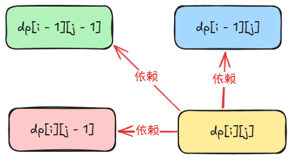

## 最长公共子序列 LCS
题目链接：[https://leetcode.cn/problems/longest-common-subsequence/description/](https://leetcode.cn/problems/longest-common-subsequence/description/)


### 思路
设 s =  text1，t = text2。则我们来看分别来自 s 和 t 的一个字母组成的一对 x 和 y 字符，那么有这么 4 中情况：

+ 选 x 选 y
+ 选 x 不选 y
+ 不选 x 选 y
+ 不选 x 不选 y

即对每个字符，我们都有选或不选 2 中情况。

我们可以先用回溯的思路来思考。

定义 dfs(i, j)，我们使用 i 和 j 分别表示 s 和 t 中当前组成“一对”的字符，返回值表示 s 的**前** i 个字符 t 的**前** j 个字符所能得到的 LCS。注意，我们倒序遍历 i 和 j。

边界条件：

+ 当 `i < 0 || j < 0` 的时候，代表有一个字符为空，则此时前 i 个字符和前 j 个字符并不能得到 LCS，返回 0

归的算法：

+ 当 `s[i] == t[j]` 的时候，才可以都选，这样的话，LCS 的长度加一
    - 选 `s[i]` 选`t[j]`：`dfs(i - 1, j - 1)` + 1
    - 选 `s[i]` 不选 `t[j]`：`dfs(i - 1, j)`
    - 不选 `s[i]` 选 `t[j]`：`dfs(i, j - 1)`
    - ~~不选 ~~`~~s[i]~~`~~ 不选 ~~`~~t[j]~~`~~：~~`~~dfs(i - 1, j - 1)~~`，很明显，这没有意义，因为为什么都不选呢？有变长的机会，为什么不选？
+ 当 `s[i] != t[j]` 的时候，不可以都选，但是可以都不选：
    - 选 `s[i]` 不选 `t[j]`：`dfs(i - 1, j)`
    - 不选 `s[i]` 选 `t[j]`：`dfs(i, j - 1)`
    - 不选 `s[i]` 不选 `t[j]`：`dfs(i - 1, j - 1)`

对于上述 2 中情况，每种情况在其子情况之间取一个最大值，这样就可以得到答案。

#### 优化递归分支（剪枝）
再来仔细思考一下下面这 2 个问题：

+ 在 `s[i] == t[j]` 的时候，是否有必要只选其中一个？
+ 在 `s[i] != t[j]` 的时候，是否有必要 2 个都不选？

对于第一个问题，考虑一下这种特殊情况：


更一般的情况是在其中插入了许多不同的字符。

通过上图可以发现，如果在相同的时候不都选，那么，我们可以肯定，不都选的情况的 LCS 长度肯定小于都选的情况的 LCS 长度。那我们还有什么必要递归到这些小于的情况的，毕竟我们只需要最大值。

第二个问题（在 `s[i] != t[j]` 的时候，是否有必要 2 个都不选？）可以这样解决：

+ 不相等的时候，会递归到 `dfs(i - 1, j)` 和 `dfs(i, j - 1)`
+ 如果递归到 `dfs(i - 1, j)`，则一定会递归到 `dfs(i - 1, j - 1)`
+ 同样的，如果递归到 `dfs(i, j - 1)`,则一定会递归到 `dfs(i - 1, j - 1)`

所以，`dfs(i - 1, j - 1)` 没有必要递归，因为它已经包含在了选 1 个的递归当中了。

#### 最终归的算法
综上，归的算法最终表述为：

+ 当 `s[i] == t[j]` 的时候，必须都选
    - 选 `s[i]` 选`t[j]`：`dfs(i - 1, j - 1)` + 1
+ 当 `s[i] != t[j]` 的时候，不可以都选，且必须选择其中一个：
    - 选 `s[i]` 不选 `t[j]`：`dfs(i - 1, j)`
    - 不选 `s[i]` 选 `t[j]`：`dfs(i, j - 1)`

将上述思路转换为递推：

+ 当 `s[i] == t[j]` 的时候：`dp[i][j] = dp[i - 1][j - 1] + 1`
+ 当 `s[i] != t[j]` 的时候：`dp[i][j] = max(dp[i - 1][j], dp[i][j - 1])`

### 空间优化
很明显，可以使用滚动数组来进行空间优化，不再赘述。

使用一个数组来优化空间时面临下述问题：



当我们将 `dp[i - 1]` 行的结果存储在 `dp[i]` 行的时候，我们计算出来的当前行的` dp[i][j - 1]` 会覆盖掉 `dp[i - 1][j - 1]` 的结果。

但是，由于只会覆盖掉一个变量，则我们可以在计算 `dp[i][j - 1]` 的时候，就将 `dp[i - 1][j - 1]` 的值保存下来，这样的话，就算被覆盖掉，我们也能找到正确的结果。

### 代码
我们避免在代码中 `i - 1` 或者 `j - 1` 中出现负数索引的情况，统一令 `i = i + 1`，`j = j + 1`, 则递推公式为：

+ 当 `s[i] == t[j]` 的时候：`dp[i + 1][j + 1] = dp[i][j] + 1`
+ 当 `s[i] != t[j]` 的时候：`dp[i + 1][j + 1] = max(dp[i][j], dp[i][j])`

但是，初始化 dp 数组的时候，就需要多加一行和一列。

无空间优化：

```rust
impl Solution {
    pub fn longest_common_subsequence(s: String, t: String) -> i32 {
        let s = s.chars().collect::<Vec<_>>();
        let t = t.chars().collect::<Vec<_>>();

        let m = s.len();
        let n = t.len();

        let mut dp = vec![vec![0; n + 1]; m + 1];

        for i in 0..m {
            for j in 0..n {
                if s[i] == t[j] {
                    dp[i + 1][j + 1] = dp[i][j] + 1;
                } else {
                    dp[i + 1][j + 1] = dp[i][j + 1].max(dp[i + 1][j]);
                }
            }
        }

        dp[m][n]
    }
}
```

一个数组：

```rust
impl Solution {
    pub fn longest_common_subsequence(s: String, t: String) -> i32 {
        let s = s.chars().collect::<Vec<_>>();
        let t = t.chars().collect::<Vec<_>>();

        let m = s.len();
        let n = t.len();

        let mut dp = vec![0; n + 1];

        for i in 0..m {
            // prev 相当于是上一行的第一列的结果，而这始终为 0
            // 因为初始化就是 0，而我们不会修改第一列的值
            let mut prev = 0;
            for j in 0..n {
                // 事先将上一行此列的结果保存下来，这样的话，我们当前计算出来的结果覆盖掉也没有关系
                let old = dp[j + 1];
                if s[i] == t[j] {
                    // 这里原来的 dp[j] 被替换为了 prev，因为在原本的递推公式中，这里是 dp[i - 1][j - 1] + 1
                    // 这里 dp[i - 1][j - 1] 会被覆盖，所以要保存在 prev 中
                    dp[j + 1] = prev + 1;
                } else {
                    // 这里的 dp[j] 不需要替换为 prev，这是原来的递推公式中是 dp[i][j - 1]，不是 dp[i - 1][j - 1]
                    // 而 dp[i][j - 1] 是我们刚算出来的，而不是被保存下来的旧值
                    dp[j + 1] = dp[j + 1].max(dp[j]);
                }
                prev = old;
            }
        }

        dp[n]
    }
}
```

## 编辑距离
题目链接：[https://leetcode.cn/problems/edit-distance/description/](https://leetcode.cn/problems/edit-distance/description/)


### 思路
设 s = word1, t = word2。

定义 dfs(i, j)，分别表示当前的一对字符 s[i] 和 t[j]，返回值表示使 s 的前 i 个字符和 t 前 j 个字符相同的最小操作数。

递归的边界条件：

+ `i < 0`，则需要在 s 中插入 `j + 1` 个字符，返回 `j + 1`
+ `j < 0`，则需要在 s 中删除 `i + 1` 个字符，返回 `i + 1`

归的算法：

+ 当 `s[i] == t[j]` 的时候，不需要任何操作，直接递归到 `dfs(i - 1, j - 1)`。与《LCS》一样的原因，不递归 `dfs(i - 1, j)` 或者 `dfs(i, j -1)`。
+ 当 `s[i] != t[j]` 的时候，可以执行下面的 3 种操作：
    - 在 s 中插入 t[j]：`dfs(i, j - 1) + 1`，注意，`i` 是没有变化的
    - 在 s 中删除 s[i]：`dfs(i - 1, j) + 1`
    - 在 s 中将 s[i] 替换为 t[j]：`dfs(i - 1, j - 1) + 1`，因为需要加一，所以不能像《LCS》一样不递归 `dfs(i - 1, j - 1)`

转换为递推时，由于边界条件为 `i < 0` 或者 `j < 0`，而从归的算法中可以确定，当 `i < 0` 或者 `j < 0` 的时候，`i == -1` 或者 `j == -1`，因为对于 i 和 j 的所有操作都只涉及减一操作。

所以，我们可以在 dp 数组中专门添加一行和一列用于表示 `i == -1` 或者 `j == -1` 的情况：


至于左上角黄色的 dp[0][0]，代表当 i = -1，j = -1 的时候，说明刚好完成，所以初始化为 0 就好了。

在编程语言中，我们肯定无法用负数作为索引，所以，我们令 `i = i + 1`, `j = j + 1`，这样就解决了索引为负数的问题。那么，递推公式为：

+ 当 `s[i] == t[j]` 时：`dp[i + 1][j + 1] = dp[i][j]`
+ 当 `s[i] != t[j]` 时：`dp[i + 1][j + 1] = min(dp[i + 1][j], dp[i][j + 1], dp[i][j]) + 1`

在进行空间优化的时候，还是一样的原因：


所以，当使用一个数组的时候，要将 `dp[i][j]` 的值保存下来，避免被当前行计算出来的 `dp[i + 1][j]` 覆盖掉。

### 代码
无空间优化：

```rust
impl Solution {
    pub fn min_distance(s: String, t: String) -> i32 {
        let s = s.chars().collect::<Vec<_>>();
        let t = t.chars().collect::<Vec<_>>();

        let m = s.len();
        let n = t.len();

        // dp 数组多增加一行一列
        let mut dp = vec![vec![0; n + 1]; m + 1];
        
        // dp[0] 是 i == -1 时的那一行（边界条件）
        for j in 0..n {
            // 返回 j + 1 表示要在 s 中插入 j + 1 个字符
            dp[0][j + 1] = j + 1;
        }
        
        // dp[..][0] 是 j == -1 时的那一列
        for i in 0..m {
            // 返回 i + 1 表示要在 s 中删除 i + 1 个字符
            dp[i + 1][0] = i + 1;
        }

        for i in 0..m {
            for j in 0..n {
                if s[i] == t[j] {
                    dp[i + 1][j + 1] = dp[i][j];
                } else {
                    dp[i + 1][j + 1] = dp[i + 1][j].min(dp[i][j + 1]).min(dp[i][j]) + 1;
                }
            }
        }

        dp[m][n] as _
    }
}
```

上述在 `j == -1` 的初始化过程可以融入进下面的计算过程中，因为我们在计算当前行的过程中，只需要知道这一行和前面行的第一列（`j == -1`）的结果，所以并不需要知道后面的行的第一列，故而可以不必将其完全初始化：

```rust
impl Solution {
    pub fn min_distance(s: String, t: String) -> i32 {
        let s = s.chars().collect::<Vec<_>>();
        let t = t.chars().collect::<Vec<_>>();

        let m = s.len();
        let n = t.len();

        // dp 数组多增加一行一列
        let mut dp = vec![vec![0; n + 1]; m + 1];

        // dp[0] 是 i == -1 时的那一行（边界条件）
        for j in 0..n {
            // 返回 j + 1 表示要在 s 中插入 j + 1 个字符
            dp[0][j + 1] = j + 1;
        }

        for i in 0..m {
            // 初始化 j == -1 的那一列
            // 赋为 i + 1 表示要在 s 中删除 i + 1 个字符
            dp[i + 1][0] = i + 1;
            
            for j in 0..n {
                if s[i] == t[j] {
                    dp[i + 1][j + 1] = dp[i][j];
                } else {
                    dp[i + 1][j + 1] = dp[i + 1][j].min(dp[i][j + 1]).min(dp[i][j]) + 1;
                }
            }
        }

        dp[m][n] as _
    }
}
```

使用一个数组来优化空间：

```rust
impl Solution {
    pub fn min_distance(s: String, t: String) -> i32 {
        let s = s.chars().collect::<Vec<_>>();
        let t = t.chars().collect::<Vec<_>>();

        let m = s.len();
        let n = t.len();

        // dp 数组多增加一行一列
        let mut dp = vec![0; n + 1];

        // 初始化 i == -1 时的那一行（边界条件）
        for j in 0..n {
            // 返回 j + 1 表示要在 s 中插入 j + 1 个字符
            dp[j + 1] = j + 1;
        }

        for i in 0..m {
            // prev 表示的是上一行的第一列的值
            let mut prev = dp[0];
            // 初始化为 i + 1 表示从 s 中删除 i + 1 个字符
            dp[0] = i + 1;
            for j in 0..n {
                let old = dp[j + 1];
                if s[i] == t[j] {
                    dp[j + 1] = prev;
                } else {
                    dp[j + 1] = dp[j].min(dp[j + 1]).min(prev) + 1;
                }
                prev = old;
            }
        }

        dp[n] as _
    }
}
```

