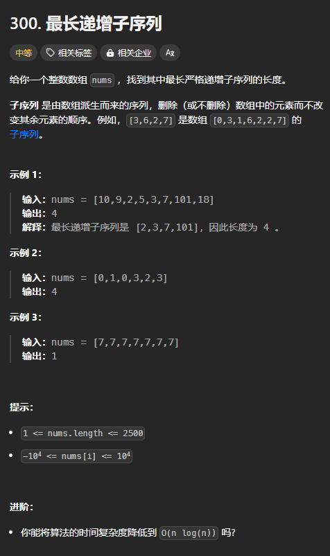
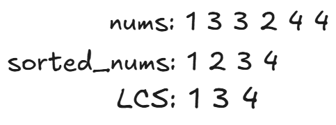
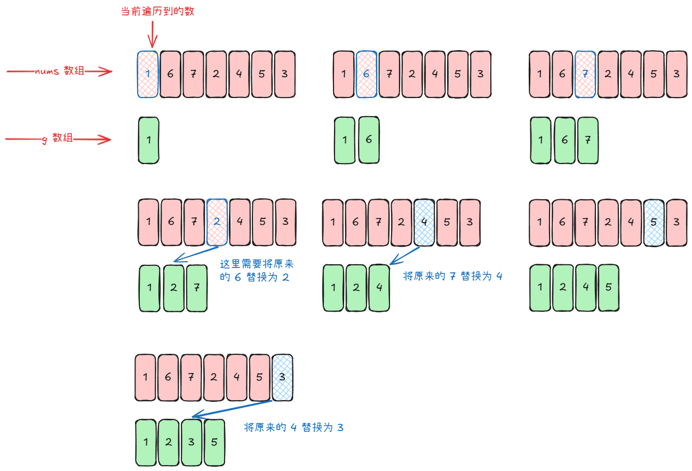

题目链接：[https://leetcode.cn/problems/longest-increasing-subsequence/description/](https://leetcode.cn/problems/longest-increasing-subsequence/description/)



## 思路一
本质上，递增的子序列还是原数组的一个子集，所以可以使用子集型回溯的思路来做。

子集型回溯有 2 种思路：

+ 选或不选
+ 枚举选哪个

对于这题，如果我们使用选或不选的思路来解决的话，还需要在递归参数中记录上一个被选的下标和当前进行选择的下标，会有 2 个递归参数。

如果使用枚举选哪个的思路，则只需要一个递归参数：我们枚举最大（小）值，当前递归参数所指向的数一定要被选（即当前的最大（小）值），然后，我们往前（枚举的是最大值）或者往后（枚举的是最小值）遍历，知道找到了比当前值还大（或者还小）的数，然后递归到该索引。

边界条件：

+ 当枚举最小值时（正序递归），`i == n` 为边界条件，此时，没有任何数可以选，返回 0
+ 当枚举最大值时（倒序递归），`i < 0` 为边界条件，返回 0

### 代码
下面的这个代码中，实际上，i 不会到达 n，所以，也就不需要递归边界。

```rust
impl Solution {
    pub fn length_of_lis(nums: Vec<i32>) -> i32 {
        let n = nums.len();

        fn dfs(index: usize, nums: &[i32]) -> i32 {
            let mut ans = 0;
            for i in index..nums.len() {
                let mut result = 0;
                for j in i + 1..nums.len() {
                    if nums[i] < nums[j] {
                        // 这里不加一，而是到下一个递归中去加一
                        result = result.max(dfs(j, nums));
                    }
                }

                // 加一是因为我们选择了 nums[i]
                ans = ans.max(result + 1);
            }

            ans
        }

        dfs(0, &nums)
    }
}
```

当 nums = [1, 2, 3] 的时候，可以由 1 递归到 2，也可以由 2 递归到 3，所以，会有重复的节点，所以，可以使用递推来优化：

```rust
impl Solution {
    pub fn length_of_lis(nums: Vec<i32>) -> i32 {
        let n = nums.len();

        // 枚举最小值
        let mut ans = 0;
        let mut dp = vec![0; n + 1];

        // 使用递推来模拟 dfs
        // 这里要倒序遍历
        // 因为 dp[i] 依赖于它后面的 dp[j]
        for i in (0..n).rev() {
            for j in i + 1..n {
                if nums[j] > nums[i] {
                    dp[i] = dp[i].max(dp[j]);
                }
            }
            
            dp[i] += 1;
            ans = ans.max(dp[i]);
        }

        ans
    }
}
```

## 思路二
当我们对 nums 排序去重后得到 sorted_nums，那么，ans 一定是 sorted_nums 的一个子序列。因为 ans 也是有序的。

然后，我们可以对 nums 和 sorted_nums 一起求一个 LCS，这样就可以得到答案了。



### 代码
无空间优化：

```rust
impl Solution {
    pub fn length_of_lis(nums: Vec<i32>) -> i32 {
        let mut sorted_nums = nums.clone();
        sorted_nums.sort_unstable();
        sorted_nums.dedup();

        let m = nums.len();
        let n = sorted_nums.len();

        // 找出 LCS 的最大长度
        let mut dp = vec![vec![0; n + 1]; m + 1];

        for i in 0..m {
            for j in 0..n {
                if nums[i] == sorted_nums[j] {
                    dp[i + 1][j + 1] = dp[i][j] + 1;
                } else {
                    dp[i + 1][j + 1] = dp[i][j + 1].max(dp[i + 1][j]);
                }
            }
        }

        dp[m][n]
    }
}
```

一个数组：

```rust
impl Solution {
    pub fn length_of_lis(nums: Vec<i32>) -> i32 {
        let mut sorted_nums = nums.clone();
        sorted_nums.sort_unstable();
        sorted_nums.dedup();

        let m = nums.len();
        let n = sorted_nums.len();

        // 找出 LCS 的最大长度
        let mut dp = vec![0; n + 1];

        for i in 0..m {
            let mut prev = dp[0];
            for j in 0..n {
                let old = dp[j + 1];
                if nums[i] == sorted_nums[j] {
                    dp[j + 1] = prev + 1;
                } else {
                    dp[j + 1] = dp[j + 1].max(dp[j]);
                }
                prev = old;
            }
        }

        dp[n]
    }
}
```

这个思路的时间用得比思路一的多。

## 思路三
对于动态规划问题，如果想要优化时间复杂度，则可以**交换状态与状态值**：

例如，对于思路一，我们定义的 dp 数组含义如下：

`dp[i]` 表示当**最小值**为 `nums[i]` 的时候，还可以从 `nums[i + 1..]` 中找到的 **LIS 长度**。

其中的“状态”就是：“最小值”

其中的“状态值”就是：“ LIS 长度”

交换状态与状态值之后，`f[i]` 表示长度为 `i + 1` 的递增子序列（IS）的末尾元素的最小值。

注意，这里交换了之后的“最小值”并不是简单地“交换”之后的结果，而是基于一下考虑：

+ 最小值可以给后面的值“更多的容纳空间”

例如:



这个思路的妙处就在于它能够在给未来的元素留充足空间的同时，也能够得到正确的答案。

+ 例如，在将 6 替换为 2 的那一步中，如果按照递增子序列的定义，则应该将原来 6 后面的 7 也一块删除，但是，这里只替换了 6，而不删除 7，这保证了递增序列的长度最大（即使组成这个最大值的序列已经被替换了），同时，也能给后面的元素留够充足的位置。
+ 留够充足的空间是什么意思？如果不是将原来的 7 替换为了 4，那么，后面就不可能添加 5。所以，当时定义 g 数组的时候取最小值的目的就是如此。

上述思路不是一个动态规划的思路（因为没有重叠的子问题），而是一个贪心的思路。

为了能更快地找到需要替换的位置，可以使用二分查找找到第一个大于 nums[i] 的位置，然后替换它。因为我们维护 g 数组使其是有序的。

### 代码
```rust
impl Solution {
    pub fn length_of_lis(nums: Vec<i32>) -> i32 {
        let n = nums.len();

        let mut g = vec![nums[0]];

        for i in 1..n {
            if nums[i] > *g.last().unwrap() {
                // 直接添加 nums[i]
                g.push(nums[i]);
            } else {
                // 找到第一个大于等于 nums[i] 的位置，然后替换它
                match g.binary_search(&nums[i]) {
                    Err(index) | Ok(index) => g[index] = nums[i]
                }
            }
        }

        g.len() as _
    }
}
```

我们可以直接使用 nums 数组来表示 g 数组，这样就可以进一步降低空间复杂度。我们只需要维护一个 g 的长度就可以了。

```rust
impl Solution {
    pub fn length_of_lis(mut nums: Vec<i32>) -> i32 {
        let n = nums.len();

        // 假设事先将 nums[0] 存储在了 g 数组中
        let mut g_len = 1;

        for i in 1..n {
            if nums[i] > nums[g_len - 1] {
                // 直接添加 nums[i]
                g_len += 1;
                nums[g_len - 1] = nums[i];
            } else {
                // 找到第一个大于等于 nums[i] 的位置，然后替换它
                match nums[..g_len].binary_search(&nums[i]) {
                    Err(index) | Ok(index) => nums[index] = nums[i]
                }
            }
        }

        g_len as _
    }
}
```

