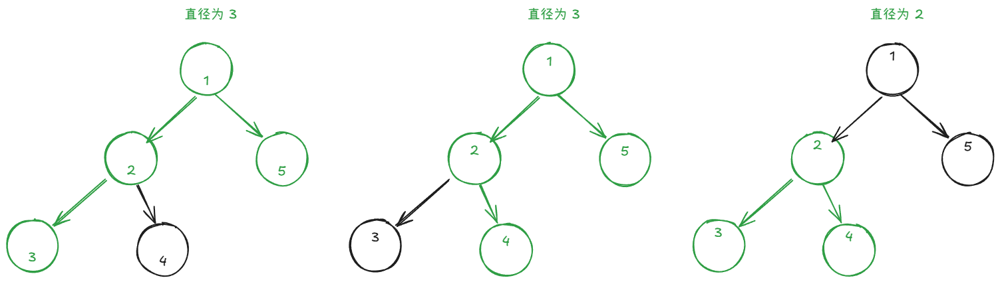
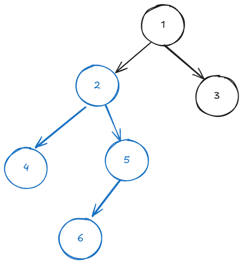
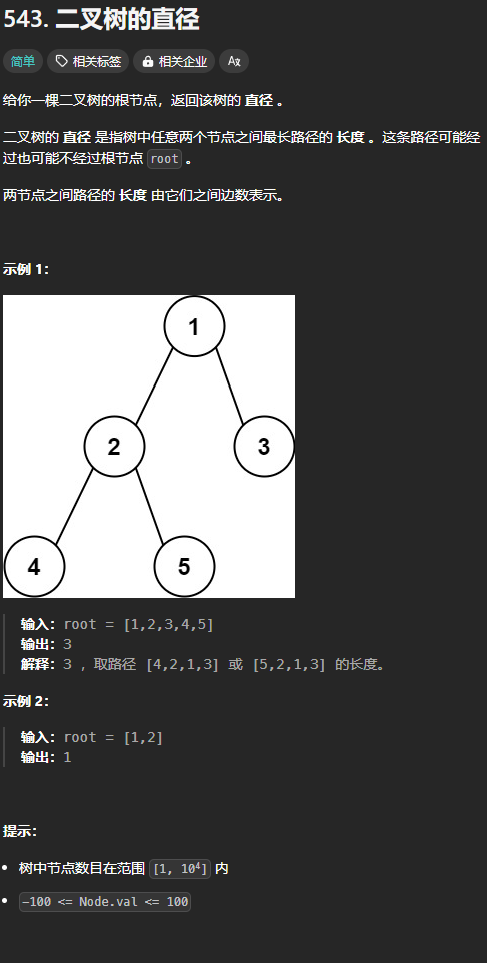
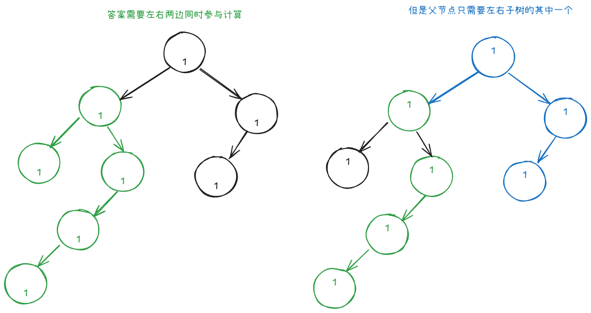

树的直径定义为：树中任意两个节点之间最长路径的长度 ，这条路径可能经过也可能不经过根节点 `root` 。

例如：



下面是一个比较明显的结论：

+ 树的直径的起点和终点都肯定是叶子节点

## 思路


我们可以枚举直径的拐点，则以此点为拐点的树的直径为 `左子树的最大深度 + 1 + 右子树的最大深度 + 1`。

我们可以维护一个全局变量来记录所有可能的树的直径的最大值，即答案。

通过上述公式知道，要返回给父节点以此节点为根节点的最大深度。

最大深度为 `max(左子树的最大深度, 右子树的最大深度) + 1 `。

如果我们将叶子节点的子节点（null） 的深度返回为 -1，则完美符合。

## 题目：二叉树的直径
题目链接：[https://leetcode.cn/problems/diameter-of-binary-tree/description/](https://leetcode.cn/problems/diameter-of-binary-tree/description/)



### 代码
```go
func diameterOfBinaryTree(root *TreeNode) int {
    ans := math.MinInt32
    var dfs func (*TreeNode) int = nil
    dfs = func (root *TreeNode) int {
        if root == nil {
            return -1
        }

        leftDepth := dfs(root.Left)
        rightDepth := dfs(root.Right)

        ans = max(ans, leftDepth + rightDepth + 2)
        return max(leftDepth, rightDepth) + 1
    }

    dfs(root)
    return ans
}
```

## 总结（提炼）
树的直径描述的是这样一类问题：



此时，答案就需要用全局变量来保存，返回给父节点的值一般要加上根节点的值，并且使用 `max` 或者 `min` 等操作选择出来一个来返回给父节点。


