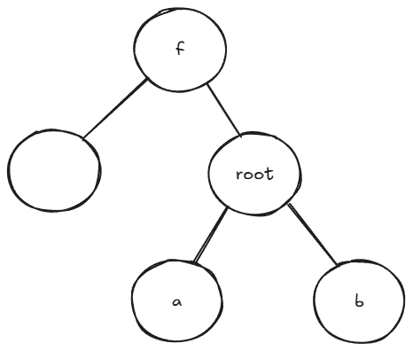
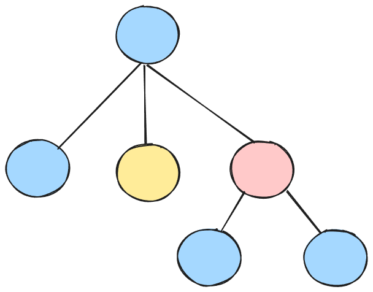
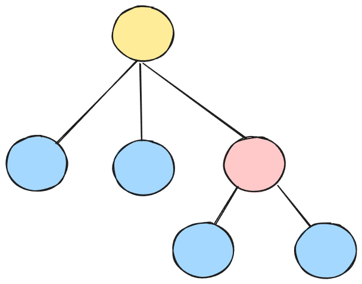
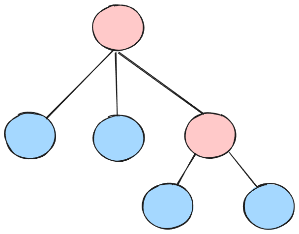
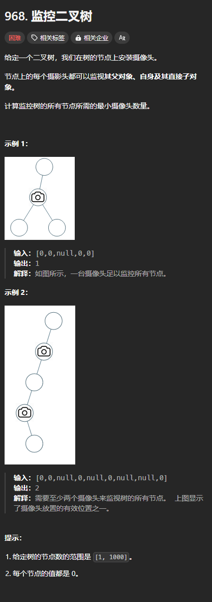

最小支配集指从图中选择尽可能少的点，选出来的点与剩余的点都相邻。

设最小支配集为 S。

则我们来看一看对于其中一个节点可能的情况：



+ 如果 root 在 S 中：则 f、a、b 都可以在也可以不在 S 中
+ 如果 root 不在 S 中：则 f、a、b 至少要有一个在 S 中

但是上面的方法很难列举所有的情况。例如 root 在 S 中，有  种可能的情况。

下面介绍一种与深度优先搜索配套使用的算法：

定义节点的颜色与意义：

+ 蓝色：该节点在 S 中
+ 黄色：该节点的父节点在 S 中，即父节点为蓝色
+ 红色：该节点的至少一个孩子节点在 S 中，即至少有一个为蓝色

下面分别讨论根节点为这三种颜色的情况：

根节点为蓝色，则它的孩子节点是什么颜色都可以：



根节点为黄色，则孩子节点不能为黄色：



根节点为红色，则孩子节点至少有一个蓝色节点，并且，孩子节点不能是黄色的：



除了树的起点根节点不可能是黄色之外，其它任何节点都可能是三种颜色的其中一种。所以，每个节点要计算出自己对应每一种颜色的每一种结果。

定义 `dfs(root) -> (蓝色, 黄色, 红色)` 为 root 分别为蓝、黄、红三种颜色对应的最小支配集中的数量（即以 root 为根的树中，最少的蓝色节点的数量）

下面来看看如何计算：

+ 节点是蓝色：对于子节点返回值即三种颜色中取一个最小值，然后将每个子节点的最小值加起来再加一
+ 节点是黄色（孩子节点不能为黄色）：则对每个子节点的蓝色和红色的结果取一个最小值，然后将每个子节点的最小值加起来
+ 节点是红色（孩子节点不能为黄色，并且至少有一个是蓝色）：假设是一个二叉树，则所有可能的情况是：
    - 左孩子蓝色
        * 右孩子红色
        * 右孩子蓝色
    - 右孩子蓝色
        * 左孩子蓝色
        * 左孩子红色
    - 对于所有可能的情况取一个最小值：`min(左蓝 + 右红, 左红 + 右蓝, 左蓝 + 右蓝)`

但是如果节点是红色，但是它有很多子节点如何解决呢？

我们注意到，在所有的颜色组合中，只要保证不是所有子节点都是红色就好了。

如此保证之后，我们就可以直接像计算**黄色**那样，对所有子节点的红色和蓝色结果取一个最小值再相加。

但是，如果我们取到的最小值都是在子节点为红色的时候取到的结果，则就会破坏这一个保证。

取到的最小值都是在子节点为红色的时候取到的时候，有如下特点：

+ 所有子节点的红色结果都小于蓝色结果

所以，我们只要破坏这一特点就能继续保证所有子节点不都是红色。

所采取的措施是选择其中的一个子节点改变为蓝色，它为蓝色时的结果我们是知道的。

将它改变为蓝色之后，在原来所有最小值相加的结果上增加了`蓝色 - 红色` 个蓝色节点。

那么，这个子节点是谁呢？

如上面所述，由于增加了 `蓝色 - 红色` 个蓝色节点，所以，选择 `蓝色 - 红色` 最小的那个节点。

当蓝色结果小于红色结果的时候，`蓝色 - 红色` 为负数，所以要与 0 取一个最大值，表示没有增加。

### 边界条件
当节点为空的时候，为边界条件。

+ 空节点为蓝色没有意义，所以返回 inf，因为要进行取小操作
+ 空节点为红色和黄色时，返回 0，因为一个空集当然它的最小支配集也为空

## 例题：监控二叉树
题目链接：[https://leetcode.cn/problems/binary-tree-cameras/description/](https://leetcode.cn/problems/binary-tree-cameras/description/)



### 代码
```go
func minCameraCover(root *TreeNode) int {
    var dfs func (root *TreeNode) (int, int, int) = nil
    dfs = func (root *TreeNode) (int, int, int) {
        if root == nil {
            return math.MaxInt32, 0, 0
        }

        leftBlue, leftYellow, leftRed := dfs(root.Left)
        rightBlue, rightYellow, rightRed := dfs(root.Right)

        // 子节点为什么颜色都可以
        blue := min(leftBlue, leftYellow, leftRed) + min(rightBlue, rightYellow, rightRed) + 1
        // 子节点不能为黄色
        yellow := min(leftBlue, leftRed) + min(rightBlue, rightRed)
        // 子节点至少有一个蓝色节点，且不能为黄色
        red := yellow + max(0, min(leftBlue - leftRed, rightBlue - rightRed))

        return blue, yellow, red
    }

    blue, _, red := dfs(root)
    return min(blue, red)
}
```

从中可以看到，`red >= yellow` 总是成立的，所以对于 `blue` 的计算可以将红色给去掉：

```go
func minCameraCover(root *TreeNode) int {
    var dfs func (root *TreeNode) (int, int, int) = nil
    dfs = func (root *TreeNode) (int, int, int) {
        if root == nil {
            return math.MaxInt32, 0, 0
        }

        leftBlue, leftYellow, leftRed := dfs(root.Left)
        rightBlue, rightYellow, rightRed := dfs(root.Right)

        // 子节点为什么颜色都可以
        blue := min(leftBlue, leftYellow) + min(rightBlue, rightYellow) + 1
        // 子节点不能为黄色
        yellow := min(leftBlue, leftRed) + min(rightBlue, rightRed)
        // 子节点至少有一个蓝色节点，且不能为黄色
        red := yellow + max(0, min(leftBlue - leftRed, rightBlue - rightRed))

        return blue, yellow, red
    }

    blue, _, red := dfs(root)
    return min(blue, red)
}
```

