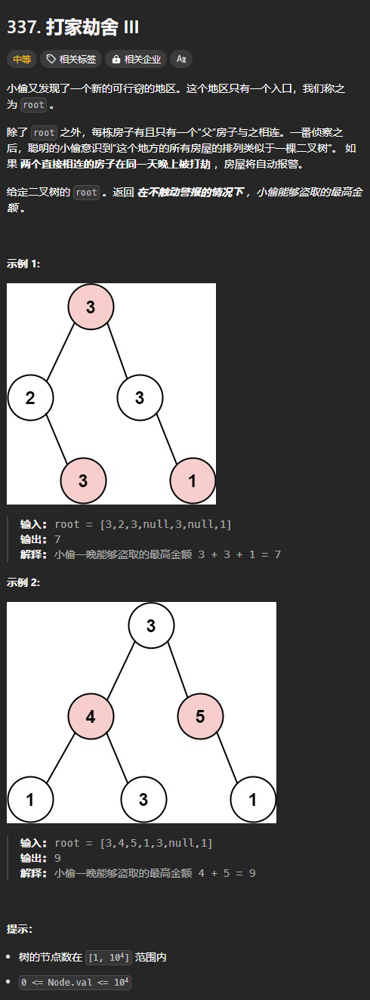
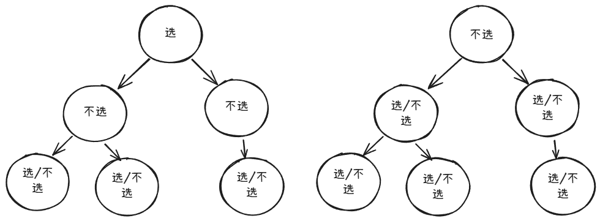

最大独立集是图的概念，是指从图中选择尽可能多的点，并且这些点不能相邻。

对于树形 DP 来说，主要解决的是最大独立集的变形：

+ 最大化点权之和（每个点的权重为树的节点值）

## 例题：打家劫舍 III
题目链接：[https://leetcode.cn/problems/house-robber-iii/description/](https://leetcode.cn/problems/house-robber-iii/description/)



### 思路
下图展示了根节点选或不选如何影响子节点：



我们可以从叶子节点开始，自低向上计算出每个节点选或不选时的结果：

+ 如果选择根节点，则不能选子节点，则结果为子节点们不选的结果之和再加上根节点的值
+ 如果不选择根节点，则子节点选或不选都可以，所以选或不选这两种情况取一个最大值，然后相加

### 代码
```go
func rob(root *TreeNode) int {
    var dfs func (root *TreeNode) (int, int) = nil
    dfs = func (root *TreeNode) (int, int) {
        if root == nil {
            return 0, 0
        }

        leftRob, leftNotRob := dfs(root.Left)
        rightRob, rightNotRob := dfs(root.Right)

        return root.Val + leftNotRob + rightNotRob, max(leftRob, leftNotRob) + max(rightRob, rightNotRob)
    }
    return max(dfs(root))
}
```

