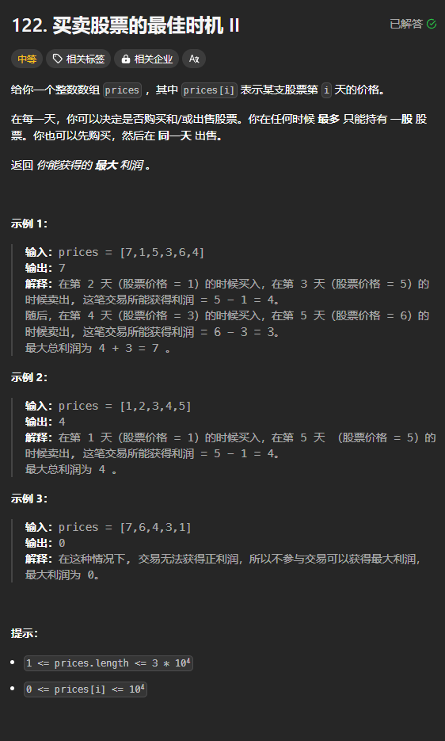
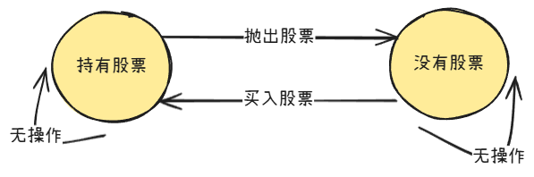

题目链接：[https://leetcode.cn/problems/best-time-to-buy-and-sell-stock-ii/description/](https://leetcode.cn/problems/best-time-to-buy-and-sell-stock-ii/description/)



## 思路
随着时间的流逝，可能有如下 2 种状态，4 种转换路径：



我们定义 `dfs(i, hold)` 表示第 `i..` 天内在状态为 hold 的情况下进行可以进行的操作，得到的最大利润。

在每一天中，进行操作得到的利润需要特殊定义：

+ 如果没有操作，则为 0
+ 如果买入股票花费了 price，则利润为 -price
+ 如果以当天的价格 price 抛出了股票，则利润为 price

 经过这么处理之后，就可以将第 `i` 天的利润和第 `i + 1..` 天的利润加起来，就得到了真正的利润。

### 归的算法
+ 如果持有股票，则可以：
    - 抛出股票：`dfs(i + 1, false) + price`
    - 不进行操作：`dfs(i + 1, true)`
+ 如果没有持有股票，则可以：
    - 买入股票：`dfs(i + 1, true) - price`
    - 不进行操作：`dfs(i + 1, false)`

对于上述两种情况，要对每种可能进行的操作进行取最大值。

### 递归边界
当 `i == n - 1` 的时候，无论是否持有股票，都是递归边界：

+ 如果没有持有股票，也不应该买入了，返回 0
+ 如果持有股票，则应该要以今天的利润抛出股票，无论是否赚了，都返回今天的价格 price

### 转换为递推
+ 如果持有股票：`dp[i][1] = dp[i + 1][1].max(dp[i + 1][0] + price)`
+ 如果没有持有股票：`dp[i][0] = dp[i + 1][0].max(dp[i + 1][1] - price)`

可以使用一个数组进行空间优化，优化过后的递推公式为：

+ 如果持有股票：`dp[1] = dp[1].max(dp[0] + price)`
+ 如果没有持有股票：`dp[0] = dp[0].max(dp[1] - price)`

由于 `dp[i]` 依赖于 `dp[i + 1]`，所以倒序遍历 i。

### 代码
无空间优化：

```rust
impl Solution {
    pub fn max_profit(prices: Vec<i32>) -> i32 {
        let n = prices.len();

        let mut dp = vec![[0; 2]; n];
        dp[n - 1][1] = prices[n - 1];

        for i in (0..n - 1).rev() {
            // 持有股票
            dp[i][1] = dp[i + 1][1].max(dp[i + 1][0] + prices[i]);
            // 没有持有股票
            dp[i][0] = dp[i + 1][0].max(dp[i + 1][1] - prices[i]);
        }

        dp[0][0]
    }
}
```

一个数组空间优化：

```rust
impl Solution {
    pub fn max_profit(prices: Vec<i32>) -> i32 {
        let n = prices.len();

        let mut dp = [0; 2];
        dp[1] = prices[n - 1];

        for i in (0..n - 1).rev() {
            // 持有股票
            dp[1] = dp[1].max(dp[0] + prices[i]);
            // 没有持有股票
            dp[0] = dp[0].max(dp[1] - prices[i]);
        }

        dp[0]
    }
}
```

