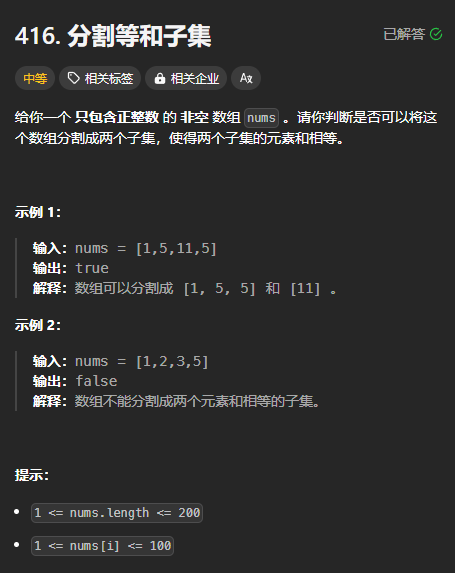

题目链接：[https://leetcode.cn/problems/partition-equal-subset-sum/description/](https://leetcode.cn/problems/partition-equal-subset-sum/description/)



## 思路
设 nums 中元素之和为 sum，由于要分为 2 个子集，sum 一定得是一个偶数。则我们只需要判断是否能从数组中选出一些元素组成和为 target = sum / 2，如果可以，则说明可以使 2 个子集的和相等。

这相当于 0-1 背包问题，背包的 capacity = target，物品的体积为 nums[i]，物品没有价值。

为了节省空间，可以将 c 初始化为 target，让其递减。

dp 数组的初始化用回溯的边界条件思考：

+ 如果 `i == n && c == 0`，则说明可以，返回 true
+ 如果 `i == n && c != 0`，则说明不可以，返回 false

递推公式：

只要选或不选有 1 个返回 true 就可以了：`dp[i][c] = dp[i + 1][c] || dp[i + 1][c - nums[i]]`

## 代码
```rust
impl Solution {
    pub fn can_partition(nums: Vec<i32>) -> bool {
        let sum = nums.iter().sum::<i32>();
        if sum % 2 != 0 {
            return false;
        }

        let target = (sum / 2) as usize;
        let mut dp = vec![false; target + 1];
        dp[0] = true;

        for num in nums {
            for c in (0..=target).rev() {
                if c as i32 >= num {
                    dp[c] |= dp[c - num as usize];
                }
            }
        }

        dp[target]
    }
}
```

