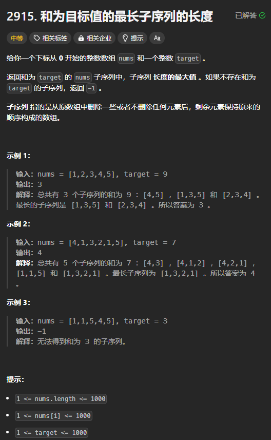

题目链接：[https://leetcode.cn/problems/length-of-the-longest-subsequence-that-sums-to-target/description/](https://leetcode.cn/problems/length-of-the-longest-subsequence-that-sums-to-target/description/)



## 思路
0-1 背包问题。nums[i] 是物品的体积，价值都为 1，代表它是构成子序列的一个元素。背包的容积为 target。

同时，我们将 c 初始值设置 target，然后递减 c，这样可以节省一点空间。

初始化使用回溯的边界条件来思考：

+ 当 `i == n && c == 0`，返回 0，说明不再需要选择一些元素了
+ 当 `i == n && c != 0` 的时候，返回 -inf，说明无法构成一个和为 target 的子序列。之所以不返回 inf，是因为我们要取最大值。

所以，dp[n][0] = 0,dp[n][1..] = -inf。

递推公式可以根据选或不选的思路来快速确定：

+ 选：dp[i + 1][c - nums[i]] + 1
+ 不选: dp[i + 1][c]

然后，2 者取一个最大值，即 `dp[i][c] = dp[i + 1][c].max(dp[i + 1][c - nums[i]] + 1)`

## 代码
```rust
impl Solution {
    const NEG_INF: i32 = -1000;
    
    pub fn length_of_longest_subsequence(nums: Vec<i32>, target: i32) -> i32 {
        let target = target as usize;

        let mut dp = vec![Self::NEG_INF; target + 1];
        dp[0] = 0;

        for i in 0..nums.len() {
            // 倒序遍历 c，防止覆盖掉上一行的结果
            for c in (0..=target).rev() {
                if c as i32 - nums[i] >= 0 {
                    dp[c] = dp[c].max(dp[c - nums[i] as usize] + 1);
                }
            }
        }

        if dp[target] <= 0 { -1 } else { dp[target] as _ }
    }   
}
```

