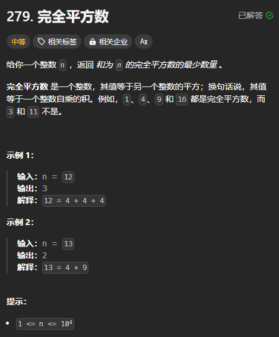

题目链接：[https://leetcode.cn/problems/perfect-squares/description/](https://leetcode.cn/problems/perfect-squares/description/)



## 思路
首先，我们需要知道 1 ~ 有哪些是完全平方数，并将所有的完全平方数收集起来，假设为 nums 数组，这样的话，问题就变成了从 nums 中找到一个子序列，使其和为 n 的最小选择数量。

也就是一个完全背包问题。物品的体积为 nums[i]，价值为 1，表示这个子序列的元素数量加一。背包的容积为 n。

---

还有一种思路是不用将完全平方数收集起来，而是枚举完全平方数的索引，例如索引 1 的完全平方数为 1，索引 2 的完全平方数为 4，索引 3 的完全平方数为 9。这样的话，物品的体积为 i * i，价值为 1.

## 代码
收集完全平方数：

```rust
impl Solution {
    const INF: i32 = 100000;

    pub fn num_squares(target: i32) -> i32 {
        let mut nums = vec![];
        
        let mut num = 1;
        while num * num <= target {
            nums.push(num * num);
            num += 1;
        }
        
        let n = nums.len();
        let mut dp = vec![Self::INF; target as usize + 1];
        dp[0] = 0;

        for i in 0..n {
            for c in 1..=target {
                if c >= nums[i] {
                    let c = c as usize;
                    dp[c] = dp[c].min(dp[c - nums[i] as usize] + 1)
                } 
            }
        }
        
        dp[target as usize]
    }
}
```

不收集完全平方数，而是枚举索引：

```rust
impl Solution {
    const INF: i32 = 100000;

    pub fn num_squares(target: i32) -> i32 {
        let target = target as usize;
        let mut dp = vec![Self::INF; target + 1];
        dp[0] = 0;

        for i in 1.. {
            let w = i * i;
            if w > target {
                break;
            }

            for c in w..=target {
                dp[c] = dp[c].min(dp[c - i * i] + 1)
            }
        }

        dp[target]
    }
}
```

