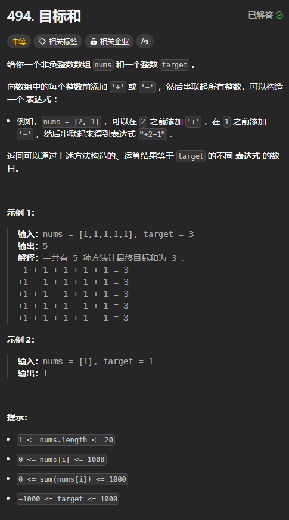

题目链接：[https://leetcode.cn/problems/target-sum/description/](https://leetcode.cn/problems/target-sum/description/)



## 思路
假设我们从 nums 中选择一些数组成和，这些数之和为 p，然后，剩下的一些元素就添加负号。

设 nums 中所有元素之和为 sum，则我们的目标是：被选择的数之和和没有被选择的数之和相减等于 target，即：`p - (sum - p) = target`,变形一下就是 `p = (sum + target) / 2`，所以，如果 sum + target 为奇数，则没有方法可以让目标和为 target。由于 nums 中，没有负数，但是 target 可以为负数，所以，如果 (sum + target) / 2 是负数，也是不可能的找到的。

现在的目标就是选择一些数，让它们的和为 `(sum + target) / 2`。

这就相当于 0-1 背包的背包恰好装 capacity,求方案数。

nums[i] 就是每个“物品”的体积，每个物品的价值都是 0，即没有价值。

思考 dp 数组初始化的时候，最好还是从回溯的思路来思考，这样方便理解：

+ 只有当 p 恰好等于 `(sum + target) / 2` 的时候，才返回 1，表示找到了一个合适的方案
+ 所以，将 dp[n][(sum + target) / 2] 初始化为 1

## 代码
没有空间优化：

```rust
impl Solution {
    pub fn find_target_sum_ways(nums: Vec<i32>, target: i32) -> i32 {
        let n = nums.len();
        let sum = nums.iter().sum::<i32>();
        if sum + target < 0 || (sum + target) % 2 != 0 {
            return 0;
        }

        let max = *nums.iter().max().unwrap();
        let target = ((sum + target) / 2) as usize;
        let mut dp = vec![vec![0; target + max as usize + 1]; n + 1];
        dp[n][target] = 1;

        // 这 2 个循环，无论是谁在外层，都可以得出正确的答案
        // 对于 c 的遍历必须倒序
        for c in (0..=target).rev() {
            // 对于 i 的遍历必须倒序
            for i in (0..n).rev() {
                dp[i][c] = dp[i + 1][c] + dp[i + 1][c + nums[i] as usize];
            }
        }

        dp[0][0]
    }
}
```

使用滚动数组来优化空间：

```rust
impl Solution {
    pub fn find_target_sum_ways(nums: Vec<i32>, target: i32) -> i32 {
        let n = nums.len();
        let sum = nums.iter().sum::<i32>();
        if sum + target < 0 || (sum + target) % 2 != 0 {
            return 0;
        }

        let max = *nums.iter().max().unwrap();
        let target = ((sum + target) / 2) as usize;
        let mut dp = vec![vec![0; target + max as usize + 1]; 2];
        dp[n % 2][target] = 1;

        // 对于 i 的遍历，只能在外层循环
        // i 只能倒序遍历
        for i in (0..n).rev() {
            // c 的遍历顺序无关紧要，都可以
            for c in 0..=target {
                dp[i % 2][c] = dp[(i + 1) % 2][c] + dp[(i + 1) % 2][c + nums[i] as usize];
            }
        }

        dp[0][0]
    }
}
```

使用一个数组：

```rust
impl Solution {
    pub fn find_target_sum_ways(nums: Vec<i32>, target: i32) -> i32 {
        let sum = nums.iter().sum::<i32>();

        if sum + target < 0 || (sum + target) % 2 != 0 {
            return 0;
        }

        let target = ((sum + target) / 2) as usize;
        let max = *nums.iter().max().unwrap();
        let mut dp = vec![0; target + max as usize + 1];
        // 只有恰好“装”了 target 个“物品”，才返回 1
        dp[target] = 1;

        // 对于 i 的遍历要放到外层循环
        // i 的遍历顺序无关紧要，都可以
        for i in 0..nums.len() {
            // 背包的容量 c 要正序遍历，防止覆盖掉 dp[i + 1] 行的结果
            // c 必须正序遍历
            for c in 0..=target {
                dp[c] += dp[c + nums[i] as usize];
            }
        }

        dp[0]
    }
}
```

