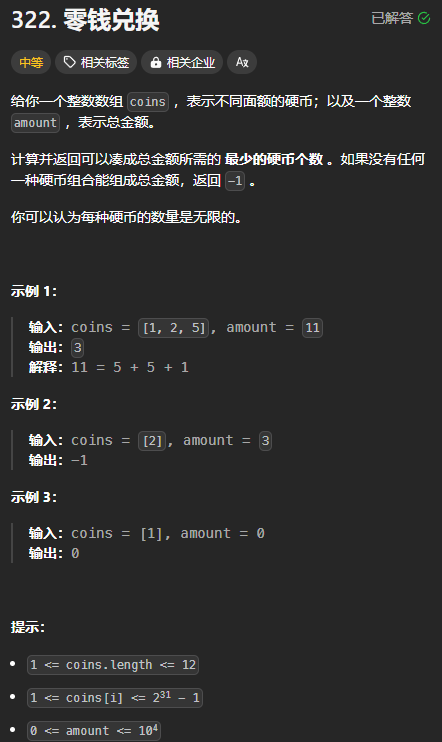

题目链接：[https://leetcode.cn/problems/coin-change/description/](https://leetcode.cn/problems/coin-change/description/)



## 思路
这相当于有 n 种物品，背包的容积为 amount，每种物品的体积为 coins[i]，价值都为 1 的完全背包问题。

价值为 1 表示的是它是一个硬币。

所以，一个数组的递推公式为:

+ `dp[c] = min(dp[c], dp[c + coins[i]] + 1)`

初始化一个数组的相当于初始化无空间优化的 dp 数组的最后一行。

而初始化最后一行相当于回溯的边界条件：

+ 如果 `i == n && c == amount`，则返回 0，表示还需要 0 个硬币才能凑成 amount
+ 如果 `i == n && c != amount`，则说明此时无法凑成 amount，则需要 inf 个硬币，表示不可能凑成amount

需要注意的一点是，coins[i] 的最大值可能是 i32::MAX，如果我们按照这个递推公式，则很可能会造成空间的消耗过大。

上述的递推公式是递增 c 得到的，换一个思路，如果我们将 c 初始值赋为 amount,则我们可以递减 c，如果 c =  0，则说明可以凑成 amount，返回 0, 如果 c 小于 0，则说明不可凑成 amount，返回 inf。

同样的，对于每种硬币 dfs(i, c) 可以有选或不选：

+ 选: 递归到 dfs(i, c - coins[i]),不是 dfs(i + 1, c - coins[i])，因为可以重复选
+ 不选：递归到 dfs(i + 1, c)

归的算法：

+ `dfs(i, c) = min(dfs(i, c - coins[i]) + 1, dfs(i + 1, c))`

上式很容易转换成递推。

c - coins[i] 如果小于 0，就直接将 dfs(i, c - coins[i]) 看做是 inf。

需要注意的是，与递增 c 不同的是，dfs(i, c) 依赖于它前面的列 dfs(i, c - coins[i])。所以，会导致遍历顺序出现一定的变化。

## 代码
无空间优化：

```rust
impl Solution {
    const INF: i64 = i32::MAX  as i64 + 1;

    pub fn coin_change(coins: Vec<i32>, amount: i32) -> i32 {
        let amount = amount as usize;
        let n = coins.len();

        let mut dp = vec![vec![Self::INF; amount + 1]; n + 1];
        dp[n][0] = 0;

        for i in (0..n).rev() {
            for c in 0..=amount {
                if c as i32 - coins[i] < 0 {
                    dp[i][c] = dp[i + 1][c];
                } else {
                    dp[i][c] = dp[i + 1][c].min(dp[i][c - coins[i] as usize] + 1)
                }
            }
        }

        if dp[0][amount] == Self::INF { -1 } else { dp[0][amount] as _ }
    }
}
```

滚动数组：

```rust
impl Solution {
    const INF: i64 = i32::MAX  as i64 + 1;

    pub fn coin_change(coins: Vec<i32>, amount: i32) -> i32 {
        let amount = amount as usize;
        let n = coins.len();

        let mut dp = vec![vec![Self::INF; amount + 1]; 2];
        dp[n % 2][0] = 0;

        for i in (0..n).rev() {
            for c in 0..=amount {
                if c as i32 - coins[i] < 0 {
                    dp[i % 2][c] = dp[(i + 1) % 2][c];
                } else {
                    dp[i % 2][c] = dp[(i + 1) % 2][c].min(dp[i % 2][c - coins[i] as usize] + 1)
                }
            }
        }

        if dp[0][amount] == Self::INF { -1 } else { dp[0][amount] as _ }
    }
}
```

一个数组：

```rust
impl Solution {
    const INF: i64 = i32::MAX  as i64 + 1;

    pub fn coin_change(coins: Vec<i32>, amount: i32) -> i32 {
        let amount = amount as usize;
        let n = coins.len();

        let mut dp = vec![Self::INF; amount + 1];
        dp[0] = 0;

        for i in 0..n {
            // 注意，这里要正序枚举 c，因为它依赖于 dp[i][c - coins[i]] 而不是 dp[i + 1][c - coins[i]]
            for c in 0..=amount {
                if c as i32 - coins[i] >= 0 {
                    dp[c] = dp[c].min(dp[c - coins[i] as usize] + 1)
                }
            }
        }

        if dp[amount] == Self::INF { -1 } else { dp[amount] as _ }
    }
}
```

