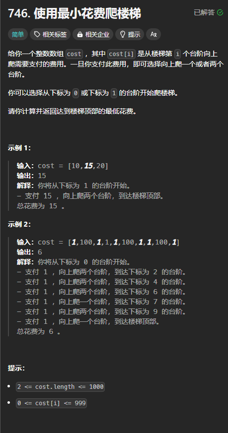

题目链接：[https://leetcode.cn/problems/min-cost-climbing-stairs/description/](https://leetcode.cn/problems/min-cost-climbing-stairs/description/)



## 思路
直接跳过回溯的思路，定义一个 dp 数组，dp[i] 表示从当前台阶 i 跳到楼顶的最低花费。

当前台阶 i 可以跳到 dp[i + 1] 或者 dp[i + 2]，但是，要支付台阶 i 的费用才可以，所以：

+ `dp[i] = dp[i + 1].min(dp[i + 2]) + cost[i]`

dp[n] 表示楼顶的那个台阶，它跳到楼顶不需要任何花费，所以 dp[n] = 0。

但是 dp[n + 1] 很明显，它不是一个有效的楼梯，所以，我们让它的到楼顶的花费是一个很大的数，表示这不是一个有效的台阶。

同样的，dp[i] 依赖于后面的 dp，所以倒序遍历。

## 代码
```rust
impl Solution {
    pub fn min_cost_climbing_stairs(cost: Vec<i32>) -> i32 {
        let n = cost.len();
        let mut dp = vec![0; n + 2];
        // 一个很大的花费，表示不是一个有效的台阶
        dp[n + 1] = 1000;

        for i in (0..n).rev() {
            dp[i] = dp[i + 1].min(dp[i + 2]) + cost[i];
        }
        
        // 可以从 0 或者 1 出发
        dp[0].min(dp[1])
    }
}
```


