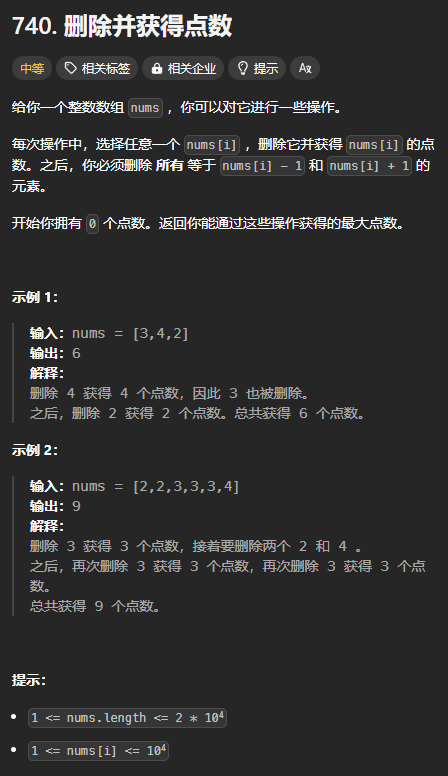

题目链接：[https://leetcode.cn/problems/delete-and-earn/description/](https://leetcode.cn/problems/delete-and-earn/description/)



## 思路
回溯的思路：

dfs(i) 表示对于 nums[i] 可以选择或者不选择，返回值表示当前节点所能获得的最大值。

那么，如果选择 nums[i]，dfs(i) 所获得的点数就要增加 nums[i]，同时，需要删除 nums[i] - 1 和 nums[i] + 1,我们可以用一个哈希表来管理哪些元素被删除了。被删除了的元素不可被选择。

如果不选择 nums[i],则直接递归到 dfs(i + 1)。

对这两种情况取一个最大值，就是当前节点的答案：

+ `dfs(i) = max(dfs(i + 1) + nums[i](同时删除 nums[i] - 1 和 nums[i] + 1), dfs(i + 1))`

需要注意的是，删除 nums[i] - 1 和 nums[i] + 1 只会影响子节点，而不会影响祖先节点。

---

上述回溯思路无法将其转换为递推，因为递推无法模拟 dfs 删除 nums[i] - 1 和 nums[i] + 1。

由于题目是选择任意 nums[i] 进行删除，即对 nums[i] 的选择没有顺序的限制。所以，我们可以事先**对 nums 进行排序**。

这样，nums[i] - 1 和 nums[i] + 1 就在 nums[i] 的旁边，我们就不需要维护一个哈希表来管理哪些元素被删除了。

具体 dfs 思路如下：

dfs(i) 还是表示对于 nums[i] 可以选择或者不选择，返回值表示当前节点所能获得的最大值。

但是，如果选择 nums[i]，我们就跳过 nums[i] 后面的 nums[i] + 1，这可以通过循环得到。假设跳过 nums[i] + 1 后的的索引为 index。则我们递归到 dfs(index)。

需要注意的很重要的一点是，**如果选择了 nums[i],我们就要选择所有与它相同的元素**。为什么？因为我们将 nums[i] - 1 和 nums[i] + 1 删除了，但是 nums[i] 是不删除的，我们为了最大化点数，肯定要选择剩下的 nums[i]。

正是因为如此，我们可以事先将每个元素出现的次数用 HashMap 统计出来，假设这个 HashMap 被称为 cnt。

由于每个元素的次数已经被统计出来了，所以，我们可以**对 nums 进行去重**，防止出现多个相同的元素分别出现选或不选的情况。因为只要选择了其中的一个相同的元素，其它相同的元素都要被选择。

如果不选择 nums[i]，则我们递归到 dfs(i + 1)。

递归的边界是 index = n 的时候，返回 0，表示 dfs(n) 能够获得的最大点数是 0.

然后，归的算法：

+ `dfs(i) = max(dfs(index) + cnt[nums[i]] * nums[i], dfs(i + 1))`,其中，index 是 i 后面第一个大于等于 nums[i] + 2 的小标。

上述回溯思路很容易转换为递推，不再赘述。

## 代码
```rust
use std::collections::HashMap;

impl Solution {
    pub fn delete_and_earn(mut nums: Vec<i32>) -> i32 {
        // 统计每个元素出现的次数
        let cnt = nums.iter().fold(HashMap::new(), |mut cnt, &num| {
            cnt.entry(num).and_modify(|cnt| *cnt += 1).or_insert(1);
            cnt 
        });

        // 排序后，让 nums[i] + 1 和 nums[i - 1] 紧邻 nums[i]
        // 同时，也让下面的 dudup 调用得以去除所有重复的元素
        nums.sort();
        // 去重
        nums.dedup();

        let n = nums.len();
        let mut dp = vec![0; n + 1];

        for i in (0..n).rev() {
            // 找到后面大于 nums[i] + 1 的第一个元素的下标 index
            let mut index = i + 1;
            while index < n && nums[index] == nums[i] + 1 { 
                index += 1;
            }
            
            dp[i] = dp[i + 1].max(dp[index] + cnt[&nums[i]] * nums[i]);
        }

        dp[0]
    }
}
```

