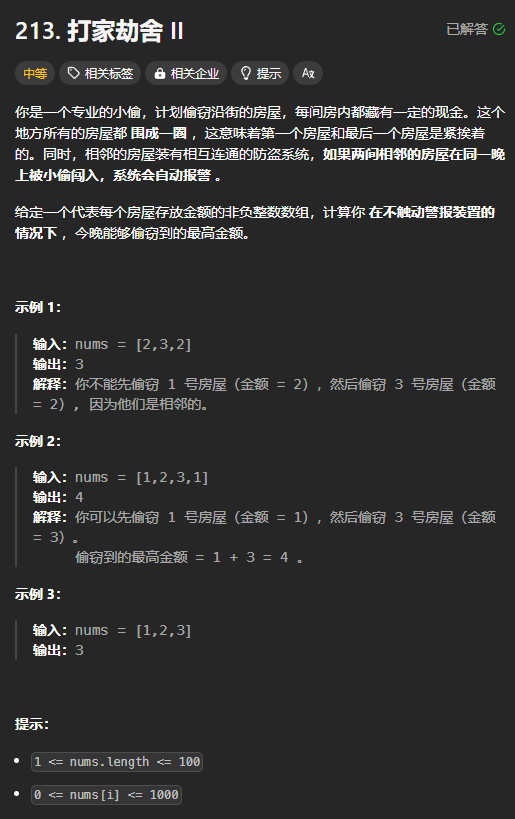
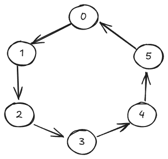

题目链接：[https://leetcode.cn/problems/house-robber-ii/description/](https://leetcode.cn/problems/house-robber-ii/description/)



## 思路
与打家劫舍相比，区别是房屋是围成一个圆的。这造成了最后一个房屋和第一个房屋相邻。



分情况讨论，如果选择了 0 号房屋，那么 n - 1 和 1 号房屋就不能选，就变为了 nums[2..n - 1] 的非环形版本。

如果不选择 0 号房屋，就是 nums[1..n] 的非环形版本。

非环形版本的递推公式是: `dp[i] = dp[i + 1].max(dp[i + 2] + nums[i])`

## 代码
```rust
impl Solution {
    pub fn rob(nums: Vec<i32>) -> i32 {
        fn rob(nums: &[i32]) -> i32 {
            let n = nums.len();
            let mut dp = vec![0; n + 2];

            for i in (0..n).rev() {
                dp[i] = dp[i + 1].max(dp[i + 2] + nums[i]);
            }

            dp[0]
        }

        let n = nums.len();
        // 这里特判是因为下面的 slice 不能 start > end
        if n == 1 {
            return nums[0];
        } else if n == 2 {
            return nums[0].max(nums[1]);
        }

        (nums[0] + rob(&nums[2..n - 1])).max(rob(&nums[1..n]))
    }
}
```


