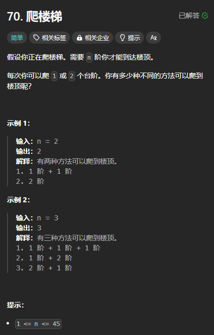

题目链接：[https://leetcode.cn/problems/climbing-stairs/description/](https://leetcode.cn/problems/climbing-stairs/description/)



## 思路
用回溯的思路来思考，定义一个 dfs(i),表示当前处于台阶 i，则当前可以跳到 dfs(i + 1) 或者 dfs(i + 2)，最后，当 i = n 的时候，返回 1，表示这是一种到达楼顶的路径。如果 i = n + 1，返回 0，,说明这不是一个合法的路径。

归的算法：

+ 当前节点到达楼顶的方法数等于 dfs(i + 1) + dfs(i + 2) 

由于这个递归是自底向上计算结果的，所以可以改写为递推：

+ 定义一个数组 dp，dp[i] 表示当前台阶 i 到达楼顶的方法数
+ 递推公式：`dp[i] = dp[i + 1] + dp[i + 2]`

从上述递推公式可以看到， dp[i] 依赖于后面的 dp，所以，我们要倒序遍历。

## 代码
```rust
impl Solution {
    pub fn climb_stairs(n: i32) -> i32 {
        let n = n as usize;
        let mut dp = vec![0; n + 2];
        dp[n] = 1;

        for i in (0..n).rev() {
            dp[i] = dp[i + 1] + dp[i + 2];
        }

        dp[0]
    }
}
```

可以进一步简化空间复杂度，我们只需要用到 dp[i + 1] 和 dp[i + 2]，可以用 2 个变量来存储就可以了：

```rust
impl Solution {
    pub fn climb_stairs(n: i32) -> i32 {
        let n = n as usize;
        let mut dp_i_plus_1 = 1;
        let mut dp_i_plus_2 = 0;

        for i in (0..n).rev() {
            let dp_i = dp_i_plus_1 + dp_i_plus_2;
            dp_i_plus_2 = dp_i_plus_1;
            dp_i_plus_1 = dp_i;
        }

        dp_i_plus_1
    }
}
```

