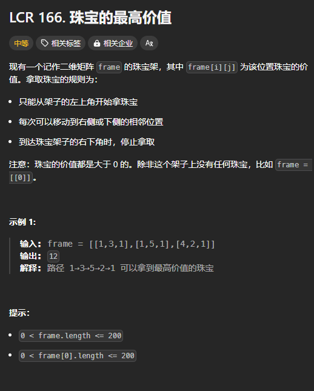

题目链接：[https://leetcode.cn/problems/li-wu-de-zui-da-jie-zhi-lcof/description/](https://leetcode.cn/problems/li-wu-de-zui-da-jie-zhi-lcof/description/)



## 思路
定义 dfs(x, y) 表示当前位于货架的 (x, y) 处，其返回值表示当前节点所能获取到的珠宝最大金额。

有 2 种选择：

+ 移动到右侧：dfs(x, y + 1)，如果 y + 1 == 货架的宽 n，则返回 0
+ 移动到下侧：dfs(x + 1, y)，如果 x + 1 == 货架的高 m, 则返回 0

归的算法：

+ `dfs(x, y) = max(dfs(x, y + 1), dfs(x + 1, y)) + frame[x][y]`

这里，涉及到 2 个参数的 dfs 转换为递推。

我们可以初始化一个二维数组，这个二维数组比 frame 多一行，并且多一列，用于处理递归的边界情况。

dfs(x, y) 就相当于 dp[x][y]。

所以,递推公式为：

+ `dp[x][y] = max(dp[x][y + 1], dp[x + 1][y] + frame[x][y])`

那么，如何遍历呢？

可以用一个二重循环，一个遍历 x，一个遍历 y。对于 x，我们需要知道 dp[x + 1]，所以，需要倒序遍历。

对于 y，我们需要知道 dp[x][y + 1],所以，要倒序遍历 y。

## 代码
```rust
impl Solution {
    pub fn jewellery_value(frame: Vec<Vec<i32>>) -> i32 {
        let m = frame.len();
        let n = frame.first().unwrap().len();

        let mut dp = vec![vec![0; n + 1]; m + 1];
        for x in (0..m).rev() {
            for y in (0..n).rev() {
                dp[x][y] = dp[x][y + 1].max(dp[x + 1][y]) + frame[x][y];
            }
        }

        dp[0][0]
    }
}
```

