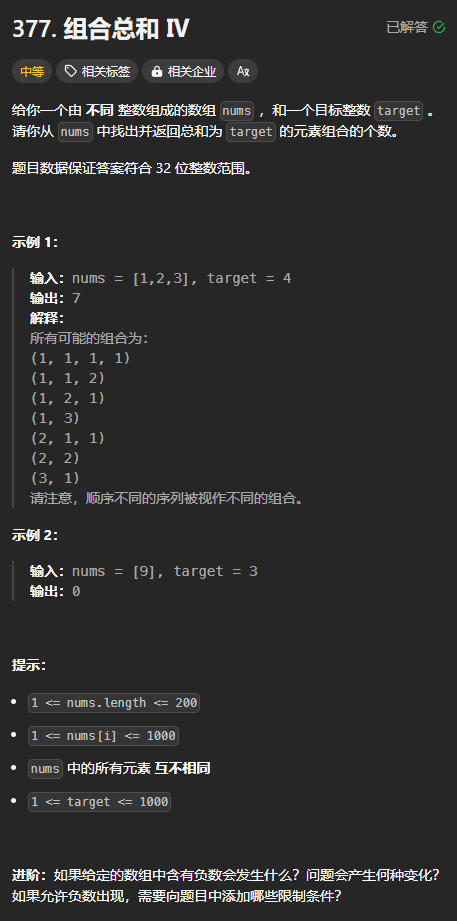

题目链接：[https://leetcode.cn/problems/combination-sum-iv/description/](https://leetcode.cn/problems/combination-sum-iv/description/)



## 思路
首先，了解一下回溯的思路：

定义一个 dfs(sum)，sum 表示当前被选择的元素的总和，返回值表示继续从数组中选择元素，使和为 target 时的选择方案数，然后，遍历 nums 中的每个元素，每个元素都可以选或者不选，如果选 nums[i]，则递归到 dfs(sum + nums[i])，如果不选，则递归到 dfs(sum)。

当 sum == target 的时候，就说明找到了一个合法的方案，返回 1，否则，如果 sum > target，则返回 0，表示没有找到一个合法的方案。

对于 dfs(sum) 来说，dfs(sum) = dfs(sum + nums[i]) + dfs(sum)

我们可以由此将该 dfs 转换为递推：

定义一个 dp 数组，dp[i] 表示当前被选择的元素总和为 sum 时，继续从数组中选择元素，使和为 target 时的选择方案数。根据上面的 dfs，可以得出 `dp[sum] += dp[sum + nums[i]]`

i 最大可以为多少？从上面来看，当 i = target，而 nums[i] 是数组中最大的一个元素的时候，最大值就为 `target + max(nums)`

由于 dp[i] 依赖于后面的元素，所以要倒序遍历 sum，然后，同时要遍历 nums[i], nums[i] 正序遍历倒序遍历都可以。

为什么可以转换为递推？

+ 因为答案的计算只与子节点有关，而不与递归参数 sum 有关

如果这题要求将组成 target 的元素作为答案，那么这题就不能使用递推，而是使用回溯，因为答案与递归参数有关。

## 代码
```rust
impl Solution {
    pub fn combination_sum4(nums: Vec<i32>, target: i32) -> i32 {
        let max = *nums.iter().max().unwrap();
        let mut dp = vec![0; (target + max) as usize + 1];
        dp[target as usize] = 1;

        for sum in (0..=target as usize).rev() {
            for i in 0..nums.len() {
                dp[sum] += dp[sum + nums[i] as usize];
            }
        }

        dp[0]
    }
}
```

## 本质
这个题本质上就是爬楼梯：

[爬楼梯](https://www.yuque.com/cline-mly1u/bgacuc/sci8zipkoke2epcc)

