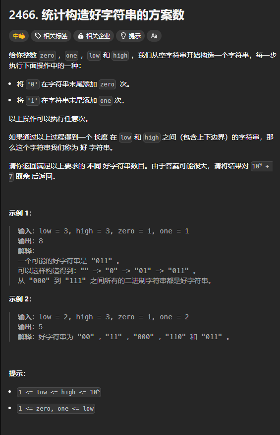

题目链接：[https://leetcode.cn/problems/count-ways-to-build-good-strings/description/](https://leetcode.cn/problems/count-ways-to-build-good-strings/description/)



## 思路
定义一个 dfs(len)，表示当前拼接出来的字符串的长度为 len，返回值表示当前 len 继续拼接 0 或 1，其长度能够位于 low 和 high 之间的方案数。

如果 dfs(len) 选择拼接 0,则递归到 dfs(len + zero)，如果选择拼接 1,则递归到 dfs(len + one)。

如果 len > high，则说明不是一个合法的拼接方案，返回 0。

如果 len >= low && len <= high, 则说明是一个合法的拼接方案，继续拼接，但是继续拼接返回的答案必须加上 1 表示已经有一个合法的方案。

综上所述，`dfs(len) = dfs(len + zero) + dfs(len + one) + if len >= low && len <= high { 1 } else { 0 }`

其 dp[len] 的含义与 dfs(i) 的含义一样，不再赘述。

dp 的最大长度为当 len = high 时，在继续递归，加上 one.max(zero) ，即 high + one.max(zero)。

## 代码
```rust
impl Solution {
    const MOD: usize = 1e9 as usize + 7;
    pub fn count_good_strings(low: i32, high: i32, zero: i32, one: i32) -> i32 {
        let (low, high, zero, one) = (low as usize, high as usize, zero as usize, one as usize);
        
        let mut dp = vec![0; high + zero.max(one) + 1];

        for len in (0..=high).rev() {
            dp[len] = (dp[len + zero] + dp[len + one] + if len >= low && len <= high { 1 } else { 0 }) % Solution::MOD;
        }

        dp[0] as _
    }
}
```

我们可以进一步将 len 的长度分为 2 段，一段为 [low, high]，另一段为 [0, low)，这样的话，就避免了每次循环都作判断：

```rust
impl Solution {
    const MOD: usize = 1e9 as usize + 7;
    pub fn count_good_strings(low: i32, high: i32, zero: i32, one: i32) -> i32 {
        let (low, high, zero, one) = (low as usize, high as usize, zero as usize, one as usize);

        let mut dp = vec![0; high + zero.max(one) + 1];

        for len in (low..=high).rev() {
            dp[len] = (dp[len + zero] + dp[len + one] + 1) % Solution::MOD;
        }
        for len in (0..low).rev() {
            dp[len] = (dp[len + zero] + dp[len + one]) % Solution::MOD;
        }

        dp[0] as _
    }
}
```

