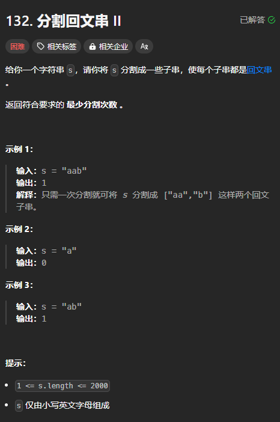
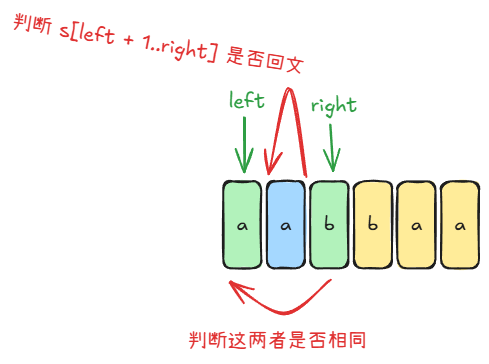

题目链接：[https://leetcode.cn/problems/palindrome-partitioning-ii/description/](https://leetcode.cn/problems/palindrome-partitioning-ii/description/)



## 思路
对于一个区间`[left, right]`，可以枚举要分割的点 i。

定义 `dfs(left, right)` 表示使区间 `[left, right]` 分割成一些子串，这些子串都是回文串的最少分割次数。

当 `left == right` 的时候，只有一个字符，必定是回文串，返回 0.

### 边界条件.
当 `right` 的时候，是空集，返回 0.

### 归的算法
枚举要分割的点 i：

+ 如果 `s[left..=right]` 是回文的，则 `dfs(left, right) = 0`
+ 否则，`dfs(left, right) = min(dfs(left, i) + dfs(i + 1, right)) + 1`

## 代码
下述代码会运行超时：

```rust
impl Solution {
    pub fn min_cut(s: String) -> i32 {
        let s = s.into_bytes();
        let n = s.len();

        let mut dp = vec![vec![0; n + 1]; n + 1];

        for left in (0..n).rev() {
            for right in left + 1..n {
                if Solution::is_palindrome_str(&s[left..=right]) {
                    dp[left][right] = 0;
                } else {
                    dp[left][right] = i32::MAX;
                    for i in left..right {
                        dp[left][right] = dp[left][right].min(dp[left][i] + dp[i + 1][right] + 1);
                    }  
                }
            }
        }

        dp[0][n - 1]
    }

    fn is_palindrome_str(s: &[u8]) -> bool {
        let mut left = 0;
        let mut right = s.len() - 1;
        while left < right {
            if s[left] != s[right] {
                return false;
            }
            left += 1;
            right -= 1;
        }

        true
    }
}
```

超时的原因是

+ 调用了 `is_palindrome_str` 函数 次。

### 判断子字符串是否是回文串
定义一个数组 `is_palindrome_str[left][right]` 表示区间 `s[left, right]` 是否是回文串。

`is_palindrome_str[left][right]` 要是回文串的条件是：



即：

1. 由于回文串的定义是从前读和从后读是一致的，那么就相当于是区间的开头与结尾是否是相同的，即 `s[left] == s[right]`
2. 判断 `s[left + 1..right]` 是否是回文的，即 `is_palindrome_str[left + 1][right - 1] == true`，这相当于判断字符串的“内部”是否是回文的。

综上，`is_palindrome_str[left][right] = is_palindrome_str[left + 1][right - 1] == true && s[left] == s[right] `

边界条件为 `left > right` 的时候，此时返回 true。

为了防止 `right - 1` 溢出，令 `right = right + 1`。

代码：

```rust
impl Solution {
    pub fn min_cut(s: String) -> i32 {
        let s = s.into_bytes();
        let n = s.len();

        let mut is_palindrome_str = vec![vec![true; n + 1]; n + 1];
        for left in (0..n).rev() {
            for right in left..n {
                is_palindrome_str[left][right + 1] = is_palindrome_str[left + 1][right] == true 
                    && s[left] == s[right];
            }
        }

        let mut dp = vec![vec![0; n + 1]; n + 1];

        for left in (0..n).rev() {
            for right in left + 1..n {
                if is_palindrome_str[left][right + 1] {
                    dp[left][right] = 0;
                } else {
                    dp[left][right] = i32::MAX;
                    for i in left..right {
                        dp[left][right] = dp[left][right].min(dp[left][i] + dp[i + 1][right] + 1);
                    }  
                }
            }
        }

        dp[0][n - 1]
    }
}
```

上述代码还是超时了。

原因是时间复杂度是 的，主要是由于枚举分割点造成的。

但是，这种思路只能写成这种了，下面换一个思路。

## 思路二
我们可以固定区间的左端点为 0.

定义 `dfs(right)` 为区间 `[0, right]` 的最小分割次数。

### 归的算法
+ 如果 `s[..=right]` 是回文串，则 `dfs(right) = 0`
+ 否则，则要进行分割。假设分割点为 i（在 index = i 的前面进行分割），则 i 的取值范围是 `[0, right - 1]`，会将区间分割为 `[0, i]` 和 `[i + 1, right]`，对应的分割次数为 `dfs(i)` 和 `???`，我们不能知道 `[i + 1, right]` 需要分割多少次，但是如果 `[i + 1, right]` 为回文串的话，就不需要分割了，则对应的分割次数为 0，此时，`dfs(right) = dfs(i) + 1`。我们一定能够找到一个合适区间 `[i + 1, right]` 的字符串为回文串，因为一个字符就是一个回文串。
    - 由于 `[i + 1, right]` 是回文的不止一个符合条件的 i，所以要在多个符合条件 i 中取一个分割次数最小的

## 代码二
```rust
impl Solution {
    pub fn min_cut(s: String) -> i32 {
        let s = s.into_bytes();
        let n = s.len();

        let mut is_palindrome_str = vec![vec![true; n + 1]; n + 1];
        for left in (0..n).rev() {
            for right in left..n {
                is_palindrome_str[left][right + 1] = is_palindrome_str[left + 1][right] == true 
                    && s[left] == s[right];
            }
        }

        let mut dp = vec![0; n];
        for right in 0..n {
            if is_palindrome_str[0][right + 1] {
                dp[right] = 0;
            } else {
                dp[right] = i32::MAX;
                for i in 0..right {
                    if is_palindrome_str[i + 1][right + 1] {
                        dp[right] = dp[right].min(dp[i] + 1);
                    }
                }
            }
        }

        dp[n - 1]
    }
}
```

注意到第 17 行是可以去除的：

```rust
impl Solution {
    pub fn min_cut(s: String) -> i32 {
        let s = s.into_bytes();
        let n = s.len();

        let mut is_palindrome_str = vec![vec![true; n + 1]; n + 1];
        for left in (0..n).rev() {
            for right in left..n {
                is_palindrome_str[left][right + 1] = is_palindrome_str[left + 1][right] == true 
                    && s[left] == s[right];
            }
        }

        let mut dp = vec![0; n];
        for right in 0..n {
            if !is_palindrome_str[0][right + 1] {
                dp[right] = i32::MAX;
                for i in 0..right {
                    if is_palindrome_str[i + 1][right + 1] {
                        dp[right] = dp[right].min(dp[i] + 1);
                    }
                }
            }
        }

        dp[n - 1]
    }
}
```

