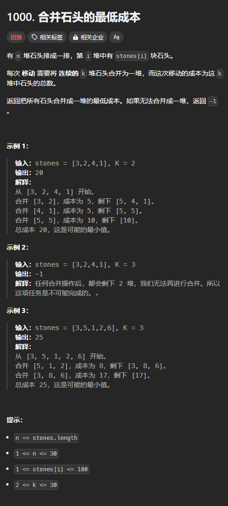
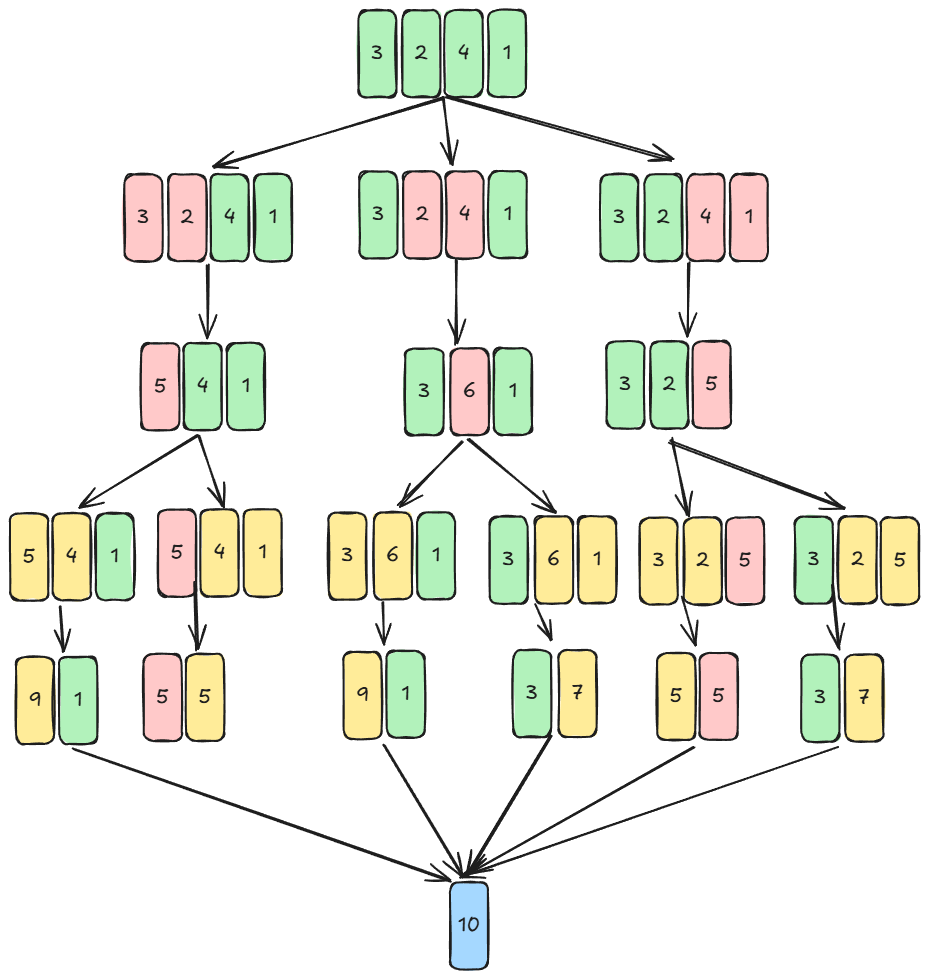
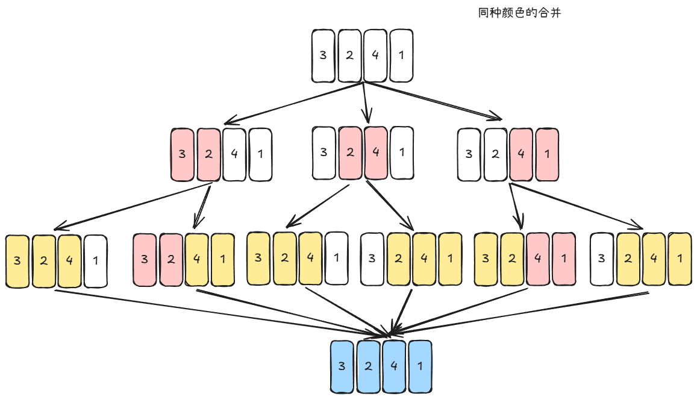
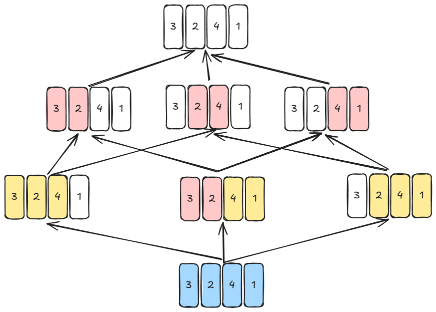

题目链接：[https://leetcode.cn/problems/minimum-cost-to-merge-stones/description/](https://leetcode.cn/problems/minimum-cost-to-merge-stones/description/)



## 思路
首先看一下什么时候返回 -1。

看一下实例 2 返回 -1 的原因是将 3 个元素变为一个之后，只剩下 2 个元素，小于 k = 3，所以返回  -1.

所以，如果 `k > n`，则返回 -1。

每一次合并就相当于减少了 `k - 1` 个元素。假设有 `n` 堆石头，进行了 `m` 次合并，要剩余 1 堆石头，此时有等式 `n - m(k - 1) = 1`，即 `n - 1 = m(k - 1)`。

上式说明，要不返回 -1，则 `n - 1` 要是 `k - 1` 的整数倍，即要 `(n - 1) % (k - 1) == 0` 为 `true`。

---

下图是 `[3, 2, 4, 1]`，`k = 2` 所有可能的合并结果：




从其中可以看到，这题的主要难点在于如何将合并结果计算后“生成”一个新的数组参与下一次合并。

但是，如果换一种表示方法：



上面这种表示方法的成本为同种颜色的石头相加。

从上图中我们可以看到黄颜色的数量有 3 的，我们需要将 3 堆同种颜色的石头合并成一堆，尽管 k = 2。

上图相当于将石头染色的过程。

但是还是不好表示。如果我们将箭头反过来，则好表示了：



上图相当于是将染上的颜色洗掉（逆合并）的过程。

当然，算法要考虑到染色的成本。

每一堆的大小（即一大堆是由多少小堆合并的小堆的数量）可能是多少呢？图中有可能是 1、2、3，这是如何得到的？

我们关注正向的过程：

+ k 小堆合并成一大堆 A，A 包含 `k` 小堆
+ A 和 `k - 1` 小堆再合并成一大堆 B，则 B 总共包含 `k + (k - 1)` 小堆
+ B 再和 `k - 1` 小堆合并成一大堆 C，则 C 中共包含 `k + 2(k - 1)` 小堆

所以，每一堆的大小可能为 `k + x(k - 1)`，但要满足 `k + x(k - 1) < n`，x 的定义域为 `0..` 。

我们将一大堆分为 2 小堆，再对剩下的 2 小堆进行递归，即再将 2 小堆的每一堆分为 2 小堆。

其中一堆的大小可以是 `1、k、...、k + x(k - 1)`，则另一堆就是剩余的石头。为了将 1 这个特殊的元素也纳入递推公式，x 可以从 `-1` 开始。

### 归的算法
定义 `dfs(left, right)` 为将一大堆石头 `[left, right]` 拆分并染色的成本。

+ 枚举最左边一堆的大小为 `size = k + x(k - 1)`，x 的定义域为 `[-1, 正无穷)`，则 `dfs(left, right) = dfs(left, right).min(dfs(left, left + size - 1) + dfs(left + size, right) + 条件判断是否需要加上[sum(stones[left..=right]))]`。

> 上述公式表示将 `[left, right]` 分为 2 堆，一堆为 `[left, left + size - 1]`，另一堆为 `[left + size, right]`，然后总的成本为再将这两堆拆分并染色的最小成本加上 `stones[left..=right].sum()`，只所以要加上这一个额外的常数是因为我们将箭头倒过来了，一开始数据就是有颜色的。
>

需要注意的是，由于我们只保证分割出来的两堆只有一堆是符合公式 `k + x(k - 1)` 的，而另一堆则不一定符合。例如，当 `k = 3, x = 2` 时，堆的大小为 7，如果一堆的大小为 1，则剩下的一堆的大小为 6，不符合公式。这意味着大小为 6 的这一堆石头并没有被染成同一种颜色，所以，我们不需要加上这一大堆石头的成本。

而，如果不符合这一个公式就代表 `(right - left + 1 - 1) % (k - 1) != 0`，所以，可以根据这个来判断是否需要加上染色的成本。

可以用前缀和来优化求和的速度。

### 边界条件
+ 当 `right - left + 1 == k` 的时候，刚好是一次合并，不需要在递归，返回 `sum(stones[left..=right])`
+ 当 `right - left + 1 == 1` 的时候，只有一个元素，不需要合并，所以没有成本，返回 0.

## 代码
```rust
impl Solution {
    pub fn merge_stones(stones: Vec<i32>, k: i32) -> i32 {
        let n = stones.len();
        if (n - 1) % (k as usize - 1) != 0 {
            return -1;
        }
        
        // 前缀和：用于优化求和的速度
        let mut pre_sum = vec![0; n + 1];
        for i in 0..n {
            pre_sum[i + 1] = stones[i] + pre_sum[i];
        }

        let mut dp = vec![vec![0; n]; n];

        for left in (0..n - 1).rev() {
            // 从 left + 1 开始，因为当 left == right 的时候，返回 0，没有计算的必要
            for right in left + 1..n {
                if right - left + 1 == k as usize {
                    // 当 right - left + 1 == k 的时候，返回 sum(stones[left..=right])
                    dp[left][right] = pre_sum[right + 1] - pre_sum[left];
                    continue;
                }

                dp[left][right] = i32::MAX ;
                // 根据 [left, right] 是否符合公式来判断成本
                let cost = if (right - left) % (k as usize - 1) == 0 { pre_sum[right + 1] - pre_sum[left] } else { 0 };
                for x in -1.. {
                    // 一大堆石头的大小
                    let size = (k + x * (k - 1)) as usize;
                    if left + size > right {
                        break;
                    }
                    dp[left][right] = dp[left][right].min(dp[left][left + size - 1] + dp[left + size][right] + cost);
                }
            }
        }

        dp[0][n - 1]
    }
}
```


