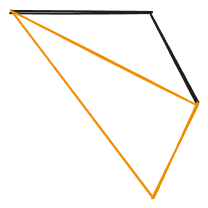

题目链接：[https://leetcode.cn/problems/minimum-score-triangulation-of-polygon/description/](https://leetcode.cn/problems/minimum-score-triangulation-of-polygon/description/)


## 思路
要确定一个三角型相当于确定它的三个顶点。

例如，有下面这个多边形：


如果以 a b 为底边，e 为顶点，则可以确定如下三角形：


然后再对四边形 ebcd 进行类似地操作：



就可以分割出一系列的三角形。

概述一下上面的分割方法：

+ 选取两个顶点作为三角形的 2 个顶点，然后，再从剩余的顶点中选取一个顶点来构成一个三角形
+ 递归处理分割后的两个不相邻的几何图形

我们如何表示分割后的两个不相邻的几何图形呢？

可以这样，利用剩余的几何图形的节点除了分割边之外，其它节点都是相邻的特点，只需要表示出分割边就可以确定一个几何图形。例如：


然后，我们这样编号：


这样的话，就不会出现数组越界之类的问题了。

### 归的算法
定义 `dfs(i, j)` 表示从 `i` 顺时针走到 `j`，然后再从 `j` 走到 `i` 围成的多边形剖分成 `(j - i + 1) - 2` 个三角形所能得到的最小分数。

假设选取的另一个顶点为 k：则有：

+ `dfs(i, j) = dfs(i, j).min(dfs(k, j) + dfs(i, k) + values[i] * values[j] * values[k])`，其中 `k` 的取值范围是 `[i + 1, j - 1]`

### 边界条件
+ 当 `j - i + 1 < 3` 即 `j < i + 2` 的时候，不能构成一个三角形，返回 0。

进一步地，由于要从 `i` 顺时针走到 `j`，则 `j` 一定大于 `i`，那么，`j` 又要小于 `i + 2`，那么，边界条件相当于是 `j = i + 1` 的时候。

## 代码
```rust
impl Solution {
    pub fn min_score_triangulation(values: Vec<i32>) -> i32 {
        let n = values.len();

        let mut dp = vec![vec![i32::MAX; n]; n];
        for i in 0..n - 1 {
            dp[i][i + 1] = 0;
        }

        for i in (0..n).rev() {
            for j in i + 1..n {
                for k in i + 1..j {
                    dp[i][j] = dp[i][j].min(dp[k][j] + dp[i][k] + values[i] * values[j] * values[k]);
                }
            }
        }

        dp[0][n - 1]
    }
}
```

我们注意到，i 至少要为 j 和 k 留 2 个位置，所以，i 可以从 n - 3 开始。

```rust
impl Solution {
    pub fn min_score_triangulation(values: Vec<i32>) -> i32 {
        let n = values.len();

        let mut dp = vec![vec![i32::MAX; n]; n];
        for i in 0..n - 1 {
            dp[i][i + 1] = 0;
        }

        for i in (0..n - 2).rev() {
            for j in i + 1..n {
                for k in i + 1..j {
                    dp[i][j] = dp[i][j].min(dp[k][j] + dp[i][k] + values[i] * values[j] * values[k]);
                }
            }
        }

        dp[0][n - 1]
    }
}
```

还有一种更简洁的写法：

```rust
impl Solution {
    pub fn min_score_triangulation(values: Vec<i32>) -> i32 {
        let n = values.len();

        let mut dp = vec![vec![0; n]; n];

        for i in (0..n - 2).rev() {
            // j 从 i + 2 开始，确保 k 能循环至少一次
            for j in i + 2..n {
                let mut result = i32::MAX;
                for k in i + 1..j {
                    result = result.min(dp[k][j] + dp[i][k] + values[i] * values[j] * values[k]);
                }
                dp[i][j] = result;
            }
        }

        dp[0][n - 1]
    }
}
```

