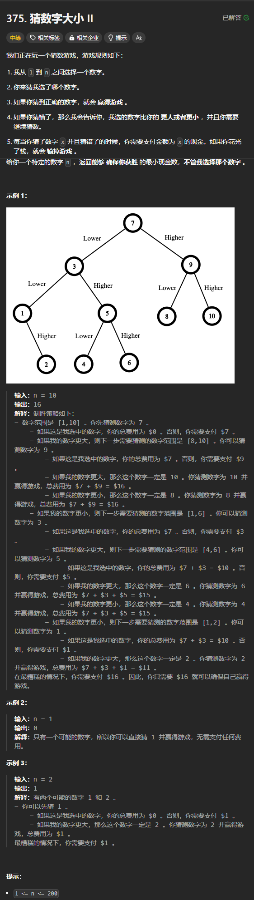

题目链接：[https://leetcode.cn/problems/guess-number-higher-or-lower-ii/description/](https://leetcode.cn/problems/guess-number-higher-or-lower-ii/description/)



## 思路
可以在区间 `[left, right]` 中枚举要猜数。

由于要确保必胜，所以可以假设枚举的数都是不正确的。除非 `[left, right]` 区间中只有一个数。

定义 `dfs(left, right)` 表示在 `[left, right]` 闭区间上选数，能够确保猜对的最小金额数。

假设当前猜的数为 i，有两种情况：

+ i 大了，则 `dfs(left, right) = dfs(left, i - 1) + i`
+ i 小了，则 `dfs(left, right) = dfs(i + 1, right) + i`

由于要确保能够胜利，所以这两种情况取一个最大值。

同时，对于每个不同的 i，`dfs(left, right)` 的结果要取一个最小值。

边界条件：

+ 当 `right == left` 时，区间内只有一个元素，此时返回 0
+ 当数组为空的时候，返回 0

## 代码
```rust
impl Solution {
    pub fn get_money_amount(n: i32) -> i32 {
        let n = n as usize;

        let mut dp = vec![vec![0; n + 1]; n + 1];

        for left in (1..n).rev() {
            // 当 right == left 的时候，答案一定是 0，所以，从 left + 1 开始
            for right in left + 1..=n {
                dp[left][right] = i32::MAX;
                for i in left..right {
                    dp[left][right] = dp[left][right].min(dp[left][i - 1].max(dp[i + 1][right]) + i as i32);
                }
            }
        }

        dp[1][n]
    }
}
```

