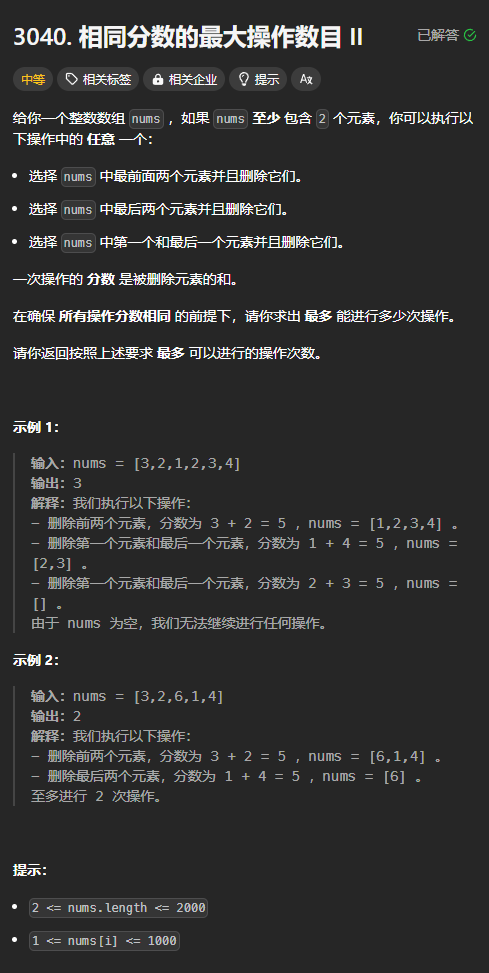

题目链接：[https://leetcode.cn/problems/maximum-number-of-operations-with-the-same-score-ii/description/](https://leetcode.cn/problems/maximum-number-of-operations-with-the-same-score-ii/description/)



## 思路
由题意可知，分数只有 3 个可能的值：

+ `nums[0] + nums[1]`
+ `nums[n - 2] + nums[n - 1]`
+ `nums[0] + nums[n - 1]`

每次操作的分数都要相同，所以，不太适合将分数放到递归参数中去，而是可以将其用一个全局变量来保存下来。

由于删除的元素不固定位置，所以我们定义 `[left, right]` 表示此区间内的元素没有被删除掉。

边界条件为 `right - left + 1 == 1` 即 `right == left` 的时候，因为此时区间内只有一个元素，不能进行操作。此时返回 0.

### 归的算法
定义 `dfs(left, right)` 表示在闭区间 `[left, right]` 中删除与 `SCORE` 全局变量相同的分数的两个元素，所能进行最大的删除数。

+ 如果 `nums[left] + nums[left + 1] == SCORE`，递归到 `dfs(left + 2, right) + 1`，表示删除掉数组中的前两个元素
+ 如果 `nums[right - 1] + nums[right] == SCORE`，递归到 `dfs(left, right - 2) + 1`
+ 如果 `nums[left] + nums[right] == SCORE`，递归到 `dfs(left + 1, right - 1) + 1`

然后让上述三种情况取一个最大值。

在转换成递推的过程中， `right - 2` 会溢出，因此令 `right = right + 1`。

## 代码
```rust
impl Solution {
    pub fn max_operations(nums: Vec<i32>) -> i32 {
        let n = nums.len();

        let mut ans = 0;

        let mut scores = vec![nums[0] + nums[1], nums[n - 2] + nums[n - 1], nums[0] + nums[n - 1]];
        for score in scores {
            let mut dp = vec![vec![0; n + 1]; n + 1];
            for left in (0..n - 1).rev() {
                for right in left + 1..n {
                    if nums[left] + nums[left + 1] == score {
                        dp[left][right + 1] = dp[left][right + 1].max(dp[left + 2][right + 1] + 1);
                    }
                    if nums[right - 1] + nums[right] == score {
                        dp[left][right + 1] = dp[left][right + 1].max(dp[left][right - 1] + 1);
                    }
                    if nums[left] + nums[right] == score {
                        dp[left][right + 1] = dp[left][right + 1].max(dp[left + 1][right] + 1);
                    }
                }
            }
            ans = ans.max(dp[0][n]);
        }

        ans
    }
}
```


