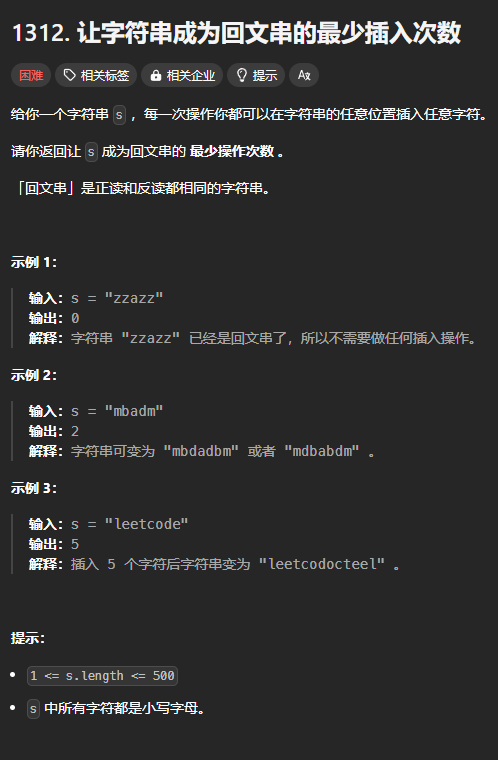
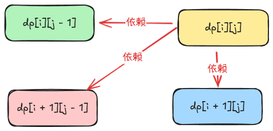

题目链接：[https://leetcode.cn/problems/minimum-insertion-steps-to-make-a-string-palindrome/](https://leetcode.cn/problems/minimum-insertion-steps-to-make-a-string-palindrome/)



## 思路
对于 `s = leetcode`，由于第一个字符 `l` 与最后一个字符 `e` 不一致，所以有 2 种解决办法：

+ 在第一个字符 `l` 的前面插入一个字符 `e`
+ 在最后一个一个字符 `e` 的后面插入 `l`

上面两种不同的选择就会造成操作次数的不同。

### 归的算法
定义 `dfs(left, right)` 表示使 `s[left, right]` 变成回文串所需要的最小插入次数。

+ 如果 `s[left] == s[right]`，说明“已经是回文的”了，不需要插入操作，递归到 `dfs(left + 1, right - 1)`
+ 如果 `s[left] != s[right]`，此时可以有 2 种不同的操作：
    - 在 `left` 的前面插入 `s[right]`，递归到 `dfs(left, right - 1) + 1`
    - 在 `right` 的后面插入 `s[left]`，递归到 `dfs(left + 1, right) + 1`

为了保证答案是最小的插入次数，对上述 2 种情况取一个最小值。

### 边界条件
+ 当 `left == right` 的时候，只有一个字符，一定是回文的，返回 0.
+ 当 `left > right` 的时候，区间为空，返回 0.

## 代码
```rust
impl Solution {
    pub fn min_insertions(s: String) -> i32 {
        let s = s.into_bytes();
        let n = s.len();

        let mut dp = vec![vec![0; n]; n];
        for left in (0..n - 1).rev() {
            for right in left + 1..n {
                if s[left] != s[right] {
                    dp[left][right] = dp[left + 1][right].min(dp[left][right - 1]) + 1;
                } else {
                    dp[left][right] = dp[left + 1][right - 1];
                }
            }
        }

        dp[0][n - 1]
    }
}
```

一个数组空间优化：



为了避免 `dp[left][right - 1]` 将 `dp[left + 1][right - 1]` 覆盖，需要提前将  `dp[left + 1][right - 1]` 保存下来。

```rust
impl Solution {
    pub fn min_insertions(s: String) -> i32 {
        let s = s.into_bytes();
        let n = s.len();

        let mut dp = vec![0; n];
        for left in (0..n - 1).rev() {
            // old = dp[left + 1][right - 1],刚开始的时候 right - 1 = left
            let mut old = dp[left];
            for right in left + 1..n {
                let temp = dp[right];
                if s[left] != s[right] {
                    dp[right] = dp[right].min(dp[right - 1]) + 1;
                } else {
                    dp[right] = old;
                }
                old = temp;
            }
        }

        dp[n - 1]
    }
}
```

