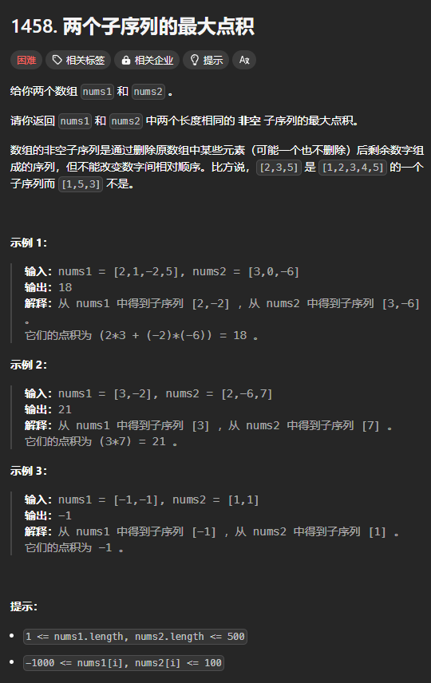

题目链接：[https://leetcode.cn/problems/max-dot-product-of-two-subsequences/description/](https://leetcode.cn/problems/max-dot-product-of-two-subsequences/description/)



## 思路
这题简单来看，如果单纯地应用 dfs 的话，可以记录 s 和 t 中有哪些被选了，哪些没被选，但是的话，这样就无法转换为递推了。

但是，由于点积的特殊性，如果两个都选，我们就可以直接在返回值中加上这 2 个元素的乘积就行了。如果一个选一个不选，那么，就不能添加。

边界条件：

+ 当 `i < 0` 时，只能都不选，返回 -inf，表示没有点积
+ 当 `j < 0` 时，只能都不选，返回 -inf，表示没有点积

对于 `s[i]` 和 `t[j]`，有以下几种选择的情况：

+ 如果 `s[i] * t[j] < 0`，那么说这 2 个数异号，只能选择其中一个或者都不选
    - 只选择 `s[i]`：`dfs(i, j - 1)`
    - 只选择 `t[j`]：`dfs(i - 1, j)`
    - ~~都不选：~~`~~dfs(i - 1, j - 1)~~`，和 《LCS》 一样，`dfs(i - 1, j - 1)` 已经包含在了上述两种情况当中了
+ 否则，就有下面 4 中情况
    - 只选择 `s[i]`：`dfs(i, j - 1)`
    - 只选择 `t[j`]：`dfs(i - 1, j)`
    - 都选：`dfs(i - 1, j - 1) + s[i] * t[j]`
    - ~~都不选：~~`~~dfs(i - 1, j - 1)~~`，和 《LCS》 一样，加上一个正数一定比不加来得好，所以，可以不考虑这种情况
+ **还有一种特殊的情况**：当 dfs 的返回值都没有 `s[i] * t[j]` 大的时候，那么，可以将原来选的都改为不选。

## 代码
```rust
impl Solution {
    pub fn max_dot_product(s: Vec<i32>, t: Vec<i32>) -> i32 {
        let m = s.len();
        let n = t.len();

        let mut dp = vec![vec![i32::MIN / 2; n + 1]; m + 1];
        
        for i in 0..m {
            for j in 0..n {
                if s[i] * t[j] < 0 {
                    dp[i + 1][j + 1] = dp[i + 1][j].max(dp[i][j + 1]);
                } else {
                    dp[i + 1][j + 1] = dp[i + 1][j].max(dp[i][j + 1]).max(dp[i][j] + s[i] * t[j]);
                }

                dp[i + 1][j + 1] = dp[i + 1][j + 1].max(s[i] * t[j]);
            }
        }

        dp[m][n]
    }
}
```

一个数组：

```rust
impl Solution {
    pub fn max_dot_product(s: Vec<i32>, t: Vec<i32>) -> i32 {
        let m = s.len();
        let n = t.len();

        let mut dp = vec![i32::MIN / 2; n + 1];
        
        for i in 0..m {
            let mut prev = dp[0];
            for j in 0..n {
                let old = dp[j + 1];
                if s[i] * t[j] < 0 {
                    dp[j + 1] = dp[j].max(dp[j + 1]);
                } else {
                    dp[j + 1] = dp[j].max(dp[j + 1]).max(prev + s[i] * t[j]);
                }

                dp[j + 1] = dp[j + 1].max(s[i] * t[j]);
                prev = old;
            }
        }

        dp[n]
    }
}
```

