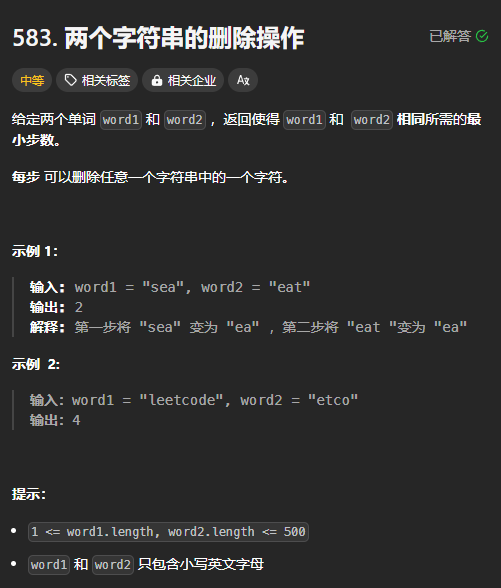

题目链接：[https://leetcode.cn/problems/delete-operation-for-two-strings/description/](https://leetcode.cn/problems/delete-operation-for-two-strings/description/)



## 思路
和 LCS 和编辑距离一样，定义 dfs(i, j) 分别表示当前位于 s[i] 和 t[j]，返回值表示是 s 的前 i 个字符和 t 的前 i 个字符相同所需要的最小步数。

边界条件：

+ 当 `i < 0` 时，需要删除 t 的`j + 1` 个字符
+ 当 `j < 0` 时，需要删除 s 的 `i + 1` 个字符

归的算法：

+ 当 `s[i] == t[j]` 时，都不删除，递归到 `dfs(i -1, j - 1)`
+ 当 `s[i] != t[j]` 时：
    - 可以删除 `s[i]`，递归到 `dfs(i - 1, j) + 1`
    - 可以删除 `t[j]`，递归到 `dfs(i, j - 1) + 1`

转换成递推时，遇到的问题和《编辑距离》是一样的，不再赘述。

## 代码
无空间优化：

```rust
impl Solution {
    pub fn min_distance(s: String, t: String) -> i32 {
        let s = s.into_bytes();
        let t = t.into_bytes();

        let m = s.len();
        let n = t.len();

        let mut dp = vec![vec![0; n + 1]; m + 1];
        for j in 0..n {
            dp[0][j + 1] = j + 1;
        }

        for i in 0..m {
            dp[i + 1][0] = i + 1;
            for j in 0..n {
                if s[i] == t[j] {
                    dp[i + 1][j + 1] = dp[i][j];
                } else {
                    dp[i + 1][j + 1] = dp[i + 1][j].min(dp[i][j + 1]) + 1;
                }
            }
        }

        dp[m][n] as _
    }
}
```

一个数组：

```rust
impl Solution {
    pub fn min_distance(s: String, t: String) -> i32 {
        let s = s.into_bytes();
        let t = t.into_bytes();

        let m = s.len();
        let n = t.len();

        let mut dp = vec![0; n + 1];
        for j in 0..n {
            dp[j + 1] = j + 1;
        }

        for i in 0..m {
            let mut prev = dp[0];
            dp[0] = i + 1;
            for j in 0..n {
                let old = dp[j + 1];
                if s[i] == t[j] {
                    dp[j + 1] = prev;
                } else {
                    dp[j + 1] = dp[j].min(dp[j + 1]) + 1;
                }
                prev = old;
            }
        }

        dp[n] as _
    }
}
```

