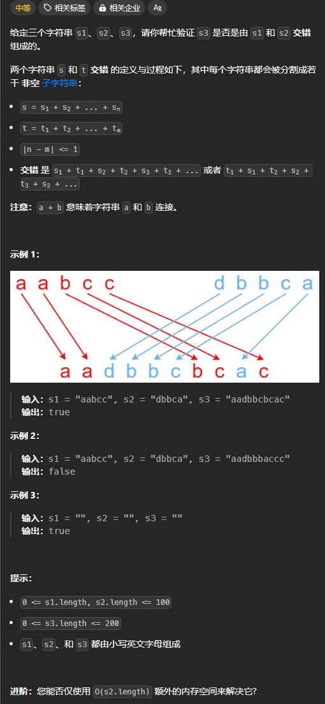
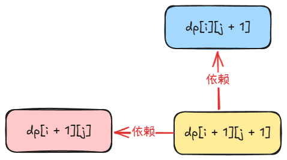

题目链接：[https://leetcode.cn/problems/interleaving-string/description/](https://leetcode.cn/problems/interleaving-string/description/)



## 思路
令 s = s1, t = s2。

这题的主要难点在于如何处理 s 和 t 中相同的字符：


例如，上图中，s 中有 b，t 中也有 b，那么，就需要确定哪些是 s 的，哪些是 t 的。这时候，就可能有多种分法。

设 s、t、s3 的指针分别为 i、j 和 k，由此定义 dfs(i, j, k)，其返回值表示 s 的前 i 个字符和 t 的前 j 个字符在 s3 中是否是交错的。注意，我们要倒序遍历 s、t、s3。

归的算法：

+ 如果 `s3[k] == s[i] || s3[k] == t[j]`
    - 如果 `s[i] == t[j]`，说明此时这个字符为 s  和 t 共有，这时候，可以有 2 种分法：
        * 将 `s3[k]` 判定为是来自 s 中：`dfs(i - 1, j, k - 1)`
        * 将 `s3[k]` 判定为是来自 t 中：`dfs(i, j - 1, k - 1)`
    - 如果 `s[i] != t[j]`，则说明这个时候，只能来自于对应的一个，也是有 2 种情况：
        * `s3[k]` 来自于 `s` 中：`dfs(i - 1, j, k - 1)`
        * `s3[k]` 来自于 `t` 中： `dfs(i, j - 1, k - 1)`
+ 如果 `s3[k] != s[i] && s3[k] != t[j]`，则说明在 s 和 t 中找不到该字符，s3 肯定不是由 s 和 t 交错组成的，直接返回 false

边界条件：

+ 如果 `i < 0`，则需要检查剩下的 t 和 s3 是不是相同的
+ 如果 `j < 0`，则需要检查剩下的 s 和  s3 是不是相同的
+ 如果 `k < 0`，则需要检查 s 和 t 是否还有剩下的元素，即是否 `i < 0 && j < 0`

可以用一个 3 维数组来转换为递推，同时，和编辑距离一样的原因，i、j、k 小于 0 时，只会是 -1，所以我们只需要在 3 个维度添加 3 行或者列就可以用来表示递归的边界条件。

### 空间优化
如果进一步发现，如果 `s.len() + t.len() != s3.len()`,则答案肯定是 false。

但是，如果 `s.len() + t.len() == s3.len()`，则一定有 `i + 1 + j + 1 == k + 1`，即 `i + j + 1 = k`，并且，在递归的过程中也是如此。

所以，我们就可以将递归中的参数 `k` 给去掉，只保留 `i` 和 `j`,然后通过 `i` 和 `j` 就可以确定 `k` 了。

## 代码
无空间优化：

```rust
impl Solution {
    pub fn is_interleave(s: String, t: String, s3: String) -> bool {
        let s = s.into_bytes();
        let t = t.into_bytes();
        let s3 = s3.into_bytes();

        let p = s.len();
        let q = t.len();
        let r = s3.len();

        let mut dp = vec![vec![vec![false; r + 1]; q + 1]; p + 1];

        // 初始化 i < 0 的边界情况
        // 检查剩下的 t 和 s3 是不是相同的
        for j in 0..q {
            for k in 0..r {
                dp[0][j + 1][k + 1] = t[..=j] == s3[..=k];
            }
        }
        // 初始化 j < 0 的情况
        // 检查剩下的 s 和 s3 是不是相同的
        for i in 0..p {
            for k in 0..r {
                dp[i + 1][0][k + 1] = s[..=i] == s3[..=k];
            }
        }
        // 初始化 k < 0 的情况
        for i in 0..p {
            for j in 0..q {
                dp[i + 1][j + 1][0] = i == 0 && j == 0;
            }
        }
        
        // 上述的初始化过程遗漏了 dp[0][0][0]
        dp[0][0][0] = true;

        for i in 0..p {
            for j in 0..q {
                for k in 0..r {
                    if s3[k] == s[i] || s3[k] == t[j] {
                        if s[i] == t[j] {
                            // 此时， s3[k] 有可能来源于 s 或者 t
                            // 所以，用 |= 来进行运算
                            // 来源于 s
                            dp[i + 1][j + 1][k + 1] |= dp[i][j + 1][k];
                            // 来源于 t
                            dp[i + 1][j + 1][k + 1] |= dp[i + 1][j][k];
                        } else if s3[k] == s[i] {
                            // 只能来源于 s，所以，直接赋值
                            dp[i + 1][j + 1][k + 1] = dp[i][j + 1][k];
                        } else {
                            // 只能来源于 t，所以，直接赋值
                            dp[i + 1][j + 1][k + 1] = dp[i + 1][j][k];
                        }
                    } else {
                        dp[i + 1][j + 1][k + 1] = false;
                    }
                }
            }
        }

        dp[p][q][r]
    }
}
```

空间优化（初步）：

```rust
impl Solution {
    pub fn is_interleave(s: String, t: String, s3: String) -> bool {
        if s.len() + t.len() != s3.len() {
            return false;
        }
        
        let s = s.into_bytes();
        let t = t.into_bytes();
        let s3 = s3.into_bytes();

        let p = s.len();
        let q = t.len();

        let mut dp = vec![vec![false; q + 1]; p + 1];

        // 初始化 i == -1 的边界情况
        // 此时 k = -1 + j + 1
        // 检查剩下的 t 和 s3 是不是相同的
        for j in 0..q {
            dp[0][j + 1] = t[..=j] == s3[..=j];
        }

        // 初始化 j == -1 的情况
        // 此时 k = -1 + i + 1
        // 检查剩下的 s 和 s3 是不是相同的
        for i in 0..p {
            dp[i + 1][0] = s[..=i] == s3[..=i];
        }

        // 上面初始化过程遗漏了左上角的 dp[0][0]
        // 此时 i == -1 && j == -1 则有 k = -1 + -1 + 1 = -1
        dp[0][0] = true;
        
        for i in 0..p {
            for j in 0..q {
                if s3[i + j + 1] == s[i] || s3[i + j + 1] == t[j] {
                    if s[i] == t[j] {
                        // 此时， s3[i + j] 有可能来源于 s 或者 t
                        // 所以，用 |= 来进行运算
                        // 来源于 s
                        dp[i + 1][j + 1] |= dp[i][j + 1];
                        // 来源于 t
                        dp[i + 1][j + 1] |= dp[i + 1][j];
                    } else if s3[i + j + 1] == s[i] {
                        // 只能来源于 s，所以，直接赋值
                        dp[i + 1][j + 1] = dp[i][j + 1];
                    } else {
                        // 只能来源于 t，所以，直接赋值
                        dp[i + 1][j + 1] = dp[i + 1][j];
                    }
                } else {
                    dp[i + 1][j + 1] = false;
                }
            }
        }

        dp[p][q]
    }
}
```

从上述的递推公式可以看出 dp 数组的依赖关系：



上述依赖关系我们可以很简便地简化为一个数组：

```rust
impl Solution {
    pub fn is_interleave(s: String, t: String, s3: String) -> bool {
        if s.len() + t.len() != s3.len() {
            return false;
        }
        
        let s = s.into_bytes();
        let t = t.into_bytes();
        let s3 = s3.into_bytes();

        let p = s.len();
        let q = t.len();

        let mut dp = vec![false; q + 1];

        // 初始化 i == -1 的边界情况
        // 此时 k = -1 + j + 1
        // 检查剩下的 t 和 s3 是不是相同的
        for j in 0..q {
            dp[j + 1] = t[..=j] == s3[..=j];
        }

        // 上面初始化过程遗漏了左上角的 dp[0]
        // 此时 i == -1 && j == -1 则有 k = -1 + -1 + 1 = -1
        dp[0] = true;
        
        for i in 0..p {
            // 初始化 j == -1 的情况
            // 此时 k = -1 + i + 1
            // 检查剩下的 s 和 s3 是不是相同的
            dp[0] = s[..=i] == s3[..=i];
            
            for j in 0..q {
                if s3[i + j + 1] == s[i] || s3[i + j + 1] == t[j] {
                    if s[i] == t[j] {
                        // 此时， s3[i + j] 有可能来源于 s 或者 t
                        // 所以，用 |= 来进行运算
                        // 来源于 s
                        dp[j + 1] |= dp[j + 1];
                        // 来源于 t
                        dp[j + 1] |= dp[j];
                    } else if s3[i + j + 1] == s[i] {
                        // 只能来源于 s，所以，直接赋值
                        dp[j + 1] = dp[j + 1];
                    } else {
                        // 只能来源于 t，所以，直接赋值
                        dp[j + 1] = dp[j];
                    }
                } else {
                    dp[j + 1] = false;
                }
            }
        }

        dp[q]
    }
}
```

上述代码有一些没有意义的代码，去除后：

```rust
impl Solution {
    pub fn is_interleave(s: String, t: String, s3: String) -> bool {
        if s.len() + t.len() != s3.len() {
            return false;
        }
        
        let s = s.into_bytes();
        let t = t.into_bytes();
        let s3 = s3.into_bytes();

        let p = s.len();
        let q = t.len();

        let mut dp = vec![false; q + 1];

        // 初始化 i == -1 的边界情况
        // 此时 k = -1 + j + 1
        // 检查剩下的 t 和 s3 是不是相同的
        for j in 0..q {
            dp[j + 1] = t[..=j] == s3[..=j];
        }

        // 上面初始化过程遗漏了左上角的 dp[0]
        // 此时 i == -1 && j == -1 则有 k = -1 + -1 + 1 = -1
        dp[0] = true;
        
        for i in 0..p {
            // 初始化 j == -1 的情况
            // 此时 k = -1 + i + 1
            // 检查剩下的 s 和 s3 是不是相同的
            dp[0] = s[..=i] == s3[..=i];
            
            for j in 0..q {
                if s3[i + j + 1] == s[i] || s3[i + j + 1] == t[j] {
                    if s[i] == t[j] {
                        // 来源于 t
                        dp[j + 1] |= dp[j];
                    } else if s3[i + j + 1] != s[i] {
                        dp[j + 1] = dp[j];
                    }
                } else {
                    dp[j + 1] = false;
                }
            }
        }

        dp[q]
    }
}
```

同时，检查 s 或者 t 是否与 s3 相同也是可以优化的：

如果我们已经算出了 s[..=i-1] 是否与 s3[..i - 1] 是否相同，并保存在了 dp[j] 中，我们现在只需要判断 s[i] 是否等于 s3[i] 相等，并且前面的字符是否相等就可以了。

下面是进一步优化后的代码：

```rust
impl Solution {
    pub fn is_interleave(s: String, t: String, s3: String) -> bool {
        if s.len() + t.len() != s3.len() {
            return false;
        }
        
        let s = s.into_bytes();
        let t = t.into_bytes();
        let s3 = s3.into_bytes();

        let p = s.len();
        let q = t.len();

        let mut dp = vec![false; q + 1];

        // 下面的初始化过程遗漏了左上角的 dp[0]
        // 此时 i == -1 && j == -1 则有 k = -1 + -1 + 1 = -1
        dp[0] = true;

        // 初始化 i == -1 的边界情况
        // 此时 k = -1 + j + 1
        // 检查剩下的 t 和 s3 是不是相同的
        for j in 0..q {
            dp[j + 1] = dp[j] && t[j] == s3[j];
        }   
        
        for i in 0..p {
            // 初始化 j == -1 的情况
            // 此时 k = -1 + i + 1
            // 检查剩下的 s 和 s3 是不是相同的
            dp[0] &= s[i] == s3[i];
            
            for j in 0..q {
                if s3[i + j + 1] == s[i] || s3[i + j + 1] == t[j] {
                    if s[i] == t[j] {
                        dp[j + 1] |= dp[j];
                    } else if s3[i + j + 1] != s[i] {
                        dp[j + 1] = dp[j];
                    }
                } else {
                    dp[j + 1] = false;
                }
            }
        }

        dp[q]
    }
}
```

