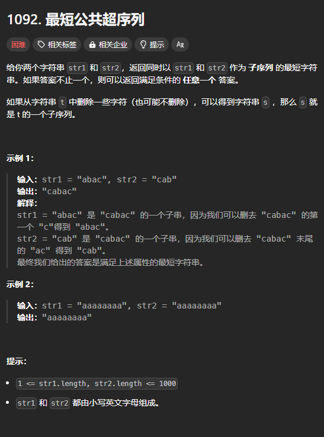
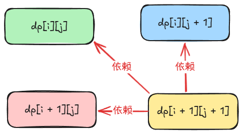

题目链接：[https://leetcode.cn/problems/shortest-common-supersequence/description/](https://leetcode.cn/problems/shortest-common-supersequence/description/)



## 思路
令 s = str1，t = str2。

如果我们倒序遍历 s 和 t，那么，可以断言答案的最后一个字符一定来源于 s 或者 t 的最后一个字符。

那么，这时候就有 3 种情况：

+ 答案的最后一个字符来源于 s
+ 答案的最后一个字符来源于 t
+ 如果 s 和 t 的最后一个字符相同，那么答案的最后一个字符就等于该字符，并且相当于同时来源于 2 者

所以，我们可以定义递归函数 dfs(i, j)，分别当前 s 和 t 的最后一个字符为 `s[i]` 和 `t[j]`，返回值表示 s 的前 i 个字符和 t 的前 j 个字符的最短公共超序列。

归的算法：

+ 如果 `s[i] == t[j]`，则答案的最后一个字符一定是 `s[i]`，同时，递归到 `dfs(i - 1, j - 1) + s[i]`
+ 如果 `s[i] != t[j]`，则答案的最后一个字符可能是 `s[i]` 也可能是 `t[j]`:
    - 假设是 `s[i]`，则答案为 `dfs(i - 1, j) + s[i]`
    - 假设是 `t[j]`，则答案为 `dfs(i, j - 1) + t[i]`
    - 由于要求答案最短，所以要将 2 者取一个最小值

边界条件：

+ 如果 `i < 0`，则答案的最后一个字符肯定是 t 的最后一个字符，所以答案为 t 剩下的所有字符
+ 如果 `j < 0`，同理，答案为 s 剩下的所有字符

## 代码
下面这个代码会爆内存：

```rust
impl Solution {
    pub fn shortest_common_supersequence(str1: String, str2: String) -> String {
        let s = str1.chars().collect::<Vec<_>>();
        let t = str2.chars().collect::<Vec<_>>();

        let m = s.len();
        let n = t.len();

        let mut dp = vec![vec!["".to_string(); n + 1]; m + 1];
        
        // 初始化 i < 0 的时候
        // 此时，返回 t 剩余的所有字符
        for j in 0..n {
            dp[0][j + 1] = str2[..=j].to_string();
        }

        // 初始化 j < 0 的时候
        // 此时，返回 s 剩余的所有字符
        for i in 0..m {
            dp[i + 1][0] = str1[..=i].to_string();
        }

        for i in 0..m {
            for j in 0..n {
                if s[i] == t[j] {
                    // 最后一个字符一定“同时”来源于 s[i] 和 t[j]
                    dp[i + 1][j + 1] = dp[i][j].clone() + &s[i].to_string();
                } else {
                    // 最后一个字符可能来源于 s[i] 或者 t[j]
                    dp[i + 1][j + 1] = if dp[i][j + 1].len() < dp[i + 1][j].len() {
                        // 来源于 s[i]
                        dp[i][j + 1].clone() + &s[i].to_string()
                    } else {
                        // 来源于 t[j]
                        dp[i + 1][j].clone() + &t[j].to_string()
                    }
                }
            }
        }

        dp[m][n].clone()
    }
}
```

可以尝试使用一维数组来节省内存：



```rust
impl Solution {
    pub fn shortest_common_supersequence(str1: String, str2: String) -> String {
        let s = str1.chars().collect::<Vec<_>>();
        let t = str2.chars().collect::<Vec<_>>();

        let m = s.len();
        let n = t.len();

        let mut dp = vec!["".to_string(); n + 1];
        
        // 初始化 i < 0 的时候
        // 此时，返回 t 剩余的所有字符
        for j in 0..n {
            dp[j + 1] = str2[..=j].to_string();
        }

        for i in 0..m {
            let mut prev = dp[0].clone();

            // 初始化 j < 0 的时候
            // 此时，返回 s 剩余的所有字符
            dp[0] = str1[..=i].to_string();
            for j in 0..n {
                let old = dp[j + 1].clone();
                if s[i] == t[j] {
                    // 最后一个字符一定“同时”来源于 s[i] 和 t[j]
                    dp[j + 1] = prev + &s[i].to_string();
                } else {
                    // 最后一个字符可能来源于 s[i] 或者 t[j]
                    dp[j + 1] = if dp[j + 1].len() < dp[j].len() {
                        // 来源于 s[i]
                        dp[j + 1].clone() + &s[i].to_string()
                    } else {
                        // 来源于 t[j]
                        dp[j].clone() + &t[j].to_string()
                    }
                }
                prev = old;
            }
        }

        dp[n].clone()
    }
}
```

这时候，通过了，但是耗时很长，有很大一个原因是调用了太多的 clone 和 to_string。

## 空间优化
假设 `dp[i][j]` 的含义是 s 的前 i 个字符和 t 的前 j 个字符构成的最短公共超序列的长度，那么我们再来看原来的归的算法和现在归的算法：

原来的：

> + 如果 `s[i] == t[j]`，则答案的最后一个字符一定是 `s[i]`，同时，递归到 `dfs(i - 1, j - 1) + s[i]`
> + 如果 `s[i] != t[j]`，则答案的最后一个字符可能是 `s[i]` 也可能是 `t[j]`:
>     - 假设是 `s[i]`，则答案为 `dfs(i - 1, j) + s[i]`
>     - 假设是 `t[j]`，则答案为 `dfs(i, j - 1) + t[i]`
>     - 由于要求答案最短，所以要将 2 者取一个最小值
>

现在的：

+ 如果 `s[i] == t[j]`，则答案的最后一个字符一定是 `s[i]`，同时，递归到 `dfs(i - 1, j - 1) + 1`
+ 如果 `s[i] != t[j]`，则答案的最后一个字符可能是 `s[i]` 也可能是 `t[j]`:
    - 假设是 `s[i]`，则答案为 `dfs(i - 1, j) + 1`
    - 假设是 `t[j]`，则答案为 `dfs(i, j - 1) + 1`
    - 由于要求答案最短，所以要将 2 者取一个最小值

现在，我们尝试从 dp 数组中“还原”出答案：

+ 如果 `dp[i][j] == dp[i - 1][j - 1] + 1`，说明答案的当前的字符为 `s[i]`
+ 如果 `dp[i][j] == dp[i - 1][j] + 1`，说明答案的当前的字符为 `s[i]`
+ 如果 `dp[i][j] == dp[i][j - 1] + 1`，则说明答案的当前的字符为 `t[j]`

但是，还有一个问题，如果 `dp[i][j - 1] == dp[i - 1][j - 1]`,那么，答案的当前字符是 `s[i]` 还是 `t[j]`？

这是上述“还原”算法不能解决的问题。

所以，我们还是要模拟构造这个 dp 数组的过程：

+ 如果 `s[i] == t[j]`，则答案的最后一个字符一定是 `s[i]`，那么，下一个递归过程一定是 `dfs(i - 1, j - 1)`
+ 如果 `s[i] != t[j]`，则有 2 种情况，此时，我们需要看 `dp[i - 1][j]` 和 `dp[i][j - 1]` 谁更小:
    - 如果 `dp[i - 1][j] < dp[i][j - 1]`，则答案的最后一个字符为 `s[i]`，那么，下一个递归过程是 `dfs(i - 1, j)`
    - 否则，答案的最后一个字符为 `t[j]`，下一个递归过程为 `dfs(i, j - 1)`

我们从 `dp[m][n]` 开始构造，那么，我们会发现，构造了答案之后，“前进方向”是确定的。所以，我们不需要用一个二重循环来枚举所有可能的 i 和 j 的组合。

上述的还原算法还有一个问题没有解决，递归的边界条件。

由于还原算法的前进方向是确定的，所以，当到达递归边界的时候，i 或者 j 就会小于 0，而另一个索引不一定为小于 0。如果不小于 0，则说明其中一个还有剩余，而剩余的字符串一定是在答案的前面，所以，只需要将其和上述还原算法构造出来的字符串拼接起来就可以了。

### 代码
```rust
impl Solution {
    pub fn shortest_common_supersequence(str1: String, str2: String) -> String {
        let s = str1.chars().collect::<Vec<_>>();
        let t = str2.chars().collect::<Vec<_>>();

        let m = s.len();
        let n = t.len();

        let mut dp = vec![vec![0; n + 1]; m + 1];
        
        // 初始化 i < 0 的时候
        // 此时，返回 t 剩余的所有字符
        for j in 0..n {
            // t[..=j] 的长度为 j + 1
            dp[0][j + 1] = j + 1;
        }

        // 初始化 j < 0 的时候
        // 此时，返回 s 剩余的所有字符
        for i in 0..m {
            // s[..=i] 的长度为 i + 1
            dp[i + 1][0] = i + 1;
        }

        for i in 0..m {
            for j in 0..n {
                if s[i] == t[j] {
                    // 最后一个字符一定“同时”来源于 s[i] 和 t[j]
                    dp[i + 1][j + 1] = dp[i][j] + 1;
                } else {
                    // 最后一个字符可能来源于 s[i] 或者 t[j]
                    dp[i + 1][j + 1] = dp[i + 1][j].min(dp[i][j + 1]) + 1;
                }
            }
        }

        // “还原”答案
        let mut ans = vec![];
        let mut i = m - 1;
        let mut j = n - 1;
        while i as i32 >= 0 && j as i32 >= 0 {
            if s[i] == t[j] {
                // 此时，答案的最后一个字符一定是 s[i]
                ans.push(s[i]);
                // 下一个递归过程就是 dfs(i - 1, j - 1)
                i -= 1;
                j -= 1;
            } else if dp[i][j + 1] < dp[i + 1][j] {
                // 此时，答案的最后一个字符是 s[i]
                ans.push(s[i]);
                // 下一个递归过程是 dfs(i - 1, j)
                i -= 1;
            } else {
                // 答案的最后一个字符是 t[j]
                ans.push(t[j]);
                // 下一个递归过程是 dfs(i, j - 1)
                j -= 1;
            }
        }

        // 解决递归边界的问题
        str1[..i + 1].to_string() + &str2[..j + 1] + &String::from_iter(ans.into_iter().rev())
    }
}
```

这个算法不仅节省了空间，而且由于没有大量调用 to_string 和 clone，所以其时间复杂度也很低。

