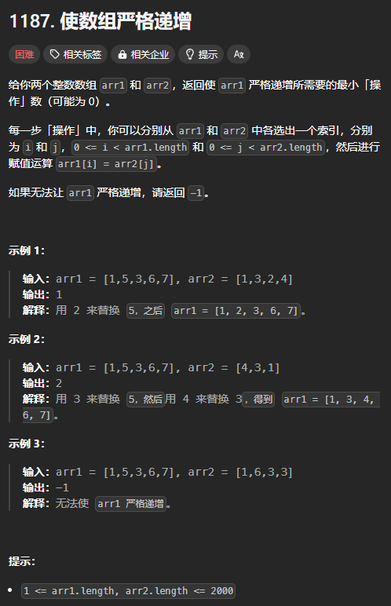
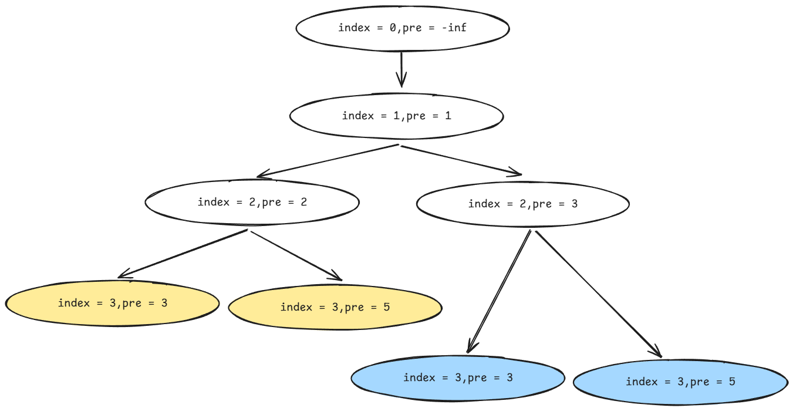

题目链接：[https://leetcode.cn/problems/make-array-strictly-increasing/description/](https://leetcode.cn/problems/make-array-strictly-increasing/description/)



## 思路（选或不选）
为了使序列递增，对于 arr1 中的两个紧邻的数 `a` 和 `b` 有下面 4 中情况：

+ 如果 `a < b`，则当前序列已经是递增的了。但是，为了给后面的元素留下充足的空间，仍然可以尝试将 `b` 替换为 arr2 中比 `b` 小但是比 `a` 大的数，最理想的情况是刚好等于 `a + 1`，所以，这里有两种情况：
    - 将 `b` 替换为 arr2 中刚好大于 `a` 的数
    - 不替换 `b`
+ 如果 `a >= b`，则必须将 `b` 替换为一个更大的数，如果没有找到更大的数，就返回 inf 表示无法完成

为了能在递归的过程中进行比较，我们可以将 a 当做参数进行传递。然后使用 index 表示当前 b 的下标。

当 b 为 arr1 的第一个数的时候，它的前面没有 a，所以，可以假设第一个数的前面是 -inf，这样可以避免特殊处理。

### 记忆化搜索
假设 `arr1 = [1, 3, 5, ...]`，`arr2 = [2, 3]`。则对于 3 可以替换或者不替换：

+ 替换：`dfs(index = 2, pre = 2)`
+ 不替换：`dfs(index = 2, pre = 3)`

对于 5 而言同样有上述两种情况，但是由于 3 的情况有两种，则对于 5 的两种情况则会调用 2 次，造成重复，此时可以用记忆化搜索来优化时间复杂度。



### 代码
```rust
use std::collections::HashMap;

impl Solution {
    pub fn make_array_increasing(arr1: Vec<i32>, mut arr2: Vec<i32>) -> i32 {
        // 返回使 arr1[index..] 严格递增的最小操作数
        fn dfs(index: usize, pre: i32, arr1: &[i32], arr2: &[i32], cache: &mut HashMap<(usize, i32), i32>) -> i32 {
            if index == arr1.len() {
                return 0;
            }

            let key = (index, pre);
            if cache.contains_key(&key) {
                return cache[&key];
            }

            let mut result = i32::MAX;

            // 必须进行替换
            if arr1[index] <= pre {
                match arr2.binary_search(&(pre + 1)) {
                    Ok(i) | Err(i) if i != arr2.len() => result = result.min(dfs(index + 1, arr2[i], arr1, arr2, cache)),
                    // arr2 中没有比 pre 大的数，返回 inf
                    _ => return i32::MAX / 2,
                }
                // 加一是因为替换操作
                return result + 1;
            }

            // 可以将 arr1[index] 减小也可以不变
            // 减小
            match arr2.binary_search(&(pre + 1)) {
                Ok(i) | Err(i) if i != arr2.len() && arr2[i] < arr1[index] => result = result.min(dfs(index + 1, arr2[i], arr1, arr2, cache)) + 1,
                // 没有比 pre 大的数或者有但是比 arr1[index] 还要大，则没有替换的必要
                _ => {}
            }
            // 不变
            result = result.min(dfs(index + 1, arr1[index], arr1, arr2, cache));

            cache.insert(key, result);
            result  
        }

        arr2.sort_unstable();
        let result = dfs(0, i32::MIN, &arr1, &arr2, &mut HashMap::new());
        if result < i32::MAX / 2 { result } else { -1 }
    }
}
```


