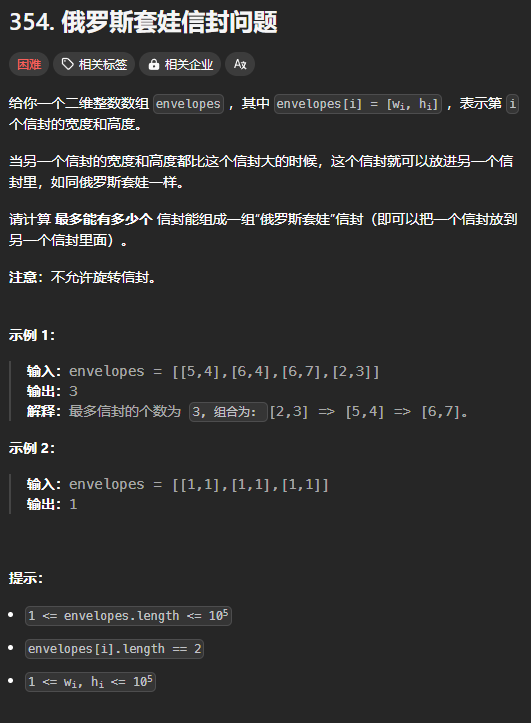

题目链接：[https://leetcode.cn/problems/russian-doll-envelopes/description/](https://leetcode.cn/problems/russian-doll-envelopes/description/)



## 思路一
选择的红包没有顺序的限制，可以以任意顺序选择。

所以，可以事先将信封按照宽度进行排序，这就使我们遍历信封的时候，可以保证宽度是非递减的，这样的话，只需要确保宽度是严格递增的并且高度也是严格递增的，后面的信封就可以“套”住前面的信封。

### 代码
```rust
impl Solution {
    pub fn max_envelopes(mut envelopes: Vec<Vec<i32>>) -> i32 {
        envelopes.sort_unstable_by(|a, b| a[0].cmp(&b[0])));

        let n = envelopes.len();
        let mut dp = vec![0; n];

        for i in 0..n {
            for j in 0..i {
                if envelopes[j][0] != envelopes[i][0] && envelopes[j][1] < envelopes[i][1] {
                    dp[i] = dp[i].max(dp[j]);
                }
            }
            dp[i] += 1;
        }

        dp.into_iter().max().unwrap()
    }
}
```

但是，上述的代码会超时，因为数组的长度最长可以到达 100000。

而这是 的做法就会超时。

### 思路二
思路二的妙就妙在它的排序上：

+ 先按照宽度进行升序排序
+ 如果宽度相同，则按照高度**降序**排序

然后，对高度求 LIS 的长度。将高度降序排序后，可以保证对高度求 LIS 的时候，相同宽度的信封只会被选择一次。同时，对高度求 LIS 的时候，选择出来的宽度也是严格递增的。

cool。

总结一下，这个思路的思路主要是将原本两个相互影响的变量通过排序变成了一个变量。

### 代码
```rust
impl Solution {
    pub fn max_envelopes(mut envelopes: Vec<Vec<i32>>) -> i32 {
        envelopes.sort_unstable_by(|a, b| a[0].cmp(&b[0]).then(b[1].cmp(&a[1])));

        let n = envelopes.len();

        // 对高度求 LIS
        let mut g = vec![envelopes[0][1]];
        for i in 1..n {
            if envelopes[i][1] > *g.last().unwrap() {
                g.push(envelopes[i][1]);
            } else {
                match g.binary_search(&envelopes[i][1]) {
                    Ok(index) | Err(index) => g[index] = envelopes[i][1]
                }
            }
        }
        g.len() as _
    }
}
```

