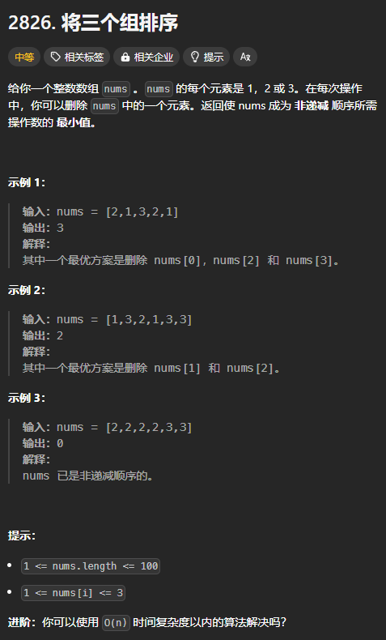

题目链接：[https://leetcode.cn/problems/sorting-three-groups/description/](https://leetcode.cn/problems/sorting-three-groups/description/)



## 思路一
这题可以说和 LIS 一模一样，区别仅是：

1. 递增子序列可以有重复的元素
2. 元素只有 3 种

思路一使用子集型回溯的思路来进行解决：

+ 可以先找出 nums 中的 LIS（可以包含重复元素），然后用原来的长度减去 LIS 的长度就得到了最小操作数

### 代码
```rust
impl Solution {
    pub fn minimum_operations(nums: Vec<i32>) -> i32 {
        let n = nums.len();

        let mut dp = vec![0; n];

        let mut ans = 0;
        for i in (0..n).rev() {
            for j in i + 1..n {
                if nums[j] >= nums[i] {
                    dp[i] = dp[i].max(dp[j]);
                }
            }
            dp[i] += 1;
            ans = ans.max(dp[i]);
        }

        (n - ans) as _
    }
}
```

## 思路二
贯穿这题的思路是寻找 nums 的 LIS，然后使用 nums.len() 减去该值就是答案。

所以，这题的思路可以说是和 LIS 是一样的。

我们可以利用求 LIS 贪心的思路，但是，我们进行替换的时候，不是找到第一个大于等于 nums[i] 的数，而是找到第一个大于等于 `nums[i] + 1` 的数，这是因为 g 数组中应该允许重复的元素出现。

### 代码
```rust
impl Solution {
    pub fn minimum_operations(nums: Vec<i32>) -> i32 {
        let n = nums.len();
        let mut g = vec![nums[0]];

        // 标准库中没有类似于 upper_bound 这种函数，所以，自己实现一个
        fn upper_bound(nums: &[i32], target: i32) -> usize {
            let n = nums.len();
            let mut left = 0;
            let mut right = n - 1;

            // 相当于找 target + 1 的 lower_bound
            let target = target + 1;
            
            // 循环不变量：
            // nums[left - 1] 总是小于 target
            // nums[right + 1] 总是大于等于 target
            while left as i32 <= right as i32 {
                let mid = (left + right) / 2;
                if nums[mid] >= target {
                    right = mid - 1;
                } else {
                    left = mid + 1;
                }
            }

            // 循环结束的时候，有 right + 1 = left
            left
        }

        for i in 1..n {
            if nums[i] >= *g.last().unwrap() {
                g.push(nums[i]);
            } else {
                // 找到第一个大于等于 nums[i] + 1 的元素，然后替换它
                let index = upper_bound(&g, nums[i]);
                g[index] = nums[i];
            }
        }

        (n - g.len()) as _
    }
}
```

nums 还有一个性质我们没有用到：

+ nums 中只含有 3 中元素

所以，g 中也只有 3 种元素，我们可以只维护每种元素在 g 中的个数，然后，向其中添加元素就是对应的种类加一，替换就是一增一减。

我们还要知道当前 g 中元素的最大值是谁，这样才能判断是直接添加，还是进行替换。

```rust
impl Solution {
    pub fn minimum_operations(nums: Vec<i32>) -> i32 {
        let n = nums.len();

        let mut g = [0; 4];
        // 将 nums[0] 事先添加进 g 中
        g[nums[0] as usize] += 1;

        for i in 1..n {
            // g 当中的最大值
            let mut max = 3;
            while g[max] <= 0 {
                max -= 1;
            }

            if nums[i] >= max as i32 {
                g[nums[i] as usize] += 1;
            } else {
                // 进行替换
                // 找到第一个大于等于 nums[i] + 1 的元素
                let mut index = nums[i] as usize + 1;
                while g[index] <= 0 {
                    index += 1;
                }
                g[index] -= 1;
                g[nums[i] as usize] += 1;
            }
        }

        n as i32 - g.into_iter().sum::<i32>()
    }
}
```

