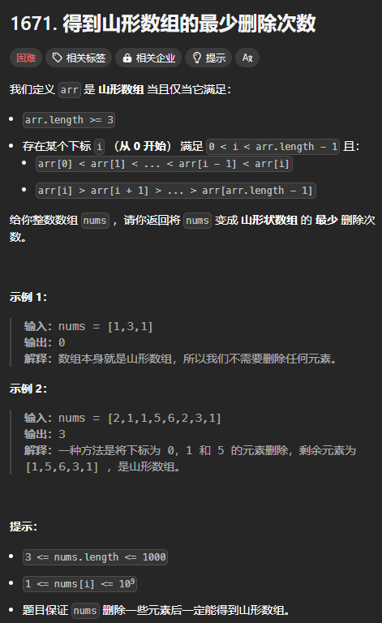
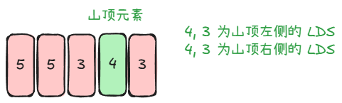

题目链接：[https://leetcode.cn/problems/minimum-number-of-removals-to-make-mountain-array/description/](https://leetcode.cn/problems/minimum-number-of-removals-to-make-mountain-array/description/)



## 思路一
我们找到了山型数组的最大长度就找到了 nums 变成山型数组的最少删除次数。

我们可以枚举山顶，这时候就有 2 个方向，一个向左，一个向右，但是，都是找到比山顶还小的元素。

这和 LIS 差不多，但是不是找递增的序列，而是找递减的序列，暂且称之为 DS（Decrement Subsequence）。

### 代码
回溯代码如下：

```rust
impl Solution {
    pub fn minimum_mountain_removals(nums: Vec<i32>) -> i32 {
        fn left(i: usize, nums: &[i32]) -> i32 {
            let mut result = 0;
            for j in (0..i).rev() {
                if nums[j] < nums[i] {
                    // 加一是因为选择了 nums[j]
                    result = result.max(left(j, nums) + 1);
                }
            }

            result
        }

        fn right(i: usize, nums: &[i32]) -> i32 {
            let mut result = 0;
            for j in i + 1..nums.len() {
                if nums[j] < nums[i] {
                    // 加一是因为选择了 nums[j]
                    result = result.max(right(j, nums) + 1);
                }
            }

            result
        }

        let n = nums.len();
        let mut ans = 0;
        for i in 1..n - 1 {
            // 如果左边或者右边没有元素，则山型数组的山顶就位于最左边或者最右边，这不符合题意
            let left_result = left(i, &nums);
            if left_result == 0 {
                continue;
            }
            let right_result = right(i, &nums);
            if right_result == 0 {
                continue;
            }
            ans = ans.max(left_result + right_result + 1);
        }

        n as i32 - ans
    }
}
```

很明显，会有重叠的子问题，可以转换为递推（省去记忆化搜索的中间转换）：

```rust
impl Solution {
    pub fn minimum_mountain_removals(nums: Vec<i32>) -> i32 {
        let n = nums.len();
        
        let mut left = vec![0; n];
        for i in 1..n - 1 {
            for j in (0..i).rev() {
                if nums[j] < nums[i] {
                    // 加一是因为选择了 nums[j]
                    left[i] = left[i].max(left[j] + 1);
                }
            }
        }
        
        let mut right = vec![0; n];
        for i in (1..n - 1).rev() {
            for j in i + 1..n {
                if nums[j] < nums[i] {
                    // 加一是因为选择了 nums[j]
                    right[i] = right[i].max(right[j] + 1);
                }
            }
        }
        
        let mut ans = 0;
        for i in 1..n - 1 {
            // 如果左边或者右边没有元素，则山型数组的山顶就位于最左边或者最右边，这不符合题意
            if left[i] == 0 || right[i] == 0 {
                continue;
            }
            // 这里加一是因为要将山顶也加上去
            ans = ans.max(left[i] + right[i] + 1);
        }

        n as i32 - ans
    }
}
```

## 思路二
我们可以枚举山顶元素，然后比较得到山型数组的最大长度：



可以定义 `prev[i]` 表示 `nums[0..=i].reverse()` 数组的 LDS 长度。

定义 `suf[i]` 表示 `nums[i..]` 数组的 LDS 长度。  
这样的话，不用每次枚举的时候都计算。

求 LDS 和求 LIS 是差不多的，只是反过来：

+ `g[i]` 表示 DS 的长度为 `i + 1` 是，DS 序列最后一个元素的最大值
+ 之所以是最大值，是因为最大值可以留够充足的空间给未来的元素

但是，如果我们求 LDS 会造成无法使用库函数的二分查找。所以，我们可以将求 LDS 转换成 LIS：

+  nums 的 LDS 等价于将 nums 反转后的 reversed_nums 的 LIS

### 代码
```rust
impl Solution {
    pub fn minimum_mountain_removals(nums: Vec<i32>) -> i32 {
        let n = nums.len();

        let mut prev = vec![0; n];
        let mut suf = vec![0; n];

        let mut lis = vec![nums[0]];

        // 求 nums[..=i].reverse() 的 LDS 相当于求 nums[..=i] 的 LIS
        for i in 1..n {
            if nums[i] > *lis.last().unwrap() {
                lis.push(nums[i]);
            } else {
                match lis.binary_search(&nums[i]) {
                    Ok(index) | Err(index) => lis[index] = nums[i]
                }
            }

            prev[i] = lis.len();
        }

        // 复用 lis 数组
        lis.clear();
        lis.push(nums[n - 1]);

        // 求 nums[i..] 的 LDS 相当于求 nums[i..].reverse() 的 LIS
        for i in (1..n - 1).rev() {
            if nums[i] > *lis.last().unwrap() {
                lis.push(nums[i]);
            } else {
                match lis.binary_search(&nums[i]) {
                    Ok(index) | Err(index) => lis[index] = nums[i]
                }
            }
            suf[i] = lis.len();
        }

        let mut mountain_max_len = 0;
        
        // 枚举山顶
        for i in 1..n - 1 {
            // 如果山顶左侧或者右侧没有比它小的元素，则该山顶不合法
            // 左侧或者右侧没有比它小的元素表现为 LDS 中只有它一个元素，那么 LIS 也只有一个元素
            if prev[i] == 1 || suf[i] == 1 {
                continue;
            }

            mountain_max_len = mountain_max_len.max(prev[i] + suf[i] - 1);
        }

        (n - mountain_max_len) as _
    }
}
```

