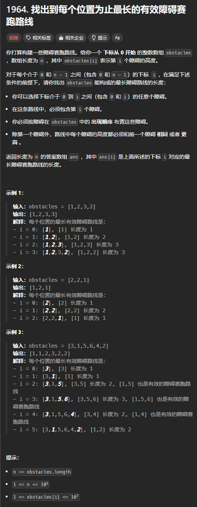

题目链接：[https://leetcode.cn/problems/find-the-longest-valid-obstacle-course-at-each-position/description/](https://leetcode.cn/problems/find-the-longest-valid-obstacle-course-at-each-position/description/)



## 思路
这题的答案和上面一题的 prev 定义看似是一样的，但是有一个关键的区别：

+ `nums[i]` 必须被选择

例如上面的示例 2，我们需要删除 2 个 2。

这个其实很好解决，当找到了需要进行替换的位置后，将该位置后面的元素删除掉就是符合这个条件的 LIS 长度。

## 代码
```rust
impl Solution {
    pub fn longest_obstacle_course_at_each_position(obstacles: Vec<i32>) -> Vec<i32> {
        let n = obstacles.len();

        let mut ans = vec![0; n];
        let mut lis = vec![obstacles[0]];
        ans[0] = 1;

        // 计算 obstacles[0..=i] 的 LIS 长度
        for i in 1..n {
            if obstacles[i] >= *lis.last().unwrap() {
                // 直接添加
                lis.push(obstacles[i]);
                // 这个时候，不需要删除任何元素
                ans[i] = lis.len() as i32;
            } else {
                // 找到第一个大于等于 obstacles[i] + 1 的元素，然后替换它
                let index = lis.partition_point(|&x| x <= obstacles[i]);
                lis[index] = obstacles[i];

                // 这时候，我们需要“虚拟”地删除替换位置后面的元素
                ans[i] = index as i32 + 1;
            } 
        }

        ans
    }
}
```

