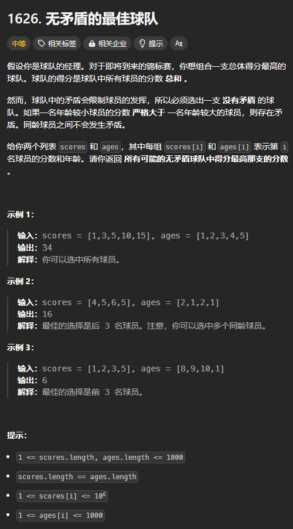

题目链接：[https://leetcode.cn/problems/best-team-with-no-conflicts/](https://leetcode.cn/problems/best-team-with-no-conflicts/)



## 思路
需要特别注意的一点是可以按照任意顺序来选择球员。例如球员的下标分别为 a 和 b。可以先选择 a 再选择 b，也可以先选择 b 再选择 a。

所以，可以先将 `scores` 进行排序，如果出现相同的元素，再按照 `ages` 进行排序。

这样的话，如果 `scores[i] < scores[j]`，则 `ages[i]` 和 `ages[j]` 的大小关系不确定，所以需要特别地判断一下是否 `ages[i] <= ages[j]`。如果 `scores[i] == scores[j]`，则一定有 `ages[i] <= ages[j]`, 这是符合题意的。

将 `scores` 排序后，还是使用枚举选哪个的思路来枚举所有可能的结果。

## 代码
```rust
impl Solution {
    pub fn best_team_score(scores: Vec<i32>, ages: Vec<i32>) -> i32 {
        let mut players = scores.into_iter().zip(ages.into_iter()).collect::<Vec<(_, _)>>();
        // 先按照 socres 进行排序，如果分数相同，再按照 ages 进行排序
        players.sort();

        let n = players.len();
        let mut dp = vec![0; n];
        for i in 0..n {
            for j in 0..i {
                if players[j].1 <= players[i].1 {
                    dp[i] = dp[i].max(dp[j]);
                }
            }
            dp[i] += players[i].0;
        }

        dp.into_iter().max().unwrap()
    }
}
```


