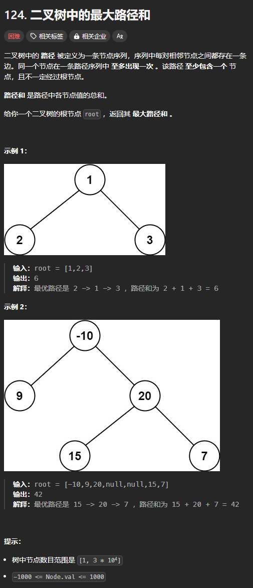
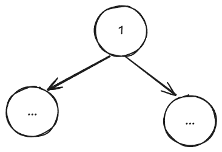

题目链接：[https://leetcode.cn/problems/binary-tree-maximum-path-sum/description/](https://leetcode.cn/problems/binary-tree-maximum-path-sum/description/)



## 思路
最优路径的结构如图所示：



我们可以枚举根节点，则根节点一定在最优路径上。

包含根节点的最大路径和为 `左子树的最大路径和 + 右子树的最大路径和 + 根节点的值`。

可以使用一个全局变量来保存所有可能根节点的最大路径和。

由于从父节点 -> 根节点 -> 子节点的路径不能再分叉，所以返回给父节点的最大路径和应该为左右子树最大路径和的最大值加上根节点的值，即`max(0, max(左子树的最大路径和, 右子树的最大路径和) + 根节点的值)`。

之所以要和 0 取一个最大值是因为如果包含当前根节点的最大路径和为负数，那么，父节点还不如没有路径到达根节点，即加上一个负数还不如不加。

## 代码
```go
func maxPathSum(root *TreeNode) int {
    ans := math.MinInt32
    var dfs func (*TreeNode) int = nil
    dfs = func (root *TreeNode) int {
        if root == nil {
            return 0
        }

        leftPathSum := dfs(root.Left)
        rightPathSum := dfs(root.Right)

        ans = max(ans, leftPathSum + rightPathSum + root.Val)
        return max(0, max(leftPathSum, rightPathSum) + root.Val)
    }

    dfs(root)   
    return ans
}
```


