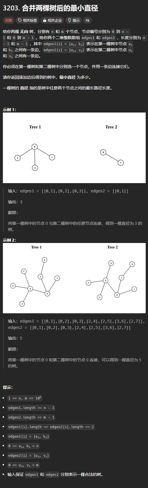
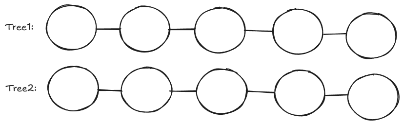
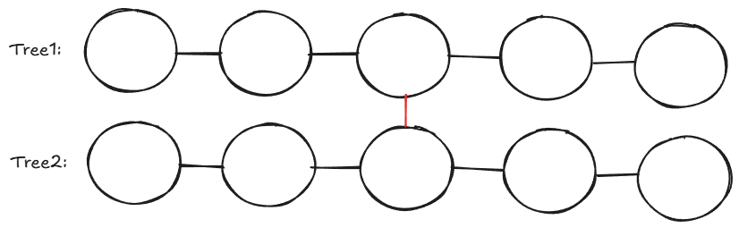
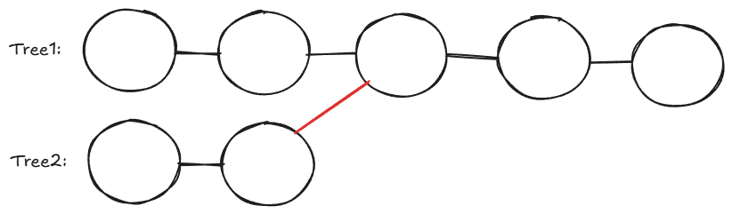

题目链接：[https://leetcode.cn/problems/find-minimum-diameter-after-merging-two-trees/description/](https://leetcode.cn/problems/find-minimum-diameter-after-merging-two-trees/description/)



## 思路
将合并后的两颗树用同一个图来表示，两棵树的连接就对应着向这个图中添加一条边。

对于图中的每一个节点，都有可能是根节点，所以需要遍历每一种情况。

但是，这很明显，就是暴力的做法。而 n、m 的取值范围都很大，所以需要发现更多的性质。

---

可以从部分推出整体：

如果 Tree1 的直径为 4，Tree2 的直径也为 4，则它们都一定存在 5 个节点，4 条边的路径：



现在我们要将这两颗树合并起来，合并起来的位置必定是两者直径的中间位置：



这样才能使合并后的树的直径最小。

由此，我们可以启发思考，设 Tree1 的直径为 a，Tree2 的直径为 b，则有下面三种情况：

+ 如果 a 很大，则合并后的树的最小直径依然为 a



+ 如果b 很大，则合并后的结果还是 b
+ 否则，合并后的树的最小直径为两者的一半相加后再加一，即 `(a + 1) / 2 + (b + 1) / 2 + 1`。


答案就是上面三种情况取一个最大值。

综上所述，下面的步骤就是 2 步：

1. 分别求出 Tree1 和 Tree2 的直径
2. 根据上面的讨论求出合并后的直径

## 代码
```go
var tree [][]int = nil

func minimumDiameterAfterMerge(edges1 [][]int, edges2 [][]int) int {
    generateGraphyFromEdges(edges1)
    a := caculateTreeDiameter()

    generateGraphyFromEdges(edges2)
    b := caculateTreeDiameter()

    return max(a, b, (a + 1) / 2 + (b + 1) / 2 + 1)
}

// 输出的图（也可以说是树）保存在全局变量 tree 中
func generateGraphyFromEdges(edges [][]int) {
    n := len(edges) + 1
    if n == 1 {
        tree = nil
        return
    }

    tree = make([][]int, n)

    for _, edge := range edges {
        // 类似于无向图
        tree[edge[0]] = append(tree[edge[0]], edge[1])
        tree[edge[1]] = append(tree[edge[1]], edge[0])
    }
}

func caculateTreeDiameter() int {
    if tree == nil {
        return 0
    }

    ans := 0
    var dfs func (int, int) int = nil
    dfs = func (root int, father int) int {
        if len(tree[root]) == 1 && tree[root][0] == father {
            // root 是叶子节点，唯一邻居是它的父节点
            return 0
        }

        // a, b 分别为根节点子树们路径最长的两个子树路径长度，其中，保证 a > b
        a, b := -1, -1
        for _, child := range tree[root] {
            if child == father {
                continue
            }

            length := dfs(child, root)

            if length > a {
                a, b = length, a 
            } else if length > b {
                b = length
            }
        }

        ans = max(ans, a + b + 2)
        return max(a, b) + 1
    }

    dfs(0, -1)
    return ans
}
```

上面代码可以精简：

```go
func diameter(edges [][]int) (res int) {
	g := make([][]int, len(edges)+1)
	for _, e := range edges {
		x, y := e[0], e[1]
		g[x] = append(g[x], y)
		g[y] = append(g[y], x)
	}
	var dfs func(int, int) int
	dfs = func(x, fa int) (maxLen int) {
		for _, y := range g[x] {
			if y != fa {
				subLen := dfs(y, x) + 1
				res = max(res, maxLen+subLen)
				maxLen = max(maxLen, subLen)
			}
		}
		return
	}
	dfs(0, -1)
	return
}

func minimumDiameterAfterMerge(edges1, edges2 [][]int) int {
	d1 := diameter(edges1)
	d2 := diameter(edges2)
	return max(d1, d2, (d1+1)/2+(d2+1)/2+1)
}
```

