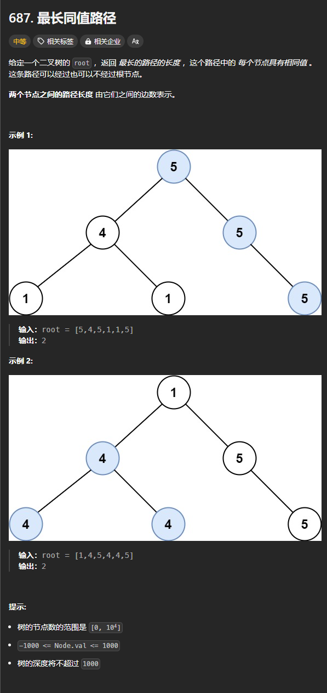

题目链接：[https://leetcode.cn/problems/longest-univalue-path/description/](https://leetcode.cn/problems/longest-univalue-path/description/)



## 思路
和上一题的思路一样，枚举根节点。

如果根节点发现子节点的值和根节点的值不同，则应该将子节点返回来的路径长度视为 -1.

## 代码
```go
func longestUnivaluePath(root *TreeNode) int {
    ans := 0
    var dfs func (root *TreeNode) int = nil
    dfs = func(root *TreeNode) int {
        if root == nil {
            return -1
        }

        leftLength := dfs(root.Left)
        if root.Left != nil && root.Val != root.Left.Val {
            leftLength = -1
        }
        rightLength := dfs(root.Right)
        if root.Right != nil && root.Val != root.Right.Val {
            rightLength = -1
        }

        ans = max(ans, leftLength + rightLength + 2)
        return max(leftLength, rightLength) + 1
    }

    dfs(root)
    return ans
}
```

