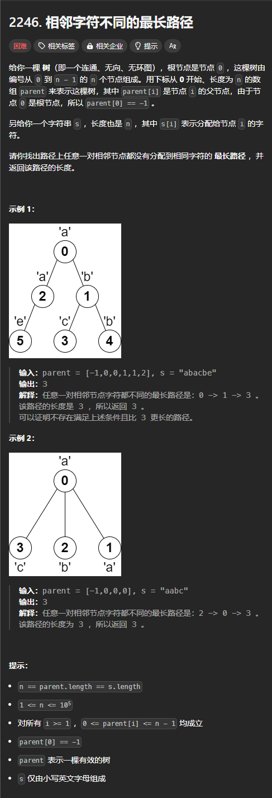

题目链接：[https://leetcode.cn/problems/longest-path-with-different-adjacent-characters/description/](https://leetcode.cn/problems/longest-path-with-different-adjacent-characters/description/)



## 思路
枚举根节点，如果根节点所分配的字符和子节点的字符相同，则根节点不能到达该子节点。否则，可以从所有可能到达的子节点中找到长度最长的两条路径，从而计算出答案。

但是，即使根节点所分配的字符和子节点的字符相同，也要递归到该子节点。只是返回的时候，根节点要将该子节点的长度视为 0.

返回给父节点的只能是两条路径中最长的一条。

## 代码
```go
func longestPath(parent []int, s string) int {
    n := len(parent)

    tree := make([][]int, n)
    for i := 1; i < n; i++ {
        // parent[i] 的子节点为 i
        tree[parent[i]] = append(tree[parent[i]], i)
    }

    ans := math.MinInt32
    var dfs func (root int) int = nil
    dfs = func (root int) int  {
        // 叶子节点
        if len(tree[root]) == 0 {
            return 1;
        }

        // 递归所有与根节点不同的子节点，找到两个最长的路径 a 和 b，其中，保证 a > b
        a, b := 0, 0
        for _, child := range tree[root] {
            length := dfs(child)
            if s[child] == s[root] {
                // 如果两者相同，则将 length 视为 0
                continue
            }

            if length > a {
                a, b = length, a
            } else if length > b {
                b = length
            }

        }

        // + 1 是因为路径要包含 root 本身
        ans = max(ans, a + b + 1) 
        // 返回给父节点时，要选择最长的一条路径
        return a + 1
    }

    // 避免 len(parent) = 1 的时候返回 math.MinInt32
    ans = max(ans, dfs(0))
    return ans
}
```

