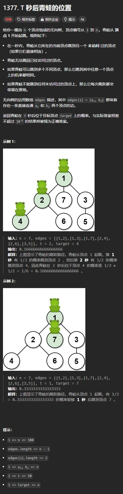

题目链接：[https://leetcode.cn/problems/frog-position-after-t-seconds/description/](https://leetcode.cn/problems/frog-position-after-t-seconds/description/)



## 思路
可以模拟青蛙跳跃的过程，并且将跳到该点的概率和剩余的时间传递到该点。

## 代码
```go
func frogPosition(n int, edges [][]int, t int, target int) float64 {
    tree := make([][]int, len(edges) + 2)

    for _, edge := range edges {
        p, q := edge[0], edge[1]
        tree[p] = append(tree[p], q)
        tree[q] = append(tree[q], p)
    }

    var dfs func (root int, father int, t int, probability float64) float64 = nil
    dfs = func (root int, father int, t int, probability float64) float64 {
        if (father != -1 && len(tree[root]) == 1) || t == 0 || len(tree[root]) == 0 {
            if root == target {
                return probability
            } else {
                // 是叶子节点或者时间已经到了，但是不是目标值
                return 0
            }
        }
        if root == target {
            // 此 root 既不是叶子节点并且时间还有剩余，则青蛙还会跳，则一定不会停留在此节点上
            return 0
        }

        countOfChildren := len(tree[root])
        if father != -1 {
            // 减去父节点
            countOfChildren--
        }
         
        for _, child := range tree[root] {
            if child == father {
                continue
            }

            p := dfs(child, root, t - 1, probability * (1 / float64(countOfChildren)))

            if p != 0 {
                return p
            }
        }
        return 0
    }

    return dfs(1, -1, t, 1)
}
```

