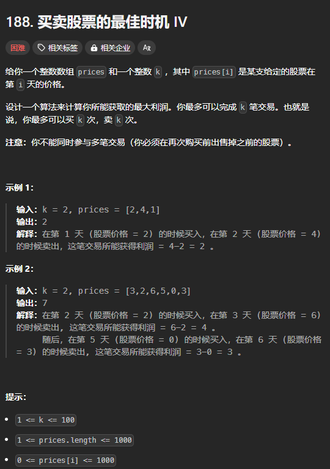

题目链接：[https://leetcode.cn/problems/best-time-to-buy-and-sell-stock-iv/description/](https://leetcode.cn/problems/best-time-to-buy-and-sell-stock-iv/description/)



## 思路
除了“是否持有股票”这一状态之外，这道题还有一个状态：

+ 已经进行了的交易次数

只需要在递归参数中增加一个表示已经进行了的交易次数就可以了。

需要注意的是，由于买入和卖出这两个操作配套成一次交易，所以，规定在卖出的时候才增加一次交易的次数。

增加了参数之后，**递归边界**同样需要改变：

+ 只要交易次数达到了限定值 k，则不能卖出和买入，利润一定为 0.

### 归的算法
+ 如果持有股票，交易次数为 j，则：`dfs(i, j, true) = dfs(i + 1, j, true).max(dfs(i + 1, j - 1, false) + price)`
+ 如果没有持有股票，交易次数为 j，则 `dfs(i, j, false) = dfs(i + 1, j, false).max(dfs(i + 1,j, true) - price`

当 `j == 0` 的时候，为边界条件。

### 转换为递推
`dp[i]` 只依赖于 `dp[i + 1]`，所以，可以去掉 `i` 这一个维度，节省空间。方法的合理性可以看背包问题的一个数组的空间优化。

转换后的递推公式如下：

+ 如果持有股票：`dp[j][1] = dp[j][1].max(dp[j - 1][0] + price)`
+ 如果没有持有股票：`dp[j][0] = dp[j][0].max(dp[j][1] - price)`，注意，这里用到了 `dp[j][1]`，而这个值需要的是“旧值”，而不是更新过的值。

## 代码
```rust
impl Solution {
    pub fn max_profit(k: i32, prices: Vec<i32>) -> i32 {
        let k = k as usize;
        let n = prices.len();
    
        let mut dp = vec![[0; 2]; k + 1];
        // 边界条件
        // dp[n - 1][..][0] = 0
        // dp[n - 1][1..][1] = prices[n - 1]
        // dp[..][0][..] = 0
        for j in 1..=k {
            dp[j][1] = prices[n - 1];
        }
 
        for i in (0..n).rev() {
            for j in 1..=k {
                // 先计算 dp[j][0]，后计算 dp[j][1]，保证了计算 dp[j][0] 使用
                // 到的 dp[j][1] 是旧值
                dp[j][0] = dp[j][0].max(dp[j][1] - prices[i]);
                dp[j][1] = dp[j][1].max(dp[j - 1][0] + prices[i]);
            }
        }

        dp[k][0]
    }
}
```

