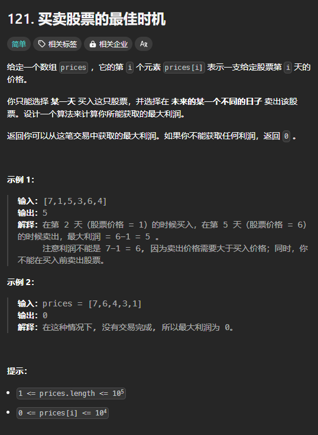

题目链接：[https://leetcode.cn/problems/best-time-to-buy-and-sell-stock/description/](https://leetcode.cn/problems/best-time-to-buy-and-sell-stock/description/)



## 思路一
这相当于只能交易一次。

直接复用上一题的代码。

[买卖股票的最佳时机 IV](https://www.yuque.com/cline-mly1u/bgacuc/sgi2npgfokyx4e48)

### 代码
```rust
impl Solution {
    pub fn max_profit(prices: Vec<i32>) -> i32 {
        let k = 1;
        let n = prices.len();
    
        let mut dp = vec![[0; 2]; k + 1];
        // 边界条件
        // dp[n - 1][..][0] = 0
        // dp[n - 1][1..][1] = prices[n - 1]
        // dp[..][0][..] = 0
        for j in 1..=k {
            dp[j][1] = prices[n - 1];
        }
 
        for i in (0..n).rev() {
            for j in 1..=k {
                // 先计算 dp[j][0]，后计算 dp[j][1]，保证了计算 dp[j][0] 使用
                // 到的 dp[j][1] 是旧值
                dp[j][0] = dp[j][0].max(dp[j][1] - prices[i]);
                dp[j][1] = dp[j][1].max(dp[j - 1][0] + prices[i]);
            }
        }

        dp[k][0]
    }
}
```

## 思路二
最大利润的产生的情况是买入了之后的某一天内，以最大值出售掉。

所以，可以计算出某一个位置 i 以后的位置的最大值。

### 代码
```rust
impl Solution {
    pub fn max_profit(prices: Vec<i32>) -> i32 {
        let n = prices.len();

        let mut suf_max = vec![0; n];
        for i in (0..n - 1).rev() {
            suf_max[i] = suf_max[i + 1].max(prices[i + 1]);
        }

        let mut ans = 0;
        for i in 0..n {
            // 在第 i 天买入
            ans = ans.max(suf_max[i] - prices[i]);
        }
        ans
    }
}
```

