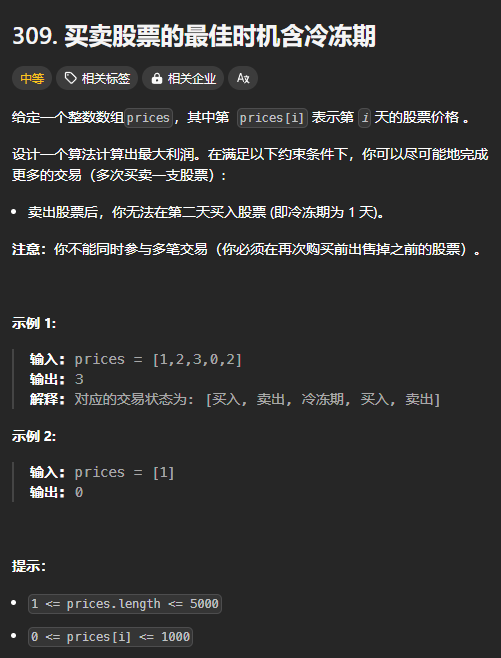

题目链接：[https://leetcode.cn/problems/best-time-to-buy-and-sell-stock-with-cooldown/description/](https://leetcode.cn/problems/best-time-to-buy-and-sell-stock-with-cooldown/description/)



## 思路
类似与打家劫舍，只需要卖出股票后递归到第 `i + 2` 天就可以了。

## 代码
```rust
impl Solution {
    pub fn max_profit(prices: Vec<i32>) -> i32 {
        let n = prices.len();

        let mut dp = vec![[0; 2]; n + 1];
        dp[n - 1][1] = prices[n - 1];

        for i in (0..n - 1).rev() {
            // 持有股票
            dp[i][1] = dp[i + 1][1].max(dp[i + 2][0] + prices[i]);
            // 没有持有股票
            dp[i][0] = dp[i + 1][0].max(dp[i + 1][1] - prices[i]);
        }

        dp[0][0]
    }
}
```

上述代码除了卖出股票递归到 `i + 2` 之外，还有一个改动是 dp 为 n 行，而不是 n - 1 行。

这避免了 i + 2 溢出或者特殊判断。

