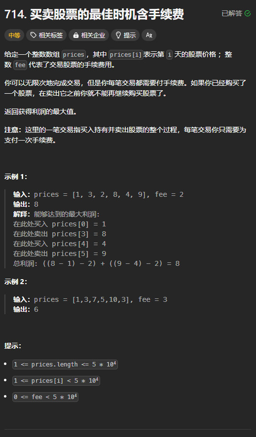

题目链接：[https://leetcode.cn/problems/best-time-to-buy-and-sell-stock-with-transaction-fee/description/](https://leetcode.cn/problems/best-time-to-buy-and-sell-stock-with-transaction-fee/description/)



## 思路
统一卖出的时候算交易费用。

## 代码
```rust
impl Solution {
    pub fn max_profit(prices: Vec<i32>, fee: i32) -> i32 {
        let mut n = prices.len();

        let mut dp = [0; 2];
        dp[1] = prices[n - 1] - fee;

        for i in (0..n - 1).rev() {
            dp[1] = dp[1].max(dp[0] + prices[i] - fee);
            dp[0] = dp[0].max(dp[1] - prices[i]);
        }

        dp[0]
    }
}
```

