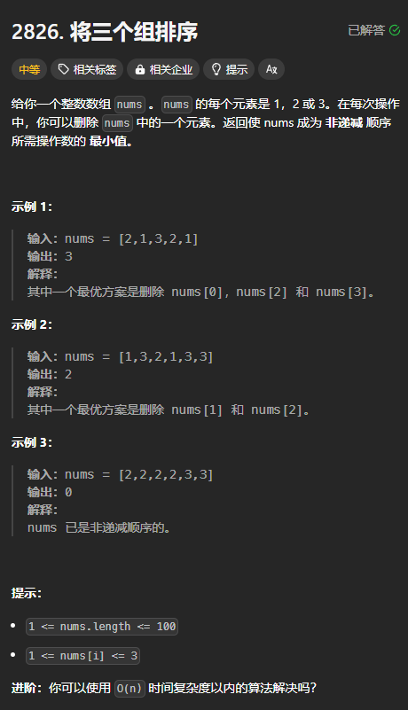
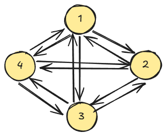

题目链接：[https://leetcode.cn/problems/sorting-three-groups/description/](https://leetcode.cn/problems/sorting-three-groups/description/)



## 思路
删除某个值相当于将其改变为某一个符合条件的值，这样，统计修改的次数就相当于是答案了。

例如，将 `[2, 1, 3]` 中的 2 删除可以相当于将 2 改为 1。

每一个元素具有 4 个状态值，即 `1, 2, 3, 4`，各个状态之间可以相互转化：



但是，转化之间是有条件的。设 `nums` 中紧邻的两个元素分别为 `a` 和 `b`：

+ 如果 `a > b`：则必须将 b 的状态往更大的状态转化，并且，为了减小操作的次数，b 应该转换为 a。而不是转换为比 a 还大的状态。假设 a = 2，b = 1，则 b 应该转换为 2。如果转换为 3，则后面所有为 2 和 1 的元素都得增加，而如果转换为 2，只需要增加 1 的的状态值就可以了。
+ 如果 `a <= b`，可以尝试将 b 减小为刚好等于 a 的数，也可以不变。

可以使用 pre 来表示 a，用 index 来表示当前 b 的索引，`dfs(index, pre)` 的返回值表示使 `nums[index..]` 非递减所需要的最小操作数则归的算法如下：

+ 如果 `a > b`：`dfs(index, pre) = dfs(index + 1,  a) + 1`
+ 如果 `a <= b`：`dfs(index, pre) = dfs(index + 1, b).min(dfs(index + 1, a) + 1)`

刚开始的第一个数前面没有元素，可以假设第一个元素的前面有 1，这样可以避免特殊处理。

边界条件为 `index == n`，返回 0 即可。

转换为递推之后，可以使用一个数组来进行空间优化。

## 代码
无空间优化：

```rust
impl Solution {
    pub fn minimum_operations(nums: Vec<i32>) -> i32 {
        let n = nums.len();
        
        let mut dp = vec![[0; 4]; n + 1];
        for index in (0..n).rev() {
            for pre in 1..=3 {
                if pre as i32 > nums[index] {
                    dp[index][pre] = dp[index + 1][pre] + 1;
                } else {
                    dp[index][pre] = dp[index + 1][nums[index] as usize].min(dp[index + 1][pre] + 1);
                }
            }
        }

        dp[0][1]
    }
}
```

一个数组空间优化：

```rust
impl Solution {
    pub fn minimum_operations(nums: Vec<i32>) -> i32 {
        let n = nums.len();
        
        let mut dp = [0; 4];
        for index in (0..n).rev() {
            for pre in 1..=3 {
                if pre as i32 > nums[index] {
                    dp[pre] = dp[pre] + 1;
                } else {
                    dp[pre] = dp[nums[index] as usize].min(dp[pre] + 1);
                }
            }
        }

        dp[1]
    }
}
```


