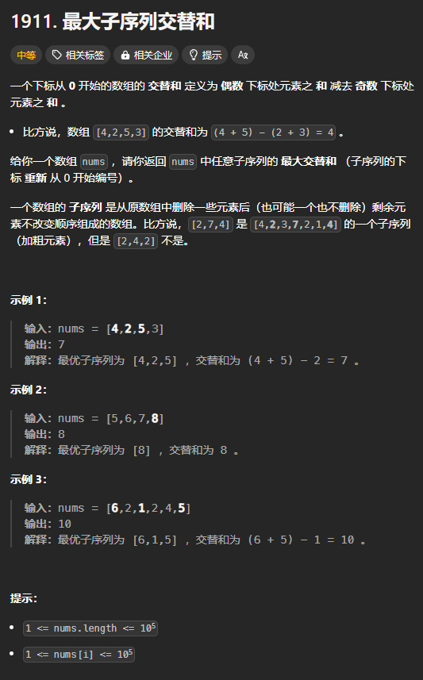

题目链接：[https://leetcode.cn/problems/maximum-alternating-subsequence-sum/description/](https://leetcode.cn/problems/maximum-alternating-subsequence-sum/description/)



## 思路
假设最优子序列为 S。

则对于每个元素，都有在 S 中和不在 S 中两种情况。

每个元素的状态是它的下标。

进一步地，我们只需要当前元素 num 的下标是偶数还是奇数，就知道了当前元素的贡献值（前提是它要在 S 中）：

+ 如果是偶数，则贡献值为 num
+ 如果是奇数，则贡献值为 -num

每一个元素的下标都有可能是偶数和不是偶数这两种情况。

因为每个元素都可以是 S 的开头。

### 归的算法
定义 `dfs(i, is_even)` 表示当前的元素为 `nums[i]`，且如果当前元素在 S 中，它的奇偶性为 is_even。

+ 元素 num 在 S 中：
    - 下标是偶数：`dfs(i, 1) = dfs(i + 1, 0) + num`
    - 下标是奇数：`dfs(i, 0) = dfs(i + 1, 1) - num`
+ 元素 num 不在 S 中：
    - `dfs(i, is_even) = dfs(i + 1, is_even)`

## 代码
无空间优化：

```rust
impl Solution {
    pub fn max_alternating_sum(nums: Vec<i32>) -> i64 {
        let n = nums.len();

        let nums = nums.into_iter().map(|num| num as i64).collect::<Vec<_>>();

        let mut dp = vec![[0; 2]; n + 1];

        for i in (0..n).rev() {
            // 当前元素的下标为偶数
            dp[i][1] = dp[i + 1][1].max(dp[i + 1][0] + nums[i]);
            // 当前元素的下标为奇数
            dp[i][0] = dp[i + 1][0].max(dp[i + 1][1] - nums[i]);
        }

        dp[0][0].max(dp[0][1])
    }
}
```

一个数组空间优化：

```rust
impl Solution {
    pub fn max_alternating_sum(nums: Vec<i32>) -> i64 {
        let n = nums.len();

        let nums = nums.into_iter().map(|num| num as i64).collect::<Vec<_>>();

        let mut dp = [0; 2];

        for i in (0..n).rev() {
            let old = dp[1];
            // 当前元素的下标为偶数
            dp[1] = dp[1].max(dp[0] + nums[i]);
            // 当前元素的下标为奇数
            dp[0] = dp[0].max(old - nums[i]);
        }

        dp[0].max(dp[1])
    }
}
```

