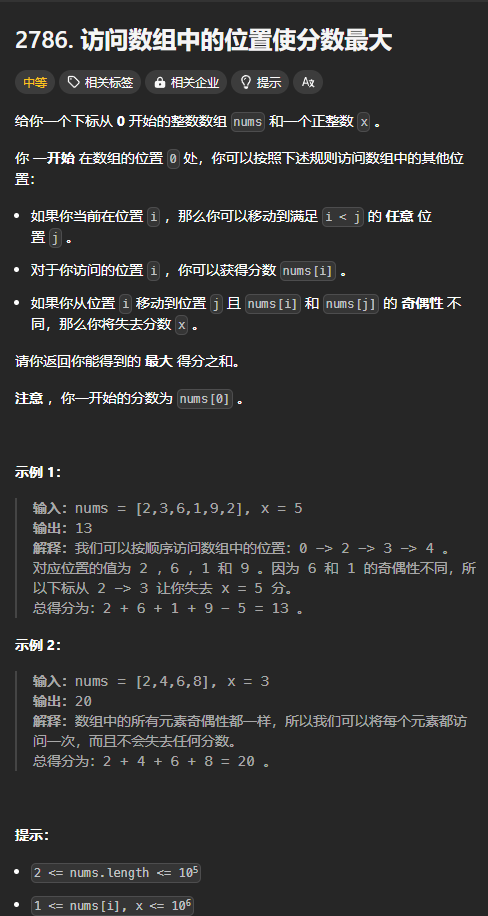

题目链接：[https://leetcode.cn/problems/visit-array-positions-to-maximize-score/description/](https://leetcode.cn/problems/visit-array-positions-to-maximize-score/description/)



## 思路
当前所处的位置就是当前的状态。

对于每个 `j > i` 的下标，我们可以移动到 `j` 处也可以不移动。

定义 `dfs(i, pos)` 表示当前位于 pos 位置，i 的含义是决定是否移动到位置 i。返回值表示能够获得的最大分数。

进一步地，由于我们只需要使用 pos 来判断奇偶性，所以将 pos 变量改变为 is_even，表示原来的位置是否是偶数。

归的算法：

`dfs(i, is_even) = dfs(i + 1, is_even).max(dfs(i + 1, nums[i] % 2 == 0) + nums[i] + 判断奇偶性来是否减去 x)`

初始的分数为 `nums[0]`。

边界条件为 `i == n` 的时候，此时相当于是一个空数组，分数一定为 0，故而返回 0。

## 代码
无空间优化：

```rust
impl Solution {
    pub fn max_score(nums: Vec<i32>, x: i32) -> i64 {
        let n = nums.len();

        let nums = nums.into_iter().map(|num| num as i64).collect::<Vec<_>>();
        let x = x as i64;

        let mut dp = vec![[0; 2]; n + 1];

        for i in (1..n).rev() {
            for is_even in 0..=1 {
                dp[i][is_even] = dp[i + 1][is_even].max(
                    dp[i + 1][(nums[i] % 2) as usize]
                        + nums[i]
                        + if nums[i] % 2 != is_even as i64 { -x } else { 0 },
                );
            }
        }

        dp[1][(nums[0] % 2) as usize] + nums[0]
    }
}
```

一个数组空间优化：

由于要使用上一行的 `dp[nums[i] as usize % 2]`，没有固定的顺序（可以 `dp[0]` 要使用上一行状态的 `dp[0]` 也有可能是上一行状态的 `dp[1]`，所以，干脆将上一行状态保存下来）：

相当于滚动数组。

```rust
impl Solution {
    pub fn max_score(nums: Vec<i32>, x: i32) -> i64 {
        let n = nums.len();

        let nums = nums.into_iter().map(|num| num as i64).collect::<Vec<_>>();
        let x = x as i64;

        let mut dp = [0; 2];

        for i in (1..n).rev() {
            let old_dp = dp.clone();
            for is_even in 0..=1 {
                dp[is_even] = old_dp[is_even].max(
                    old_dp[(nums[i] % 2) as usize]
                        + nums[i]
                        + if nums[i] % 2 != is_even as i64 { -x } else { 0 },
                );
            }
        }

        dp[(nums[0] % 2) as usize] + nums[0]
    }
}
```

