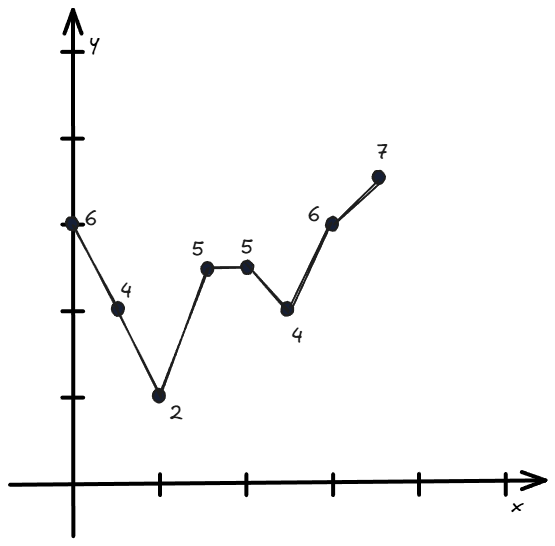
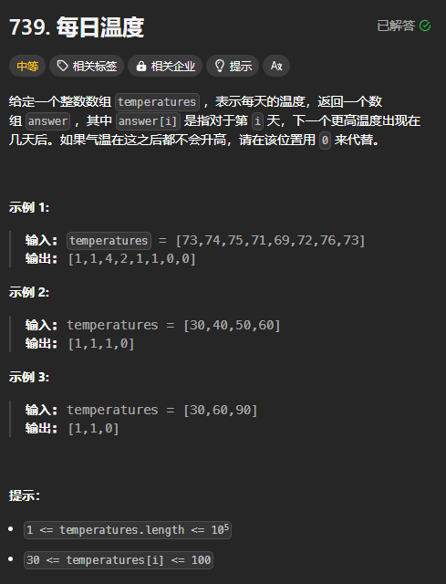

单调栈常常被用来解决如下问题：

+ 下一个更大与当前遍历到的元素的关系
+ 下一个更小与当前遍历到的元素的关系



单调栈的解决思路是：如果当前元素的下一个更大的元素还不能确定，则暂时将其存放在栈中，如果确定了，就立即弹出。

例如图中从左向右遍历，`[6, 4, 2]` 的一个更大的元素还不能确定，则暂时用栈按照顺序存储起来，遍历到 5 的时候，发现 5 比栈顶元素更大，则立即弹出 2，并将 2 对应的下一个更大的元素确定为 5，然后再检查栈顶元素与 5 的关系，再次弹出栈顶，直到栈顶的元素比 5 更大。

---

还有一种从右往左的思路找下一个更大的元素：

如果遇到一个元素比栈顶的元素更小，则它的下一个更大的元素就是栈顶元素，同时将它入栈，让它有机会成为前面元素的更大元素。

如果遇到一个元素比栈顶的元素更大，则栈顶元素不是它的下一个更大的元素，弹出栈顶元素，直到找到比它更大的元素。

## 例题：每日温度
题目链接：[https://leetcode.cn/problems/daily-temperatures/](https://leetcode.cn/problems/daily-temperatures/)



### 代码
从左往右：

```rust
impl Solution {
    pub fn daily_temperatures(temperatures: Vec<i32>) -> Vec<i32> {
        // 单调栈，存储的是元素的下标
        let mut stack = vec![0];
        let mut result = vec![0; temperatures.len()];

        for (i, &temperature) in temperatures.iter().enumerate().skip(1) {
            while !stack.is_empty() && temperature > temperatures[*stack.last().unwrap()] {
                // 找到了一个更大的元素 temperature
                let index = stack.pop().unwrap();
                result[index] = (i - index) as i32;
            }

            // 经过上面的循环后，栈顶元素必定大于等于当前元素，或者栈为空
            stack.push(i);
        }

        result
    }
}
```

从右往左：

```rust
impl Solution {
    pub fn daily_temperatures(temperatures: Vec<i32>) -> Vec<i32> {
        let n = temperatures.len();

        // 单调栈，存储的是元素的下标
        let mut stack = vec![n - 1];
        let mut result = vec![0; n];

        for (i, &temperature) in temperatures.iter().enumerate().rev().skip(1) {
            // 单调栈存储的是比当前元素更大的元素
            while !stack.is_empty() && temperature >= temperatures[*stack.last().unwrap()] {
                // 比当前元素更小的元素应该被弹出
                stack.pop().unwrap();
            }

            // 栈中剩下的元素比当前元素大
            if !stack.is_empty() {
                result[i] = (*stack.last().unwrap() - i) as i32;
            } else {
                // 后面没有什么元素比当前元素更大
                result[i] = 0;
            }
            stack.push(i);
        }

        result
    }
}
```

第 21 行的赋值没有什么意义，可以省去。


