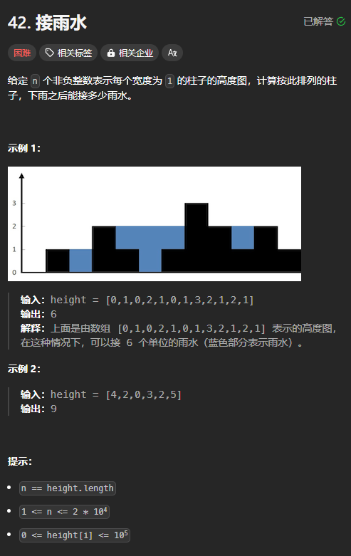
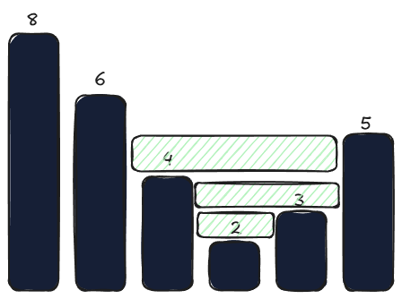
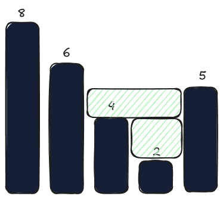
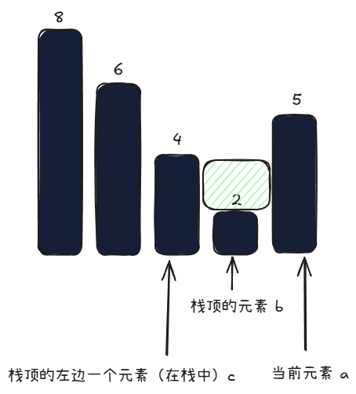

题目链接：[https://leetcode.cn/problems/trapping-rain-water/](https://leetcode.cn/problems/trapping-rain-water/)

前面用双指针做过了这个题目：

[接雨水](https://www.yuque.com/cline-mly1u/bgacuc/sheewabtf7ggcrzm)



## 思路



我们从左向右遍历，如果当前的元素小于栈顶的元素，则加入到栈中，否则，当前元素就可以与前面的栈中的元素形成一个容器。

这个容器的容积大小为`（min(a,c) - b) * (a 与 c 之间的距离)`：



不断地弹出比当前元素小的栈顶元素，就相当于往容器中填“水泥”。

## 代码
```rust
impl Solution {
    pub fn trap(heights: Vec<i32>) -> i32 {
        let mut stack = vec![0];

        let mut ans = 0;
        let mut last_poped = 0;
        for (i, &height) in heights.iter().enumerate().skip(1) {
            while !stack.is_empty() && height >= heights[*stack.last().unwrap()] {
                let bottom_height = heights[stack.pop().unwrap()];

                if stack.is_empty() {
                    // 此时，当前元素的左边没有比它更高的“墙”了
                    break;
                }

                let left_wall_index = *stack.last().unwrap();
                ans += (heights[left_wall_index].min(height) - bottom_height) * (i - left_wall_index - 1) as i32;
            }
            stack.push(i)
        }

        ans
    }
}
```


