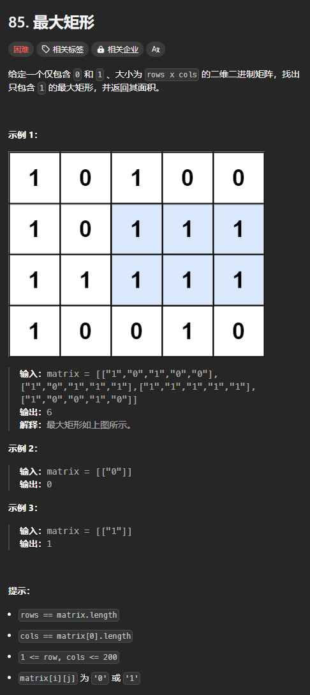
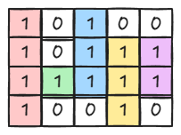
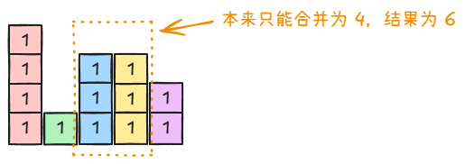
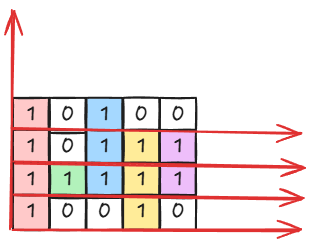

题目链接：[https://leetcode.cn/problems/maximal-rectangle/description/](https://leetcode.cn/problems/maximal-rectangle/description/)



## 思路
我们通过前面一题知道了柱状图的最大矩形，如果我们能够将此题也转换成柱状图就可以解决问题了。

我们按照“列” 的方向来将相邻的 1 转换成一个一个的柱子：



但是我们不能将所有柱子放在同一水平线上，因为如果放在同一水平线上，就会造成原本不能合并的单元格也被合并了：



所以，就创造性地提出了一个 y 轴，多个 x 轴：



采用这种方法后，我们可以分别在每个 x 轴上运行一次《柱状图中最大的矩形》的算法。

对于每个 x 轴来说，每个柱子的高度都是不同的，所以每次更换 x 轴之后，都单独计算。

在实际的算法中，我们会将 y 轴方向旋转 180 度以从下标 0 开始。

## 代码
```rust
impl Solution {
    pub fn maximal_rectangle(matrix: Vec<Vec<char>>) -> i32 {
        let m = matrix.len();
        let n = matrix.first().unwrap().len();

        let mut ans = 0;

        for x in 0..m {
            // 柱子的高度
            let mut heights = vec![0; n];
            for y in 0..n {
                let mut height = 0;
                let mut x = x;
                while x < m && matrix[x][y] == '1' {
                    height += 1;
                    x += 1;
                }

                heights[y] = height;
            }

            ans = ans.max(Solution::largest_rectangle_area(heights));
        }

        ans
    }

    fn largest_rectangle_area(heights: Vec<i32>) -> i32 {
        let n = heights.len();

        // 首先计算元素右边的第一个更小的值
        let mut stack = vec![n - 1];
        // 初始化为 n，目的是为了当找不到比它更小的元素的时候，不用特殊判断
        let mut right = vec![n; n];
        for (i, &height) in heights.iter().enumerate().rev().skip(1) {
            while !stack.is_empty() && heights[*stack.last().unwrap()] >= height {
                // 去除栈中所有大于等于 height 的元素
                // 则栈顶元素就一定小于等于 height
                stack.pop().unwrap();
            }

            if let Some(&stack_top) = stack.last() {
                right[i] = stack_top;
            }
            stack.push(i);
        }

        // 边计算元素左边的第一个更小的值，边计算答案
        let mut ans = 0;
        stack.clear();
        for (i, &height) in heights.iter().enumerate() {
            while !stack.is_empty() && heights[*stack.last().unwrap()] >= height {
                stack.pop().unwrap();
            }

            if let Some(&left) = stack.last() {
                // 左边的第一个更小的值就是栈顶元素
                ans = ans.max(height * (right[i] - left - 1) as i32);
            } else {
                // 此时，虚拟地假设第一个更小的位置在 -1 位置上
                ans = ans.max(height * right[i] as i32);
            }
            stack.push(i);
        }  

        ans
    }
}
```

