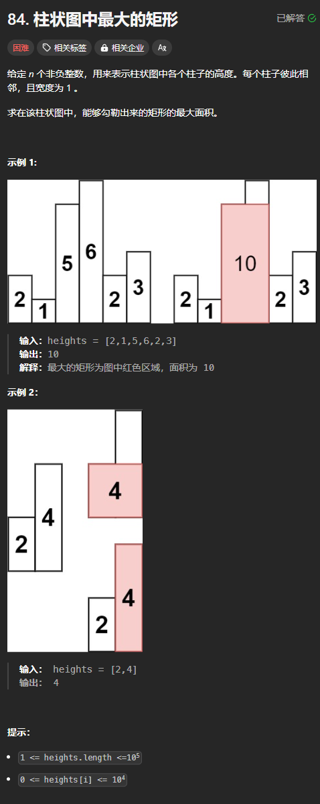

题目链接：[https://leetcode.cn/problems/largest-rectangle-in-histogram/description/](https://leetcode.cn/problems/largest-rectangle-in-histogram/description/)




## 思路
有一个结论：

+ 矩形的高一定和 heights 中某个元素的值相同

所以，我们可以枚举 heights 中的每个元素作为高，高就固定下来了。

然后，为了找到面积最大的矩形，我们就需要找到最长的宽。

因为我们固定了高，则高的左边和右边就不能有比它更小的柱子了，因为有了更小的柱子高就不是固定下来的高了。

所以，我们要分别知道高的左边和右边第一个比高更小的柱子，然后宽度就是它们两者之间的距离（不包括端点）。

为了避免高的左边或者右边没有找到一个比它更小的柱子，可以“虚拟”地在数组的左边和右边添加一个高度为 0 的柱子，它们的位置就分别为 -1 和 n。

涉及到下一个更小的问题，用单调栈来解决。

## 代码
```rust
impl Solution {
    pub fn largest_rectangle_area(heights: Vec<i32>) -> i32 {
        let n = heights.len();

        // 首先计算元素右边的第一个更小的值
        let mut stack = vec![n - 1];
        // 初始化为 n，目的是为了当找不到比它更小的元素的时候，不用特殊判断
        let mut right = vec![n; n];
        for (i, &height) in heights.iter().enumerate().rev().skip(1) {
            while !stack.is_empty() && heights[*stack.last().unwrap()] >= height {
                // 去除栈中所有大于等于 height 的元素
                // 则栈顶元素就一定小于等于 height
                stack.pop().unwrap();
            }

            if let Some(&stack_top) = stack.last() {
                right[i] = stack_top;
            }
            stack.push(i);
        }

        // 边计算元素左边的第一个更小的值，边计算答案
        let mut ans = 0;
        stack.clear();
        for (i, &height) in heights.iter().enumerate() {
            while !stack.is_empty() && heights[*stack.last().unwrap()] >= height {
                stack.pop().unwrap();
            }

            if let Some(&left) = stack.last() {
                // 左边的第一个更小的值就是栈顶元素
                ans = ans.max(height * (right[i] - left - 1) as i32);
            } else {
                // 此时，虚拟地假设第一个更小的位置在 -1 位置上
                ans = ans.max(height * right[i] as i32);
            }
            stack.push(i);
        }  

        ans
    }
}
```

